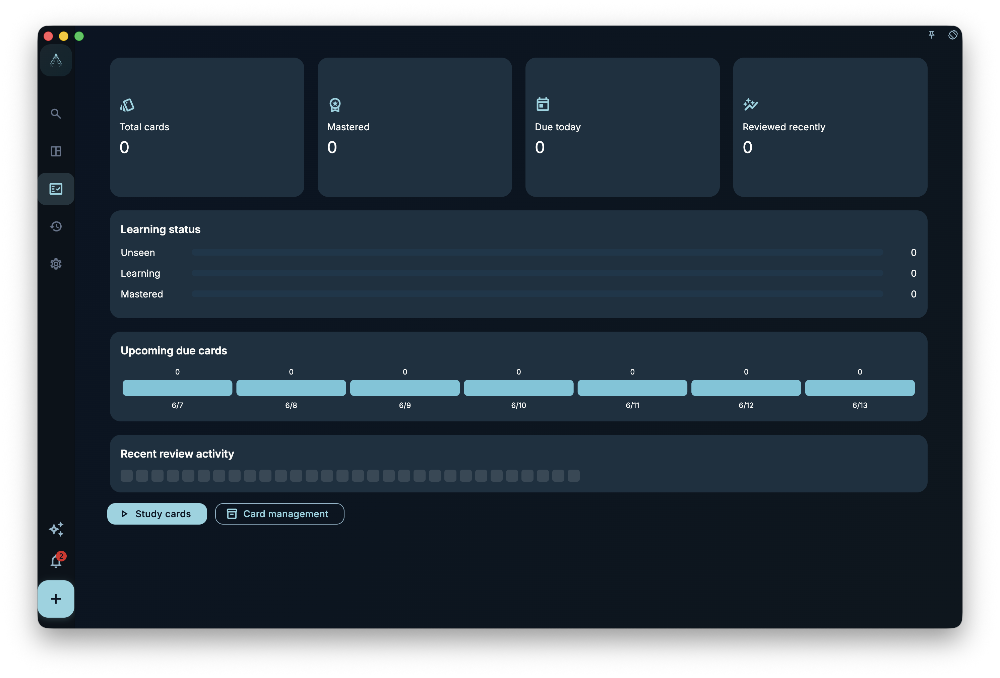
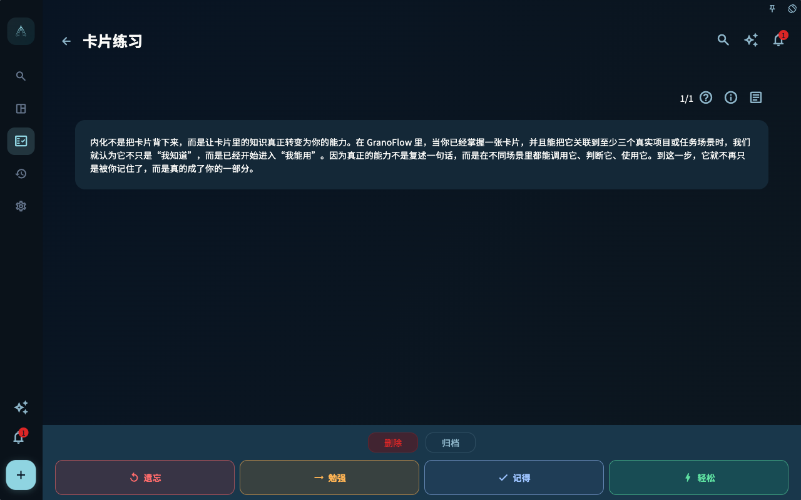

很多人会记任务、做任务、勾掉任务。但如果事情做到这里就结束了，一天很容易只剩下两种感受：

- 做得不够多
- 还有很多没做完

这也是为什么，很多任务工具越用越忙，越用越容易让人觉得自己永远在落后。

GranoFlow 里的“回顾”，不是为了让你把一天重新审判一遍。
它的存在，是为了帮你把已经发生的事，从“完成记录”慢慢变成“可以带走的经验”。

写下任务，是为了减轻脑中的负担。
完成任务，是为了推进现实里的事情。
回顾，则是为了把经历变成判断，让你慢慢知道：

- 什么对自己有效
- 什么只是看上去很忙
- 哪些行动真的接近你重视的方向
- 下一步怎样更清楚

如果你熟悉 ACT（接纳与承诺疗法）或《幸福的陷阱》，可以把回顾理解成一次温和的“承诺行动检查”：

> 我这段时间，是否仍在靠近自己真正重视的方向？

更多背景可以读 [ACT 与《幸福的陷阱》](/en/value-to-action/act-loop/)。

## 回顾不是自我检讨

回顾不是批评自己。

它不是问：

> 我今天为什么不够努力？
> 我为什么又拖延？
> 我为什么没有完成所有计划？

这些问题很容易让回顾变成压力，也会让你下意识地回避它。

更适合问的是：

> 今天真实发生了什么？
> 我完成了哪些事？
> 哪些行动接近我重视的方向？
> 哪些地方需要调整？
> 下一步是什么？

回顾的目的不是审判自己，而是看清现实。
看清现实之后，你才知道哪些事情值得继续，哪些事情需要改变，哪些事情可以放下。

## 完成任务只是第一步

任务完成以后，它会成为记录。
但记录本身还不是经验。

例如，你完成了：

> 写完「任务与收集箱」这一章

如果只是打勾，它只是一个已完成任务。

如果你在回顾里写下：

> 今天写完了任务章节。结构已经清楚，但“回顾”这一章需要更明确地区分“沉淀经验”和“自我检讨”。明天继续处理回顾系统。

它就变成了经验。

完成任务告诉你：我做了什么。
回顾告诉你：这件事意味着什么。

这就是回顾真正的价值：
它让你不是只把一天“用掉”，而是把一天“留下来”。

## 每天只问几个问题就够了

日回顾不需要很长。
很多时候，真正能持续使用的回顾，反而是短的、真实的、没有表演感的。

每天结束时，你可以只回答几个问题：

- 今天完成了什么？
- 哪件事最接近我重视的方向？
- 哪件事消耗了我，但没有真正推进什么？
- 有什么值得记住？
- 下一步是什么？

你不需要每天写出“深刻洞见”。
有时候，一句简单记录就够了：

> 今天状态一般，但还是完成了一个关键任务。明天继续处理剩下的部分。

这也是有效回顾。

回顾的重点，从来不是文采，而是真实。

## 不要只看任务数量

完成很多任务，不一定代表这一天真的有价值。

有时候，你完成了十件小事，但都只是杂务。
有时候，你只完成了一件事，但它真正推进了项目。

所以回顾时，不要只看数量。
更重要的是看：

- 哪些任务推进了项目？
- 哪些任务推动了里程碑？
- 哪些行动接近价值观？
- 哪些事情只是让自己看起来很忙？

GranoFlow 的回顾，不是为了证明你很高效。
它是为了帮你看见：你的时间，是否真的流向了重要的方向。

## 把经验留下来，之后再复习

有些回顾内容不只是当天有用。

例如：

> 和客户沟通前，先写下对方真正关心的限制条件。

这样的经验以后还会反复用到。你可以把它整理成知识卡片，让它和相关任务保持关联。之后在任务详情、日回顾、周回顾或月回顾中看到这些卡片时，可以进入卡片复习，把已经发生过的经验重新带回下一次行动。

In task details, even when a task has no linked cards yet, you can tap **Add card** in the **Task cards** area to open the **Link cards** page. Search and link existing cards first; if nothing fits, use **Add cards with AI** or **Add card** on the same page. Cards already linked to this task are not shown as linkable again.

**Add card** starts on the **note page**: enter the title first (other fields unlock afterward); title and field content auto-save with no **Save note** button. After title and body, open the **layout page** to place note fields on the front and back. After layout, you return to the note page and can use **Add another layout** to create sibling cards for the same note. Source is written automatically from the task name on first title save and shown read-only under advanced options; keywords remain editable there. The task cards area groups sibling cards by note; at group level you can edit the note or unlink the group, and at card level you can edit layout, archive, or move to trash. Source and keywords are not part of front/back layout; they appear as subtle footnotes at the bottom of the card back during review.

**Add cards with AI** still uses draft preview and confirmation before import. Card management, card details, and import flows keep the original single-page editor.

After importing Anki cards, you do not need to turn the whole deck into a daily obligation. A steadier approach is to import decks that relate to your current work or study, then link a few relevant cards when you add a work or study task. You can also create a study task specifically to link imported cards. If a card is currently archived, unarchive it only when you decide to study it again.

This brings cards back from isolated memorization into a real situation. In learning-level terms, pure card drilling mostly supports remembering. Linking cards to the task you are doing helps you reach understanding and application faster: you are not only recalling an answer, but also judging where it applies and using it in the next action.

卡片复习不是考试。它更像一次轻量提醒：

- 我还记得这条经验吗？
- 我能不能说出它适用的场景？
- 下一次遇到类似任务时，我要不要调整做法？

如果一张卡片已经有译文，卡片详情会把译文放在高级区域；复习时先看问题，再显示答案，最后用“遗忘、勉强、记得、轻松”四档给自己一个简单反馈。显示答案后，如果这张卡已经不适合继续学习，可以移到回收站；如果只是想让它不再进入主动复习，可以选择归档。归档卡片仍可能在相关任务和回顾上下文中出现，并会标记“已归档”。这两个动作都会给出撤销入口。

The difference between active review cards and archived cards is this: active review cards are included in card learning statistics, the due-today queue, and review scheduling; archived cards leave those active review surfaces while keeping their card content, task links, and review context. You can unarchive them from the archived cards view when needed.

The Card learning area on the Progress page shows active review card count and cards due today, excluding archived cards. Clicking total cards opens Card statistics. Card statistics is the main page for the card deck area: the top-left control stays as the main menu, and the page provides entries into card review and card management. Card details, Card review, and Card management open as child pages. Card details returns to the page you opened it from; Card review and Card management return to Card statistics.

If you want to organize cards, open Card management from statistics. The same page lets you review active and archived cards, search, filter, sort, edit, archive, unarchive, or move cards you no longer need to the recycle bin.

In Card management, the main tools keep search, filter, and sort separate. Deck selection lives in the Filter panel; Import deck, Export current deck, and Import Anki deck live in the page-level More menu. After you confirm an Anki import, a full-screen progress page shows four stages—reading the deck, importing media, importing notes, and importing cards. On iOS and Android, the progress page always shows a fixed advisory suggesting large decks be imported on a computer. The Anki/APKG path is import-only in the current release and only brings card content into GranoFlow: image and audio attachments become local media assets; video decks are disabled by default and are only available in controlled test or internal builds. If an APKG references remote media, GranoFlow does not silently download it or keep remote links in long-term card content. A small number of remote media links can be reviewed and stripped before import; too many remote links are rejected. Full Anki templates, deck options, and lossless review history migration are not part of this capability yet.

To share or move a GranoFlow card deck between GranoFlow installations, use a `.deck.grano` package. It is different from a full `.flow.grano` data backup and does not replace Anki/APKG: export starts from one top-level deck, automatically includes its child decks and non-deleted cards, and excludes study history unless you explicitly enable **Include study history**. Export requires a `GF1-DESK-...` copyright token. The token helps verify later re-export intent; it is not copy protection or strong DRM.

Before importing a `.deck.grano` package, GranoFlow shows a preview and waits for confirmation. Import does not create tasks. It only keeps task links that already exist on the current device; cards with no valid local task link become archived cards. Study history is off by default and is only merged when you enable **Import study history** in the preview.

<!-- manual-screenshot:id=review-card-statistics-main -->


<!-- manual-screenshot:id=review-card-management-main -->


<!-- manual-screenshot:id=review-card-study-answer -->


## 回顾项目，而不是只回顾当天

除了每天回顾，也要定期回顾项目。

因为人很容易陷入一种状态：

> 每天都很忙，但项目没有真正前进。

项目回顾可以帮助你避免这种情况。
你可以问：

- 这个项目还重要吗？
- 当前里程碑是否清楚？
- 哪些任务真正推进了它？
- 哪些任务只是绕路？
- 这个项目是否还符合我的价值观？
- 下一阶段应该继续、调整、归档，还是放弃？

如果一个项目长期没有推进，不一定是你懒。
可能是它太大、太模糊，或者已经不再重要。

这时要做的，不是责备自己，而是重新整理。

## 中断后，从回顾重新开始

人生会中断。

你可能几天没打开 GranoFlow。
也可能某个项目停了几周。
也可能之前写的任务已经过期。

这时不要补账。
不要试图把断掉的每一天都补回来。那只会增加压力，也会让你更难回来。

更好的方式，是做一次简短回顾：

> 这段时间发生了什么？
> 哪些事情已经不重要了？
> 哪些项目还值得继续？
> 今天能重新开始的最小一步是什么？

中断不是失败。
真正重要的是：回来之后，你还能重新看见方向，并做出下一步行动。

回顾在这里的作用，不是让你“补交作业”，
而是帮你温和地恢复行动感。

## 回顾也帮助你放下

回顾不只是帮助你继续。
它也帮助你放下。

有些任务不再需要做。
有些项目不再值得推进。
有些目标只是过去某个阶段的想法。
有些计划听上去正确，但其实已经不适合现在的你。

如果不回顾，它们会一直占用注意力。

你可以在回顾中写下：

> 这个项目已经不适合当前方向，先归档。之前的尝试让我确认，我现在更需要专注另一个项目。

这不是失败。
这是把过去的投入，转化成判断。

很多时候，真正让人轻松下来的不是“终于全做完了”，
而是“我终于看清楚，有些事可以不再继续了”。

## 回顾如何帮助你校准价值观

价值观不是写完就结束。
它需要在回顾中被验证。

你可以对照自己的价值观，看最近的行动是否真的接近它。

例如，你写过：

> 我希望自己成为一个可靠、持续交付的人。

回顾时可以问：

> 最近我是否真的在交付？
> 我有没有把很多时间花在准备、犹豫和反复修改上？
> 下一步怎样更接近“可靠交付”？

再例如，你写过：

> 我希望长期照顾身体，而不是一直透支自己。

回顾时可以问：

> 最近我是否给身体留下恢复空间？
> 我是不是只在身体出问题后才注意它？
> 明天能做一个什么小调整？

价值观提供方向，回顾检查方向是否还在现实中发生。
所以，回顾不是附属动作，而是“价值 → 行动”这条路上的闭环。

## 让 AI 帮你整理，但不要替你判断

你可以把回顾内容导出或复制给外部 AI（人工智能），让它帮你整理本周做了什么、哪些项目推进了、哪些任务反复拖延。

AI 适合做整理、归纳和提醒；最终判断仍然应该由你决定。因为只有你知道：哪些事情真的重要，哪些事情只是看起来合理。

## 一个简单的回顾模板

如果你不知道怎么开始，可以直接用下面这个模板：

```text
今天完成了什么？

哪件事最接近我重视的方向？

今天有什么困难或偏离？

我学到了什么？

下一步是什么？
```

## 下一步

当你开始通过回顾沉淀经验之后，可以继续把这条闭环看得更完整：

- [先确定长期方向](/en/value-to-action/long-term-direction/)：理解你在用哪些价值观为行动定向。
- [项目与里程碑：把长期方向拆成阶段目标](/en/value-to-action/projects-and-milestones/)：检查回顾如何帮助项目继续推进。
- [AI 辅助：整理你的记录，不替你做决定](/en/value-to-action/ai-assistance/)：理解 AI 在回顾中的合适角色。
