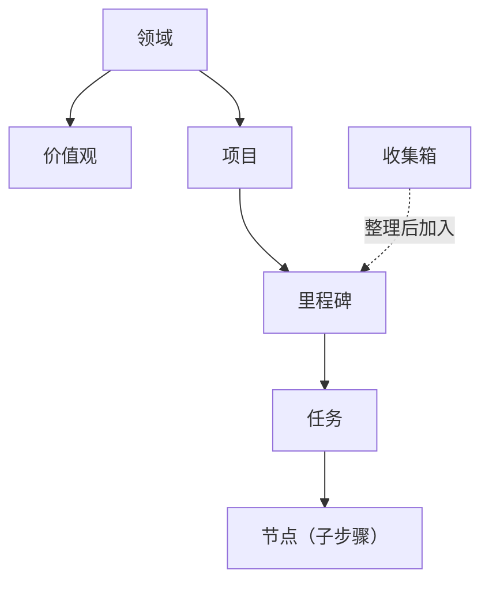

如果你在 GranoFlow 里看到一个词不懂，就在这页查：它会告诉你这个词指什么、放在哪里用、和其他概念是什么关系。

GranoFlow 的主要关系可以这样理解：领域下面有价值观和项目，项目下面有里程碑，里程碑下面有任务，任务里可以再拆节点；收集箱里的任务整理后可以加入项目或里程碑。

---

## 人生结构

### 领域

领域是你生活里的大方向，比如“工作”“健康”“家庭”“学习”。

它不是任务文件夹，不能直接拿来存任务。你可以把它理解成一张人生地图上的区域：项目会归到某个领域里，回顾时你就能看到自己最近把精力放在哪些方向。

### 价值观

价值观是你在某个领域里想长期坚持的标准，比如“工作上只做真正有影响力的事”。

它不是任务，不能被完成，也不会自动帮你打勾。它的作用是在回顾时提醒你：这段时间做的事，是否符合你自己定下的标准。

### 项目

项目是一个需要持续推进的目标容器，比如“搬家”“毕业论文”“开发 App v2”。

任务可以归属到项目和里程碑；整理到项目时，通常需要选择具体里程碑。项目或里程碑只说明任务属于哪里，不会单独让一条没有日期的任务离开收集箱。项目可以归档或完成；如果项目里还有未处理的任务，系统会先让你决定这些任务怎么处理。

### 里程碑

里程碑是项目里的阶段节点，用来把大项目拆成几个小阶段，比如“初稿完成”“测试通过”“上线”。

每个里程碑下面可以有任务。任务全完成后，里程碑才算可以关闭。它的用处是让长项目有清楚的阶段感，而不是一直像在做一件没有尽头的事。

### 任务

任务是 GranoFlow 里最基本的行动单位，也就是你要做的那件具体事情。

一个任务可以有标题、截止日期、提醒、标签、项目、里程碑和描述。任务状态包括：待办、进行中、已完成、已归档、回收站。任务完成时会记录完成时间；取消完成时，这个完成时间会被清除。

### 节点

节点是任务里的子步骤，用来拆解复杂任务。

比如任务是“提交税务申报”，节点可以是“整理收据”“填写表格”“提交”。当所有节点都完成时，父任务会自动完成；如果你又新增一个未完成节点，父任务会回到待办状态。

### 收集箱

收集箱是临时放任务的地方，适合放那些“先记下来，还没想好怎么安排”的事。

没有日期、并且状态是待办或进行中的任务，会出现在收集箱。项目和里程碑只是归属；如果任务仍然没有日期，它也可以继续留在收集箱。一旦你给任务安排了日期，或者完成、归档、删除它，它才会离开收集箱。你可以把收集箱想成口袋里的便条纸：先放进去，之后再整理。

---

## 使用节奏

### 规划

规划就是把一个模糊想法，变成有日期、有项目，或至少更清楚的可执行任务。

你可以在快速新增、收集箱整理或任务详情里做规划。输入框里的 `#` `@` `~` 是快捷方式，但任何真正写入数据的操作都需要你确认。

### 执行

执行就是开始做任务本身。

你可以配合专注计时、置顶任务或背景音乐使用。任务完成时，GranoFlow 会先把相关的专注会话收尾，再记录完成时间，这样回顾数据里的时间段不会混乱。

### 完成

完成表示任务已经做完，并且会记录一个完成时间。

日回顾按任务“实际完成的那一天”统计，不按截止日期统计。每天从 0 点开始算新的一天，0 点以后完成的任务会进入新一天的回顾。

### 归档

归档表示这件事已经封存，不再出现在当前工作视图里，但记录仍然保留，可以之后翻查。

项目、里程碑、任务都可以归档。归档前如果里面还有活跃任务，系统会先让你决定怎么处理这些任务。

### 日回顾

日回顾是用来查看“某一天实际完成了什么”的页面。

它按完成时间统计，不按截止日期统计。如果某天没有完成任务，页面会显示安静的空状态，不会用空图表制造压力。

### 复盘

复盘是回看一段更长时间里的投入、进展和状态。

你可以在周回顾、月详情等视图里做复盘。它关注的不是单纯完成了多少任务，而是你有没有在推进真正重要的事，以及精力分布有没有偏掉。

---

## AI 辅助

### AI 助手

AI 助手指的是你自己选择的外部 AI 工具，比如 ChatGPT、Codex、Claude、Gemini 或 DeepSeek。

GranoFlow 不内置一个会偷偷替你改数据的黑箱 AI。它会帮你准备提示词，复制到剪贴板，然后打开你选择的 AI 工具。

### 提示词

提示词是 GranoFlow 交给外部 AI 的说明文字，用来告诉 AI 应该问什么、整理什么、按什么格式输出。

你可以编辑提示词模板，但系统会阻止空模板或损坏的模板被保存。

### 剪贴板回流

剪贴板回流就是把外部 AI 生成的结果复制回 GranoFlow 的流程。

AI 的回复不会被自动写进你的任务。你把结果复制回来后，GranoFlow 会先识别格式并弹出确认；只有你同意后，内容才会真正导入。已经拒绝过或已经导入过的内容，不会反复弹窗。

---

## 数据与安全

### 本地优先

本地优先表示 GranoFlow 的核心数据会先存在你的设备上，不依赖服务器也能正常使用。

离线记任务、整理任务、做回顾都可以。只有当数据要离开设备时，比如备份或云同步，才会进入加密流程。

### 云同步

云同步会把你的本机数据和云端数据对齐，让不同设备看到同样的内容。

同步前，系统会检查账号、会员状态和加密密钥是否匹配。如果发现不一致，系统会先暂停并引导你确认，而不是静默覆盖数据。

### 端到端加密（E2EE）

端到端加密表示数据离开你的设备之前就已经被加密，服务器上保存的是密文。

这意味着 GranoFlow 的服务器读不到你的任务内容。本地搜索和日常使用优先保证速度；备份和云端上传才会走加密流程。

### 密钥

密钥是解锁加密备份和云端数据的关键凭证，**不是登录密码**。

密钥很重要。丢了密钥，就解不开旧备份或对应的加密云端数据。GranoFlow 会多次提醒你保存密钥，但服务器不能替你找回丢失的密钥。

### 备份与恢复

备份是把设备上的全部数据导出为 `.flow.grano` 文件，并用密钥加密保护。

恢复是把这个备份文件重新导入 GranoFlow，需要提供创建备份时使用的密钥。如果附件在备份时没有完全下载，备份里可能不会包含完整附件。

### App 锁定

App 锁定会在你打开应用时增加一次本机验证，比如 Face ID、指纹或 PIN。

它可以降低别人临时拿到你设备就能翻看内容的风险。但它不是全能防护；如果设备本身已经被破解，它挡不住这种情况。

---

## 账户与权益

### 账户

账户用于登录、同步、订阅识别和账号恢复。

当前主要登录方式是邮箱验证码。未登录也可以使用本地功能，但进入云同步时，系统会引导你先登录。

### 会员与权益

会员，包括 Pro 或天使会员，表示你购买了正式权益。

权益由服务端确认，不是客户端自己判断。权益会影响云同步、存储配额、附件补下载等功能。如果订阅买在另一个账号上，当前账号不会自动获得对应权益。

---

## 界面与设备

### 桌面端 vs 移动端

桌面端，也就是 Windows、macOS、Linux，更适合长时间整理、项目管理和回顾。

移动端，也就是 iOS 和 Android，更适合快速记录和随手捕捉。

### 系统托盘

在桌面端，关掉窗口可能只是把 GranoFlow 隐藏到系统托盘，它仍然在后台运行。

这种情况下，专注计时不会中断。要彻底退出，请从托盘菜单选择“退出”。

### 侧边栏模式

桌面端可以把 GranoFlow 收成窄窗口，贴在屏幕边缘使用。

这样你可以一边做其他事，一边查看或勾选任务。
