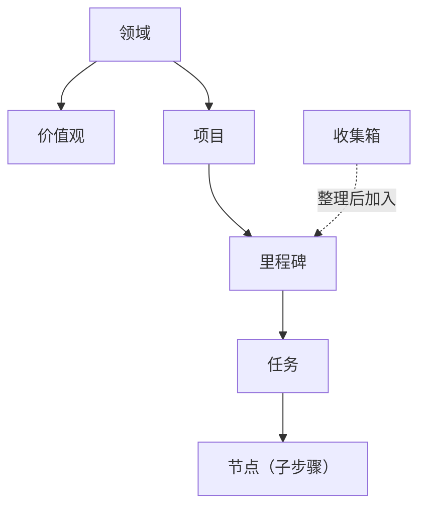

不知道某个词是什么意思？翻这页就够了。每个概念都只用两三句话解释清楚，不废话。

下图展示了 GranoFlow 里各概念的层级关系：

---

## 人生结构

### 领域

你的人生可以分几个大方向，比如"工作""健康""家庭""学习"，这些就是领域。

领域不是文件夹，不存任务，它更像是你给自己画的人生地图上的几块区域。项目会归属到某个领域，回顾的时候你能看到自己最近在哪些领域投入了精力。

### 价值观

价值观是你在某个领域里希望长期坚持的判断标准，比如"做工作时：只做真正有影响力的事"。

它不是任务，不能被完成，也不会自动把事情打勾。它主要在回顾时帮你问自己：这段时间的行动，有没有符合我自己的标准？

### 项目

项目是一段时间内要持续推进的目标容器，比如"搬家""毕业论文""开发 App v2"。

任务可以挂在项目里，收集箱的任务一旦被加入项目就会消失。项目可以归档或完成，但如果里面还有未处理的任务，系统会先让你决定怎么处理它们。

### 里程碑

里程碑是项目里的阶段节点，用来把大项目拆成小阶段，比如"初稿完成""测试通过""上线"。

每个里程碑下面有任务，任务全完成后里程碑才算可以关闭。它的作用是让你在推进长项目时，不会感觉永远在走一段看不到头的路。

### 任务

任务是 GranoFlow 的基本行动单位——就是你要做的那件具体的事。

一个任务可以有标题、截止日期、提醒、标签、项目、里程碑和描述。任务有几种状态：待办、进行中、已完成、已归档、回收站。完成时会记录时间，取消完成会清除这个时间。

### 节点

节点是任务里面的步骤，用于拆解一个复杂任务。

比如任务是"提交税务申报"，节点可以是"整理收据""填写表格""提交"。节点全部完成后，父任务会自动完成；新增一个未完成的节点，父任务会回到待办。

### 收集箱

收集箱是"还没想好怎么安排"的任务的临时停放处。

只有没有截止日期、没有项目、没有里程碑，且状态是待办或进行中的任务，才会出现在收集箱。一旦你给任务加了日期或加入了项目，它就自动离开收集箱。把收集箱想成你口袋里的便条纸——先扔进去，等你有时间再整理。

---

## 使用节奏

### 规划

把脑子里的想法变成一个有日期、有项目的可执行任务，这个过程叫规划。

你可以在快速新增、收集箱整理或任务详情里做规划。输入框里的 `#` `@` `~` 是快捷方式，但任何写入都需要你确认。

### 执行

执行就是真的去做任务——可以配合专注计时、置顶任务或背景音乐使用。

任务完成时，GranoFlow 会先把相关的专注会话收尾，再记录完成时间，避免回顾数据出现时间段混乱。

### 完成

完成表示任务做完了，会记录一个完成时间。

这个时间在日回顾里很重要——回顾是按任务"实际完成那天"统计的，不是按截止日期。如果你凌晨 3 点前完成，它还算是"昨天"的。

### 归档

归档表示这件事已经封存，不会出现在当前工作视图里了，但记录还在，可以翻查。

项目、里程碑、任务都可以归档。归档前如果里面还有活跃任务，系统会让你先决定怎么处理。

### 日回顾

日回顾是每天结束时看一看"今天实际完成了什么"的页面。

按完成时间统计，不按截止日期。没有完成任务的日期会安静显示空态，不会用空图表制造焦虑。

### 复盘

复盘是回看一段时间的投入、进展和状态——比日回顾覆盖的时间更长。

你可以在周回顾、月详情等视图里做复盘，关注的是：我有没有在推进真正重要的事？投入分布有没有偏？

---

## AI 辅助

### AI 助手

AI 助手是你自己选择的外部 AI 工具，比如 ChatGPT、Claude、Gemini 或 DeepSeek。

GranoFlow 不内置一个替你改数据的黑箱 AI。它帮你准备好提示词，复制到剪贴板，再打开你选的 AI。

### 提示词

提示词是 GranoFlow 交给外部 AI 的说明文字，告诉 AI 应该问什么、整理什么、输出什么格式。

你可以编辑模板，但系统会阻止空模板或损坏的模板被保存。

### 剪贴板回流

这是把 AI 生成的结果复制回 GranoFlow 的流程。

AI 回复不会被偷偷写进你的任务。你把结果复制回来，GranoFlow 先识别格式，弹出确认，你点同意之后才会真正导入。拒绝过或已经导入过的内容，不会反复弹窗。

---

## 数据与安全

### 本地优先

本地优先表示 GranoFlow 的核心数据先存在你的设备上，不依赖服务器也能正常用。

离线记任务、整理、回顾，都没问题。数据传出设备时（备份、云端同步），才进入加密流程。

### 云同步

云同步把你的本机数据和云端对齐，让不同设备看到同样的内容。

同步前会检查账号、会员状态、加密密钥是否匹配。发现不一致时，系统会先暂停并引导你确认，而不是静默覆盖。

### 端到端加密（E2EE）

端到端加密意味着数据离开你的设备之前就已经加密，服务器上存的是密文，GranoFlow 的服务器读不到你的任务内容。

本地搜索和使用优先保证速度；备份和云端上传才走加密流程。

### 密钥

密钥是解锁加密备份和云端数据的关键凭证，**不是登录密码**。

密钥很重要，丢了就解不开旧备份。GranoFlow 会多次提醒你保存，但服务器不能替你找回丢失的密钥。

### 备份与恢复

备份是把设备上的全部数据导出为 `.flow.grano` 文件，用密钥加密保护。

恢复是把备份文件重新导入 GranoFlow，需要提供创建备份时的密钥。如果附件当时没有完全下载，备份可能不完整。

### App 锁定

App 锁定在你打开应用时增加一次本机验证（Face ID / 指纹 / PIN），减少别人临时拿到你设备就能翻看内容的风险。

它不是全能防护——设备本身被破解的情况下它挡不住。

---

## 账户与权益

### 账户

账户用于登录、同步、订阅识别和账号恢复。当前主要登录方式是邮箱验证码。

未登录也可以用本地功能，但云同步入口会引导你先登录。

### 会员与权益

会员（Pro 或天使会员）表示你购买了正式权益。权益由服务端确认，不是客户端自己说了算。

权益影响云同步、存储配额、附件补下载等功能。买了订阅但连接到了另一个账号的情况，当前账号不会自动获得对应权益。

---

## 界面与设备

### 桌面端 vs 移动端

桌面端（Windows / macOS / Linux）适合长时间整理、项目管理和回顾；移动端（iOS / Android）适合快速记录和随手捕捉。

### 系统托盘

桌面端关掉窗口可能只是隐藏到托盘，GranoFlow 仍在后台运行。专注计时不会因此中断。要彻底退出，从托盘菜单选"退出"。

### 侧边栏模式

桌面端可以把 GranoFlow 收成窄窗口贴在屏幕边缘，一边做其他事一边查看或勾选任务。
