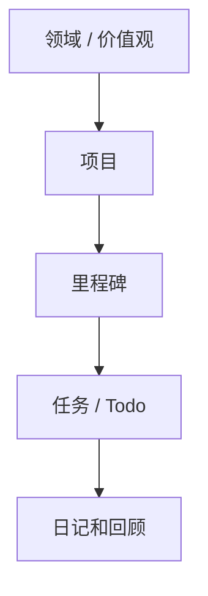

GranoFlow 是一个本地优先的个人规划应用。你可以先把它当 Todo 用：记下任务、安排时间、完成后勾掉；之后再把任务连到项目、里程碑、价值观和回顾里，看自己每天做的事是否真的在推进重要目标。

## 任务只是入口

最简单的用法是：想到一件事，就在 GranoFlow 里新增一个任务。你不需要一开始就把所有内容整理完。

等你有时间时，可以再决定这个任务属于哪个项目、和哪个里程碑有关、什么时候处理。任务在 GranoFlow 里不是孤立清单，而是一个入口，帮助你把日常事情放回更大的生活结构中。

## 不只是 Todo 清单

普通 Todo 工具通常只回答一个问题：今天要做什么？

GranoFlow 还会帮你多看一层：这些任务属于哪个项目？项目在推进哪个里程碑？这些事和你在意的方向有没有关系？

下面是 GranoFlow 里常见的关系：

这样，即使一周只完成了几件事，你也可以回头看：它们只是让你变忙，还是确实让某个项目往前走了一点。

## 回顾不等于打卡

GranoFlow 也是复盘工具。日回顾和每周价值观记录不是为了制造连续打卡压力，也不是为了把暂停说成失败。

你可以用它记录发生了什么、当时怎么想、下一步准备怎么调整。回顾的重点是看清事实，而不是责备自己。

## 保留私人的规划空间

GranoFlow 采用本地优先产品思路。核心记录先在设备上；同步、备份和加密各有明确边界。

AI 辅助回顾可以帮你整理思考，但它只是辅助。要不要采纳、怎么调整、下一步做什么，仍然由你决定。

:::note[刚开始用？]
第一次打开 GranoFlow，只需要记住一件事：点 **+** 可以新增任务。其他功能可以等真正需要时再探索。
:::
