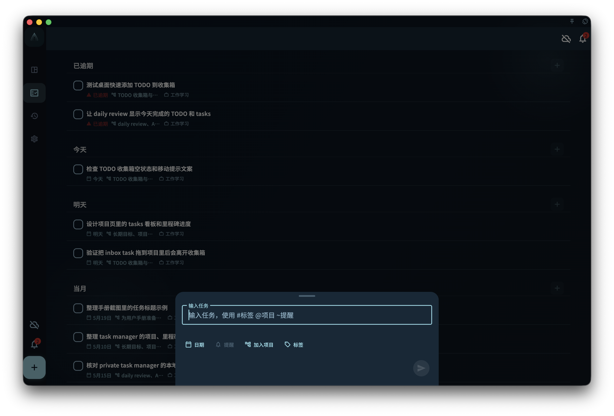

这一章把 Tiny Habits、福格行为模型和微习惯方法，转成 GranoFlow 中低阻力任务、自然提示、完成反馈和日回顾的实践。它适合把习惯养成接回长期项目，而不是只追连续打卡。

这一页给你一个很短的实践方法。

目标不是一次建立完整习惯系统，而是用 5 分钟在 GranoFlow 里完成一个微习惯闭环：

> 选择方向 → 写成小任务 → 找到提示 → 完成 → 回顾

## 第一步：选择一个真实方向

不要先问“我要养成什么伟大的习惯”。

先问：

> 我现在希望生活里哪件事变得稳定一点？

例如：

- 身体状态
- 英语学习
- 写作表达
- 睡前整理
- 每天回顾
- 项目推进

方向可以很普通。习惯养成最怕一开始就写得太宏大。

## 第二步：把它缩小成一个任务

在 GranoFlow 里写一个小到能开始的任务。

<!-- manual-screenshot:id=interface-quick-add-main -->


不要写：

> 坚持运动

可以写：

> 晚饭后做 2 分钟拉伸

不要写：

> 学好英语

可以写：

> 听 3 分钟英语材料

不要写：

> 每天复盘

可以写：

> 睡前写下今天完成的一件事

判断标准很简单：如果你看到它还想逃开，它可能还不够小。

## 第三步：给它一个自然提示

Tiny Habits 很重视提示。一个行为如果没有触发点，很容易被忙碌冲掉。

你可以在任务标题里直接写出触发场景：

- 早餐后，读 1 页书
- 关电脑前，写下明天第一件事
- 刷牙后，做 1 分钟拉伸
- 打开 GranoFlow 后，整理一个收集箱任务

提示不需要复杂。它最好接在一个你已经会做的动作后面。

## 第四步：只完成最小版本

做完最小版本，就把任务标记为已完成。

不要在第一天临时加码，把 2 分钟变成 30 分钟，再用超额完成证明自己“终于改变了”。

微习惯的价值在于降低开始成本。你当然可以多做，但 GranoFlow 里记录的那一步，应该仍然小到你明天也愿意回来。

## 第五步：做一次很短的回顾

当天结束时，写三句话就够：

```text
今天完成了什么微习惯？

它发生在什么场景后面？

这个版本是否足够容易继续？
```

例如：

```text
今天晚饭后做了 2 分钟拉伸。

它接在收拾餐具之后，提示比较自然。

动作足够小，明天可以继续。
```

回顾不是检查你有没有完美坚持。

它是在观察这个习惯设计是否有效：行为够小吗？提示自然吗？做完后感觉是否愿意继续？

## 不要急着堆很多习惯

一开始选一个就够。

GranoFlow 可以放很多任务、项目和回顾，但习惯养成不需要一次铺满生活。先让一个微小行为稳定出现，再决定是否扩大。

下一步可以继续阅读：[把微习惯接回长期项目](/habit-formation-tiny-habits/from-habit-to-project/)。
