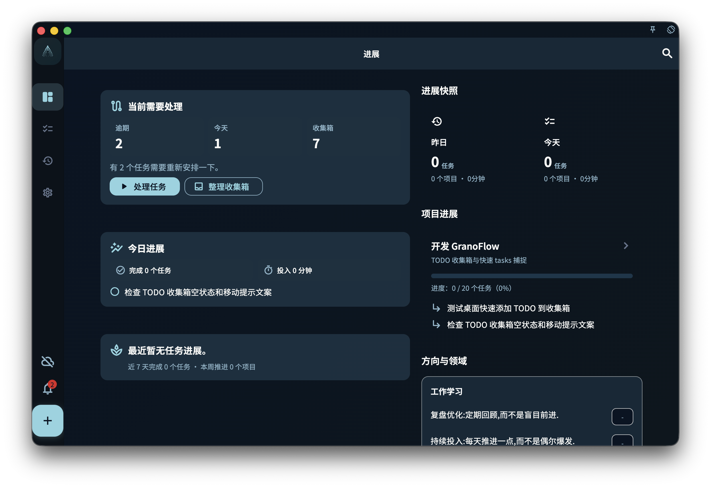

「进展」是 GranoFlow 的默认首页，用来快速查看你最近有没有在稳定推进。

它不是单纯的统计页，而是一张当前状态看板：你可以看到今天做了什么、昨天留下了什么、本周和本月推进了哪些项目，以及这些行动是否正在连接到更长期的方向。

## 今日与昨日

页面会显示「今天」和「昨天」的简要状态，包括完成任务数、涉及项目数和专注时间。

<!-- manual-screenshot:id=interface-home-progress-main -->

点击「今天」可以进入任务页，继续处理当前任务。  
点击「昨天」可以进入对应日期的回顾，查看昨天完成了什么。

## 项目进展

如果你正在推进项目，进展页会显示重点项目卡片。

项目卡片通常包含：

- 项目名称
- 当前关注的里程碑
- 任务完成进度
- 最近需要继续推进的任务

点击项目卡片，可以进入对应项目详情页。

## 领域价值进展

如果你在回顾中记录了与长期方向有关的内容，进展页会按领域展示这些价值项。

这部分不是为了打分或排名，而是帮助你看到：最近的行动是否仍然连接着自己重视的方向。

## 本周与本月

进展页还会汇总本周和本月的推进情况，包括项目数、完成任务数和专注时间。

点击本周或本月统计，可以进入回顾页查看更完整的周回顾或月历视图。

## 回顾入口

当一天接近结束，或当天已有任务进展时，页面可能会显示回顾入口。

你可以从这里写今日回顾，也可以打开月历查看更长时间范围内的积累。

## 第一次使用时

如果你还没有创建任务、项目或领域内容，进展页会显示新手引导。

你可以先完成三件事：

1. 创建第一条任务。
2. 创建第一个项目。
3. 编辑一个重要领域或价值方向。

完成这些之后，进展页会逐渐从引导页变成你的个人进展看板。
