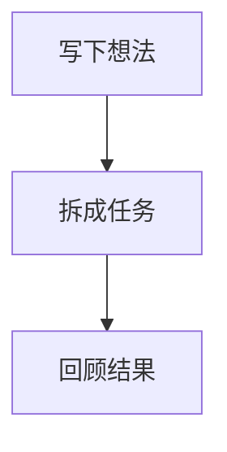

GranoFlow 的长文本字段使用 Markdown 保存内容。你可以把它当作一段带格式的文字：普通文字直接输入，需要结构时再加入 Markdown 语法。

常见位置包括任务描述、项目或里程碑说明、回顾记录，以及支持 Markdown 的卡片字段。不同页面的入口文案可能不同，但写法是一致的。

## 打开编辑器

在支持 Markdown 的字段里点击描述或内容区域，会进入编辑页。顶部工具栏可以在三种模式间切换：

| 模式 | 适合什么情况 |
| --- | --- |
| Source | 直接编辑 Markdown 源码，最稳定，也最适合排查格式问题 |
| Basic | 一边写源码，一边查看预览 |
| Advanced | 在 Basic 的基础上提供插入表格、公式、图表和媒体链接的按钮 |

手机或窄屏上可以通过工具栏里的预览按钮打开预览页，再用顶部返回回到编辑页。

<!-- manual-screenshot-needed:id=markdown-editor-modes; reason=展示 source/basic/advanced 切换、预览按钮和保存按钮 -->

## 添加表格

在 Advanced 模式里点击表格按钮，输入行数和列数后，GranoFlow 会插入标准 Markdown 表格模板。插入后继续在源码里改表头和单元格文字。

也可以手写：

```markdown
| 名称 | 状态 | 下一步 |
| --- | --- | --- |
| 发布说明 | 进行中 | 补截图 |
| 回归测试 | 待开始 | 跑桌面端 |
```

表格最容易出错的地方是分隔行。第二行必须保留 `---`，列数也要和表头一致。单元格里的竖线 `|` 会被当作分列符号；如果确实要显示竖线，尽量改写文字，或者用代码格式包起来。

<!-- manual-screenshot-needed:id=markdown-table-insert; reason=展示表格插入弹窗、插入后的源码和预览里的表格 -->

## 添加公式

公式使用 LaTeX 写法。块级公式适合单独占一行：

```markdown
$$
E = mc^2
$$
```

行内公式适合放在句子里：

```markdown
当 $a^2 + b^2 = c^2$ 时，可以表示直角三角形三边关系。
```

公式内容会作为 Markdown 源码保存。不同平台的公式渲染能力可能随版本逐步开放；如果当前版本或当前页面尚未渲染 LaTeX，公式不会丢失，通常会以源码或普通文本形式显示。遇到公式显示异常时，先切回 Source 模式检查 `$`、`$$` 是否成对。

<!-- manual-screenshot-needed:id=markdown-latex-rendering; reason=展示公式源码保存，以及支持时在正文内渲染的效果 -->

## 添加远程图片

远程图片使用标准 Markdown 图片语法：

```markdown

```

方括号里的文字是图片说明。图片加载失败、链接失效或网络不可用时，这段说明会帮助你判断原本放的是什么。

远程图片会访问外部网站。第一次加载远程资源前，GranoFlow 会弹窗确认；如果你勾选以后不再提示，设置会保存在当前设备上。之后可以到设置里重新打开提示，让下次远程图片、音频或视频再次请求确认。

常见问题：

- 链接必须能直接打开图片文件；网页地址不一定能当图片显示。
- 需要登录、带防盗链、临时签名或很快过期的图片链接，可能无法长期显示。
- 远程图片不会变成本地附件；原网站删除或改权限后，内容可能无法再加载。

<!-- manual-screenshot-needed:id=markdown-remote-image-consent; reason=展示远程图片 trigger、首次加载确认弹窗和已同意后的图片显示 -->

## 添加远程音频

音频可以写成普通链接，只要链接指向常见音频文件：

```markdown
[森林环境音](https://example.com/forest.ogg)
```

当前识别的常见音频后缀包括 `.mp3`、`.m4a`、`.aac`、`.wav`、`.ogg`。渲染时会显示一个音频 trigger，点击后再打开或播放；不会在未确认远程资源前自动请求外部网站。

容易出错的地方：

- 链接如果不是直接音频文件，而是一个播放网页，可能只会作为普通网页打开。
- 某些音频站点禁止外部 App 直接播放。
- 大文件、弱网络或服务器限速会导致打开很慢。

<!-- manual-screenshot-needed:id=markdown-remote-audio-trigger; reason=展示远程音频链接渲染成 trigger，以及点击前的远程资源确认 -->

## 添加 YouTube 视频

YouTube 视频建议使用普通链接：

```markdown
[自然风景短片](https://www.youtube.com/watch?v=4hXYRXaJdtk)
```

GranoFlow 不会在正文里自动加载第三方播放器。视频链接会以 trigger 或链接形式出现，点击后再打开外部页面或播放器。这样可以避免页面一打开就向 YouTube 请求内容，也能减少第三方平台嵌入限制带来的问题。

限制和易错点：

- 需要登录、地区受限、年龄限制或已下架的视频无法保证可播放。
- YouTube、Vimeo 等第三方平台可能调整播放、嵌入或隐私策略。
- 如果你想让内容长期可复用，最好在链接旁写一句文字说明，避免视频失效后看不出原意。

<!-- manual-screenshot-needed:id=markdown-youtube-video-trigger; reason=展示 YouTube 链接的 trigger/外部打开提示和远程资源确认 -->

## 图表和 Mermaid

图表使用 Mermaid 代码块：

````markdown

````

GranoFlow 会把 Mermaid 代码块识别为图表 trigger。点击后在独立视图里查看图表；如果当前版本或平台无法渲染图表，源码仍会保留，你可以回到 Source 模式继续编辑。

Mermaid 对缩进、箭头和节点字符比较敏感。图表打不开时，先检查代码块第一行是不是 ` ```mermaid `，最后一行是不是单独的 ` ``` `，再检查节点名称里是否混入了没有配对的括号或引号。

<!-- manual-screenshot-needed:id=markdown-mermaid-trigger; reason=展示 Mermaid 源码、图表 trigger 和独立查看视图 -->

## 远程资源确认和设置

远程图片、音频、视频、YouTube 或 Vimeo 链接都可能向外部服务发起请求。GranoFlow 的原则是：没有确认前，不自动加载远程内容。

第一次点击或加载远程资源时，你会看到确认弹窗。勾选“以后不再提示”后，当前设备会记住这个选择。这个设置只影响当前设备，不会改变你的任务、项目、回顾或卡片内容。

想重新看到确认弹窗时，进入设置页，找到远程 Markdown 资源提醒相关开关，把它改回需要提醒的状态。

<!-- manual-screenshot-needed:id=markdown-remote-resource-setting; reason=展示设置页里的远程 Markdown 资源提醒开关 -->

## 排查格式问题

格式不对时，先切到 Source 模式。大多数问题都可以从源码看出来：

- 表格不显示：检查第二行 `---` 和每行列数。
- 公式不显示：检查 `$` 或 `$$` 是否成对。
- 图片不显示：确认链接是直接图片地址，且不需要登录。
- 音频或视频没有 trigger：确认链接后缀是支持的音频或视频格式。
- YouTube 打不开：确认视频没有下架、地区限制或登录要求。
- 图表打不开：确认 Mermaid 代码块完整，语法没有多余符号。

如果内容很重要，建议在链接后补一句说明。远程媒体本身可能失效，但文字说明会继续留在 GranoFlow 里。
