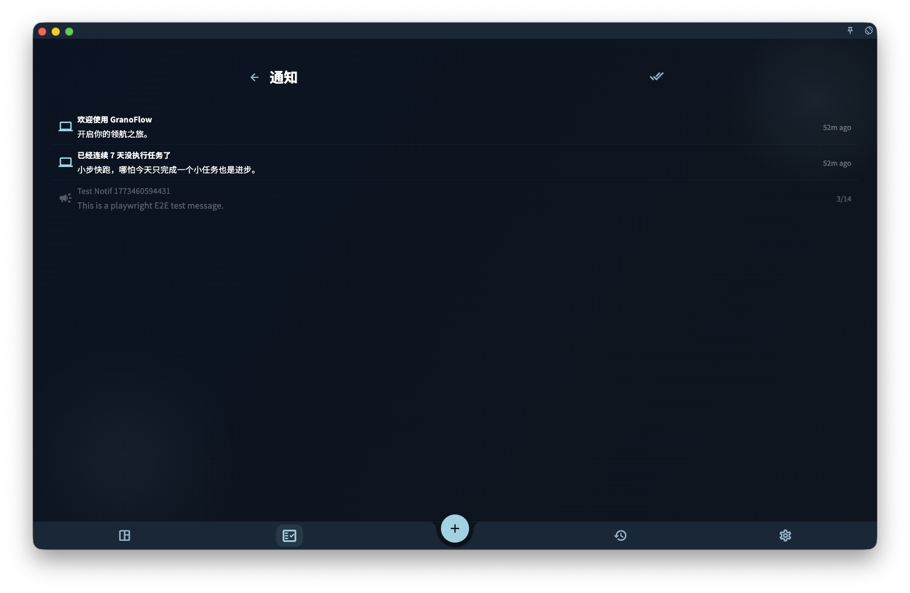

通知页就像 GranoFlow 内部的收件箱——App 想告诉你的消息都在这里。

## 通知页能做什么

- 查看未读消息（未读状态会有标记）
- 点击通知跳转到对应功能位置
- 全部标记为已读

## 注意：通知不等于状态确认

"全部标记为已读"只是改变了通知的已读状态，不代表通知里提到的问题已经解决。

如果你在排查同步、订阅权益、账号或任务提醒的问题，不要只看通知页——回到对应的功能页面，才能看到当前的真实状态。

通知可以提示你"有事发生"，但不能替代那些页面本身的确认。

## 和系统通知的关系

通知页显示的是 **App 内消息**。

系统层面的推送通知（比如任务提醒弹窗）是否出现，还受系统权限、平台后台限制和网络状态影响。如果你的任务提醒没有按时弹出，需要同时检查：系统通知权限是否开启、设备是否处于勿扰模式。
