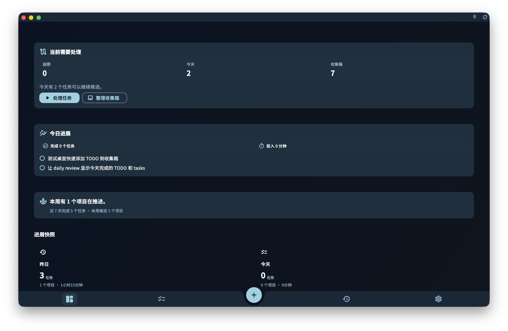

想知道 GranoFlow 里每个功能在哪里，先看主界面的四个入口：**进展** 看状态，**任务** 处理待办，**回顾** 做复盘，**设置** 管账号、同步、数据、AI 辅助、外观和偏好；中间的 **+** 用来快速新增一件事。

GranoFlow 的主界面很简单。手机竖屏时，导航通常在底部；横屏或桌面时，导航可能在左侧。位置会变，但入口还是这几个。

<!-- manual-screenshot:id=interface-overview-navigation -->

## 四个主要入口

| 入口 | 在这里能做什么 |
| ---- | -------------- |
| **进展** | 默认首页。用来看今天完成了什么，以及项目大概处在哪个阶段。 |
| **任务** | 查看任务清单，并继续推进还没完成的任务。 |
| **回顾** | 做日回顾、周回顾，也可以查看月度日历。 |
| **设置** | 管理账号、同步、数据、AI 辅助、外观与偏好。 |

## 快速新增

底部中间的 **+** 是快速新增入口。

你想到一件事时，点 **+**，先把它写下来。需要的话，可以同时设置日期、项目、里程碑和标签；不确定也没关系，可以先不设置，之后再整理。

这个入口不会把你带到一个完全独立的页面。它的作用是让你在当前界面里快速记录想法或任务。

:::tip[找不到某个功能？]
先去 **设置** 看看。账号、同步、数据、AI 辅助、外观和偏好这类不常用但重要的入口，通常都在那里。任务、项目进展和回顾这些常用功能，直接从主导航切换。
:::
