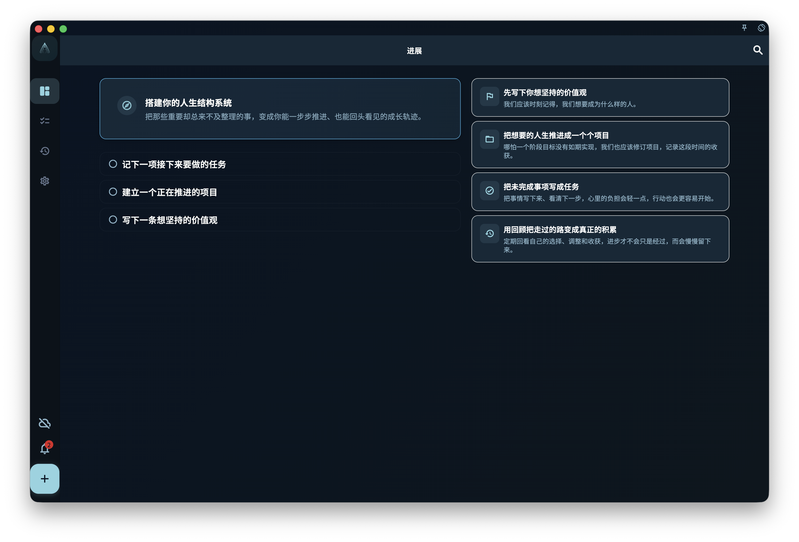

当你第一次打开 GranoFlow，或本地数据还没有形成任务、项目和价值观内容时，「进展」页会先显示第一次使用引导。

这个状态不是错误，也不是统计页没有加载出来。它是在告诉你：GranoFlow 还没有足够的内容生成个人进展看板，所以先给你一条最短路径，把重要的事写下来，再逐渐变成可以回顾的结构。

<!-- manual-screenshot:id=interface-progress-onboarding-cold-start -->

## 你会看到什么

横屏或桌面窗口足够宽时，页面左侧会显示标题「搭建你的人生结构系统」和三个起步动作：

1. 记下一项接下来要做的任务。
2. 建立一个正在推进的项目。
3. 写下一条想坚持的价值观。

右侧会显示四条方法文案，解释 GranoFlow 希望你怎样开始：

- 先写下你想坚持的价值观。
- 把想要的人生推进成一个个项目。
- 把未完成事项写成任务。
- 用回顾把走过的路变成真正的积累。

在较窄的窗口或竖屏设备上，这些内容会改成单列排列，但含义不变。

## 什么时候会消失

当你完成起步动作，或应用检测到已经有任务、项目、注册账号、导入历史或有效同步历史时，GranoFlow 会旁路这个第一次使用引导。

之后再次进入「进展」页，你会看到面向已有数据的状态：当前需要处理什么、今天如何继续、近期项目、领域价值观、周/月进展和回顾入口。

## 和普通进展页的区别

第一次使用引导只负责帮你开始。它不会提前显示工作队列、今日进展或简短反馈，因为这些卡片需要真实任务和项目数据才有意义。

如果你已经导入了备份或同步过数据，却仍然看到这个状态，通常说明本地数据还没有完成恢复、导入或刷新。等数据完成加载后，再回到「进展」页检查一次。

## 相关页面

- [进展](/manual/interface/home-progress/)
- [任务系统总览](/manual/tasks/overview/)
- [项目与里程碑总览](/manual/projects/overview/)
- [回顾系统总览](/manual/review/overview/)
