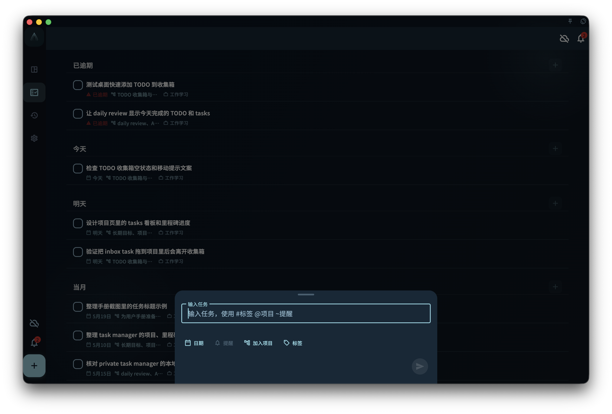

快速添加适合先把脑中想到的一件事记下来。点击底部中间的 `+` 后，输入任务标题，再提交即可保存。

如果暂时不想分类，只写标题就够了。没有日期、项目或里程碑的任务会进入收集箱，之后再整理。

## 直接写标题

可以输入一行普通文字，例如：

```text
整理周报
给 Alex 回邮件
检查发布截图
```

写完后点击提交按钮。系统会把这一行作为任务标题保存。

## 在标题里加字段

桌面端输入框会提示 `#标签 @项目 ~提醒`。这些符号是快捷入口，不是必填项。

<!-- manual-screenshot:id=interface-quick-add-main -->


- 输入 `#` 可以搜索标签。
- 输入 `@` 可以搜索项目或里程碑。
- 输入 `~` 可以写提醒时间。

例如：

```text
检查订阅页文案 @官网改版 #发布 ~明天 8点
```

快捷入口只有在你选择候选，或用 `Enter` / `Tab` 确认后，才会写入任务字段。未确认的 `#发布` 或 `@官网改版` 会保留在标题里，按普通文字保存。

## 日期和提醒

你也可以直接写日期词，例如：

```text
周五前检查发布截图
```

日期词会先被高亮或显示为待确认的日期。点击日期提示，或在日期词后输入空格完成确认后，它才会成为任务日期；没有确认的日期词会继续留在标题里。

提醒用 `~` 开始，例如：

```text
明天整理截图 ~8点
给 Alex 回邮件 ~8am
```

提醒是通知时间，不等同于任务日期。若当前任务还没有日期，Granoflow 会根据提醒时间补一个合适的任务日期；你也可以用下方的日期按钮手动选择。

## 用下方按钮选择

不想记快捷符号时，可以直接用输入框下方的按钮：

- 日期
- 提醒
- 加入项目
- 标签

按钮和 `#`、`@`、`~` 写入的是同一组任务字段。已经选择的字段会显示成小标签，可以再次点击修改，或点掉移除。

## 建议和纠错

输入时，Granoflow 可能会显示相似任务建议。点击建议会套用那条任务的标题，以及它最近一次保存的标签、项目或里程碑，并直接创建新任务。

如果系统发现明显拼写问题，第一次提交可能会先把文字修正出来，而不是立刻保存。检查修正后的标题后，再次提交即可保存。

## 移动端和桌面端

移动端输入提示更简短，通常只提示你输入新任务。桌面端会显示 `#标签 @项目 ~提醒`，方便键盘操作。

无论在哪个端，快捷符号都只是加速方式。你可以完全不用它们，只通过下方按钮设置日期、提醒、项目、里程碑和标签。
