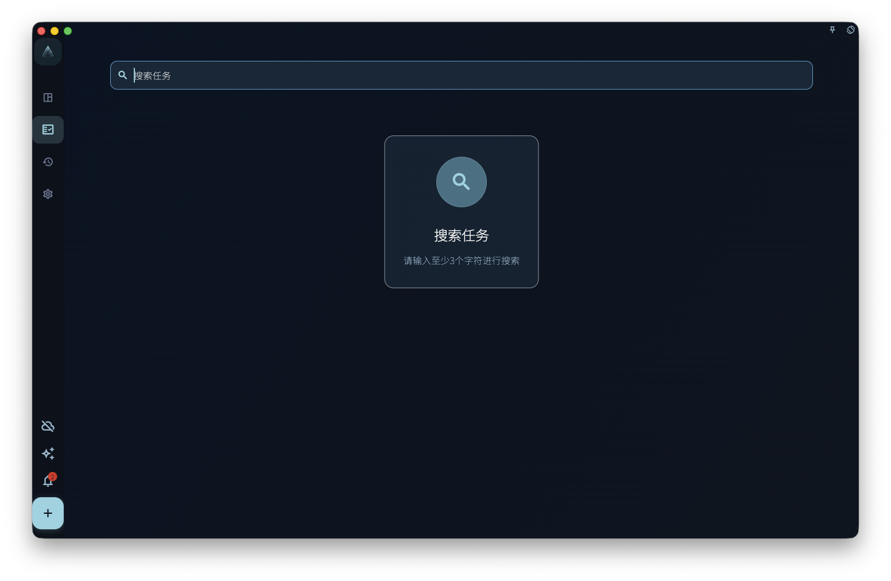

搜索用来快速找到已有任务。它适合在你记得一部分标题、但不确定任务现在放在哪个列表时使用。

不要把搜索当成完整的数据审计、附件全文检索或长期筛选规则。它是找回和跳转入口，不会替你重新整理任务。

## 从哪里进入

从首页或主界面的搜索入口进入。打开搜索页后，输入至少一段足够明确的关键词，再查看结果。

<!-- manual-screenshot:id=interface-search-main -->

如果关键词太短，页面会先提示你继续输入。没有结果时，说明当前可搜索范围内没有匹配项，不代表所有历史数据、附件或已删除内容都被逐项检查过。

## 结果如何使用

搜索结果以任务为主。点开某条结果后，GranoFlow 会根据任务当前状态带你回到对应位置，例如收集箱、任务列表、已完成、归档或回收站。

如果任务属于项目，打开结果后仍要在任务或项目上下文里继续判断它和阶段、里程碑、日期的关系。

## 适合什么时候用

- 记得任务标题的一部分，但忘了它放在哪。
- 想快速打开一个已完成或已归档的任务。
- 整理收集箱、项目或回顾前，先找出某个旧任务。

搜索不会创建新任务，不会批量修改结果，也不会保存成自动筛选视图。需要长期按标签、项目、日期或完成状态查看时，继续使用对应列表和项目页面。
