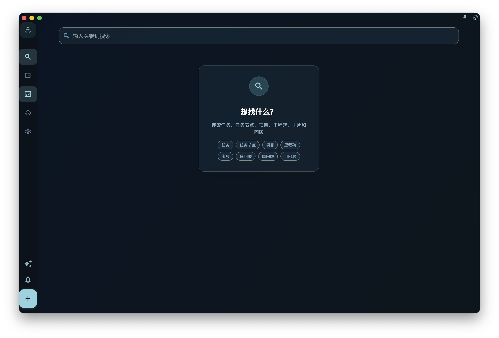

如果你记得任务、任务节点、项目、里程碑、日回顾、周回顾或月回顾内容里的一两个词，但忘了它在哪里，就用搜索来把它找出来并打开。搜索的作用是“找已有内容”，不是做完整检查，也不是替你整理任务或项目。

## 从哪里进入

从首页或主界面的搜索入口进入搜索页。打开后，在输入框里输入比较明确的关键词，例如任务标题、任务节点标题、项目说明、里程碑摘要或回顾记录中的几个连续字词，然后查看下面出现的结果列表。

你也可以在搜索词里加入结构化条件：

- 输入 `#标签`，只看带有这个标签的任务。标签可以写系统标签展示名或已有自定义标签名，例如 `#重要`、`#紧急`、`#Work-Learning`、`#家`。
- 输入 `@项目`，只看属于这个项目的任务。项目名可以写完整名称，也可以写能唯一指向项目的部分名称。
- 普通关键词可以和结构化条件一起使用，例如 `方案 #重要 @产品优化`。

<!-- manual-screenshot:id=interface-search-main -->

如果只输入普通关键词，关键词太短时页面会提示你继续输入。`#标签` 或 `@项目` 这种结构化条件可以单独搜索，不需要先凑够三个字。

如果没有结果，只表示当前可搜索范围内没有匹配项。也可能是标签名或项目名没有对应到已有对象。它不代表 GranoFlow 已经逐项检查了所有附件内容、已删除内容或未纳入搜索范围的历史数据。

## 结果如何使用

搜索结果按类型分栏显示，只显示有结果的分栏。分栏顺序是任务、项目、里程碑、日回顾、周回顾、月回顾。任务内节点命中时，不会单独出现“节点”分栏，而是把所属任务显示为一条任务结果，并在任务结果下列出命中的节点。这样你既能看到命中原因，也能立刻知道它属于哪个任务。

任务结果里会展示标题、更新时间和命中的文字。多个节点、任务描述或任务回顾同时命中时，会在同一条任务结果下显示最多两行的命中节选。任务标题本身直接命中时，结果只显示任务标题和基础信息，不再展开描述、回顾或节点内容。

点开某条任务结果后，GranoFlow 会按这个任务当前所在的位置带你过去。它可能在收集箱、任务列表、已完成、归档或回收站里。点开项目或里程碑结果会进入对应项目上下文；点开回顾结果会进入成就与回顾页面，并尽量定位到对应日期或周。

如果结果属于某个项目，打开后仍然要回到任务或项目页面里继续判断：它属于哪个阶段、和哪个里程碑有关、日期是否还合适。

## 适合什么时候用

- 你记得任务、任务节点、项目、里程碑、日回顾、周回顾或月回顾文本的一部分，但忘了它放在哪。
- 你想快速打开一个已完成或已归档的任务。
- 你在整理收集箱、项目或做回顾前，想先找出某个旧任务。

搜索不会创建新任务，不会创建新标签或新项目，不会批量修改搜索结果，也不会保存成自动筛选视图。如果你需要长期按标签、项目、日期或完成状态查看任务，请继续使用对应的列表和项目页面。
