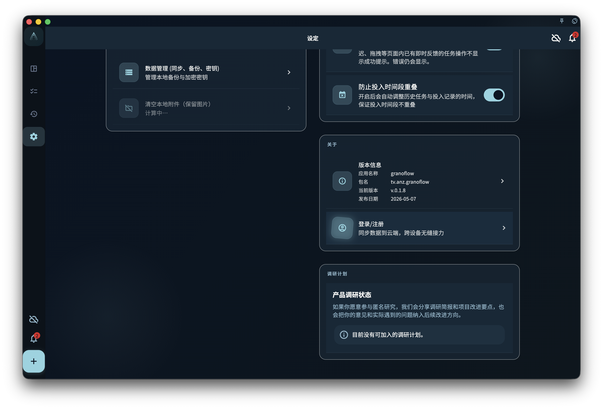

设置相关页面：

- [设置总览](/manual/interface/settings-overview/)
- [语言、主题与字体](/manual/interface/settings-language-appearance/)
- [当前设备偏好](/manual/interface/device-preferences/)
- [账号、同步与数据入口](/manual/interface/settings-account-data-entrypoints/)

设置页里的账号、同步、数据、订阅和 AI 相关入口通常会带你进入更具体的页面。这个页面先用一句话说明每个入口具体做什么，再把更完整的规则交给对应章节。

如果某个操作涉及恢复、删除、同步重置、密钥、订阅权益或账号退出，继续前先读对应页面。

## 账号入口

账号入口用于注册、登录、退出、查看账号状态，以及把当前设备接入同一个账号体系。

<!-- manual-screenshot:id=interface-settings-account-data-entrypoints -->

登录后才能购买或恢复 GranoFlow Pro 权益，启用需要账号的云同步能力，并进入与账号有关的个性化配置。阅读 [账号总览](/manual/account/overview/) 查看账号能做什么；阅读 [设备管理](/manual/account/device-management/) 理解当前设备和其他设备的关系。

## 同步入口

同步入口用于让任务、项目、回顾等核心记录在多台设备之间保持一致。

同步不是简单的“把本机所有设置复制到别处”。它主要处理业务记录的数据流动；语言、主题、字体、应用锁等当前设备偏好属于不同范围。阅读 [多端同步](/manual/data-security-and-recovery/sync/) 查看哪些内容会同步，以及同步异常时应该先检查什么。

## 数据与恢复入口

数据入口用于导入、导出、备份、恢复、查看附件状态或清理本地占用。

这些操作通常比外观和当前设备偏好更敏感：备份是为了在换机、重装或异常时保留重要数据；恢复会把备份或云端数据带回当前设备。恢复前要确认备份来源、账号状态、密钥和版本条件。阅读 [备份与恢复](/manual/data-security-and-recovery/backup-and-restore/) 查看详情。

## 订阅入口

订阅入口用于查看 GranoFlow Pro 权益、购买状态、恢复购买说明，以及不同平台购买可能带来的限制。

Pro 权益可能影响云同步、附件能力、存储配额或高级配置的可用范围；实际价格和可购买状态以平台展示为准。阅读 [订阅总览](/manual/subscription/overview/) 理解订阅为什么存在，阅读 [订阅权益](/manual/subscription/entitlements/) 查看权益边界。

## AI 助手与标签管理

AI 助手入口用于选择或配置你要配合 GranoFlow 使用的外部 AI 工具，例如把整理好的内容交给 ChatGPT、Claude、Gemini、DeepSeek 或自定义助手处理。它不表示 AI 会自动读取所有本地数据，也不表示 AI 会静默修改你的记录。阅读 [AI 辅助](/manual/ai-assistance/overview/) 理解整体边界，阅读 [AI 助手与剪贴板](/manual/ai-assistance/clipboard-assistant/) 查看剪贴板流程。

标签管理用于创建、重命名、整理或停用任务标签，让你按场景、地点、精力或主题横向整理任务。标签本身会影响任务组织方式，因此它不应被当成单纯外观设置。阅读 [标签](/manual/tasks/tags/) 查看标签如何帮助整理任务。

## 下一步

- 遇到同步问题，阅读 [多端同步](/manual/data-security-and-recovery/sync/)。
- 准备备份或恢复，阅读 [备份与恢复](/manual/data-security-and-recovery/backup-and-restore/)。
- 不确定是否影响账号，阅读 [账号总览](/manual/account/overview/)。
