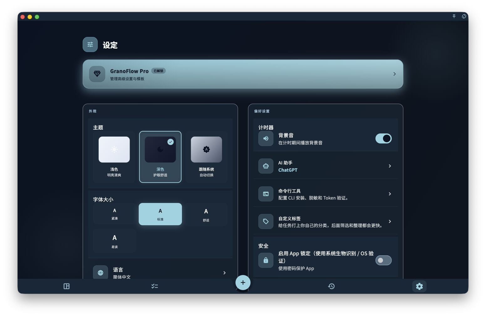

如果你想把 GranoFlow 看得更顺手，可以在「设置」→「外观」里改语言、主题和字体大小。这些设置只影响你在当前设备上看到的界面，不会改动你的任务、项目、标签、回顾记录或同步数据。

设置相关页面：

- [设置总览](/manual/interface/settings-overview/)
- [语言、主题与字体](/manual/interface/settings-language-appearance/)
- [当前设备偏好](/manual/interface/device-preferences/)
- [账号、同步与数据入口](/manual/interface/settings-account-data-entrypoints/)

## 更改语言

打开「设置」，进入「外观」，再选择「语言」。在这里选择你想使用的界面语言。

<!-- manual-screenshot:id=interface-settings-overview-main -->

语言切换只会改变 App 自带的界面文字。它不会自动翻译你自己写过的内容，例如任务标题、项目名称、标签、笔记或回顾内容。

举例来说，如果你把界面从中文切换成英文，原来写下的中文任务仍然会保持中文。

如果你在多台设备上使用 GranoFlow，每台设备都可以选择适合自己的语言。语言偏好不应理解为账号级数据，也不应影响 [多端同步](/manual/data-security-and-recovery/sync/) 中的业务记录。

## 更改主题

打开「设置」，进入「外观」，再选择「主题」。你可以选择浅色、深色或跟随系统。

主题只影响当前设备上的显示效果。你可以在桌面端使用深色主题，在手机上使用浅色主题；这不会改变任何任务、项目、回顾记录或 [账号](/manual/account/overview/) 状态。

如果某个平台显示为跟随系统，实际效果取决于当前设备的系统外观设置。

## 调整字体大小

打开「设置」，进入「外观」，再选择「字体大小」。在这里把界面文字调大或调小。

字体大小适合按设备分别设置。比如，手机上可以调大一些，方便阅读；桌面端可以保持更紧凑的显示。它只改变界面呈现，不会改变你写入的数据，也不会影响 [备份与恢复](/manual/data-security-and-recovery/backup-and-restore/) 的内容。

## 下一步

- 想了解设置页整体怎么分组，阅读 [设置总览](/manual/interface/settings-overview/)。
- 想了解应用锁、提醒横幅等本机体验设置，阅读 [当前设备偏好](/manual/interface/device-preferences/)。
