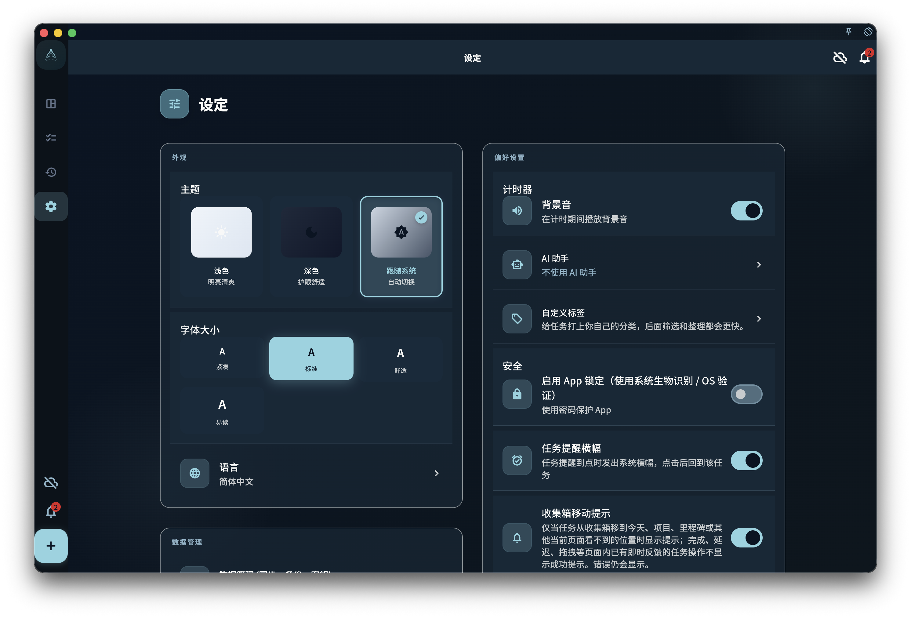

设置相关页面：

- [设置总览](/manual/interface/settings-overview/)
- [语言、主题与字体](/manual/interface/settings-language-appearance/)
- [当前设备偏好](/manual/interface/device-preferences/)
- [账号、同步与数据入口](/manual/interface/settings-account-data-entrypoints/)

设置页是 GranoFlow 的统一入口。它把显示体验、当前设备偏好、账号、同步、数据、订阅、AI 和关于信息放在一个地方，但每个入口影响的范围并不一样。

这页先帮助你判断：某项设置只是改变当前设备的使用体验，还是会带你进入账号、数据或订阅相关页面。

## 外观

外观通常包含主题、字体大小和语言。

<!-- manual-screenshot:id=interface-settings-overview-main -->

这些设置主要影响你在当前设备上看到的界面。切换语言、改深色模式或调大字体，不会改写任务、项目、标签、回顾记录，也不会改变 [多端同步](/manual/data-security-and-recovery/sync/) 中的数据含义。

如果你只是想调整阅读和显示体验，继续阅读 [语言、主题与字体](/manual/interface/settings-language-appearance/)。

## 当前设备

当前设备偏好用于控制这台设备上的操作习惯，例如计时器声音、应用锁、任务提醒横幅、滑动操作通知，以及防止投入时间段重叠。

这些选项更像是“这台设备怎么提醒我、怎么保护我、怎么显示反馈”。它们不应该被理解为账号级业务数据，也不应该被当作跨设备同步承诺。

## 账号与同步

账号入口用于登录、退出、查看账号状态或进入相关账号能力。同步入口用于理解当前设备与云端数据之间的关系。

如果你要处理登录、设备或同步问题，先阅读 [账号总览](/manual/account/overview/) 和 [设备管理](/manual/account/device-management/)。如果你要理解数据如何在多台设备之间流动，阅读 [多端同步](/manual/data-security-and-recovery/sync/)。

## 创作与回顾

设置页可能提供 AI 助手、标签管理、提示词或回顾相关入口。

这些入口是为了进入具体配置或说明页面，不代表 AI 会自动修改你的记录。涉及外部 AI 的流程，应先理解 [AI 辅助](/manual/ai-assistance/overview/) 和 [AI 助手与剪贴板](/manual/ai-assistance/clipboard-assistant/) 的边界。

## 数据与恢复

数据与恢复入口用于导入、导出、备份、恢复、附件或清理相关操作。

这些操作的影响通常比外观设置更大。继续前先阅读对应页面，尤其是 [备份与恢复](/manual/data-security-and-recovery/backup-and-restore/) 和 [数据与安全总览](/manual/data-security-and-recovery/overview/)。

## 关于、订阅与调研

关于区域通常包含版本信息、账号入口和必要的辅助入口。隐藏诊断或测试数据入口不会作为普通用户默认入口展示。

订阅入口用于查看权益、购买状态或恢复购买说明。具体权益和平台规则以 [订阅总览](/manual/subscription/overview/) 及实际平台展示为准。

调研计划属于低频入口，用于用户主动参与反馈或研究，不影响日常任务和数据结构。

## 下一步

- 想调整显示效果，阅读 [语言、主题与字体](/manual/interface/settings-language-appearance/)。
- 想理解本机开关，阅读 [当前设备偏好](/manual/interface/device-preferences/)。
- 想处理账号、同步或数据入口，阅读 [账号、同步与数据入口](/manual/interface/settings-account-data-entrypoints/)。
