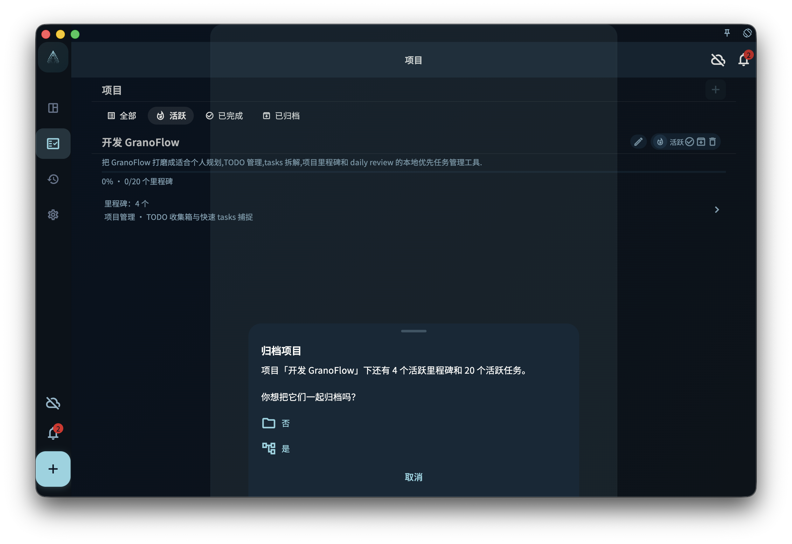

理解项目完成、归档、直接删除和保护规则，避免误删仍包含任务或里程碑的项目。

## 从哪里开始

从项目页进入。项目适合承载持续一段时间的目标，里程碑负责阶段，任务负责具体行动。

<!-- manual-screenshot:id=projects-archive-menu -->

## 怎么操作

- 创建或打开项目后，先确认名称和目标是否清晰，再把相关任务连接进去。
- 需要阶段管理时添加里程碑；需要执行时创建或移动任务，而不是把所有说明都写进项目名。
- 项目完成或归档前，检查里面是否仍有任务或里程碑，避免活跃内容被收起。

## 结果和边界

项目会改变任务的组织位置，但不会替代今日安排、标签筛选或日回顾。一个任务可以在项目中出现，也可能因为日期或完成状态出现在其他视图。

- 空项目可以更直接地删除；包含任务或里程碑的项目通常需要先处理内部内容。
- 项目归档是整理长期目标，不是删除所有相关任务。

## 下一步

继续阅读创建项目、里程碑、连接任务或归档规则，按你当前要做的动作进入下一页。
