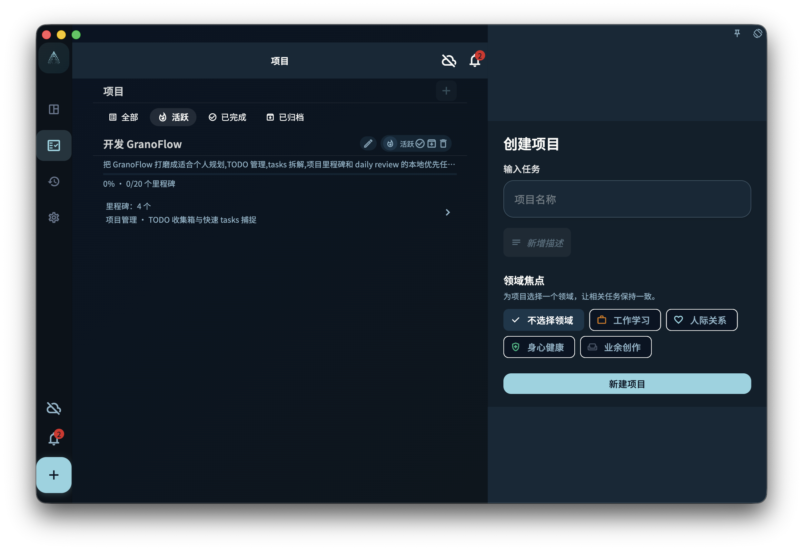

建项目非常简单：进入项目页，点击"新建"，给它取个名字，就创建好了。

## 创建入口

在项目列表页右上角点击 **+** 按钮，会弹出创建对话框。

创建时可以填写：

- **名称**（必填）：清楚说明这个目标是什么，比如"Q3 产品发布"比"项目一"好用得多
- **领域**（可选）：把项目归属到一个大方向下，比如"工作""学习""健康"
- **截止日期**（可选）：项目整体的目标完成时间

:::tip[名字起好，以后省事]
项目名称直接决定了你将来能不能一眼看出这个项目是干什么的。建议用动词 + 目标的结构，比如"写完毕业论文"，而不是"论文"。
:::

## 创建空项目 vs 先建项目再加任务

这两种方式都行，选你顺手的就好：

| 方式 | 适合场景 |
|------|---------|
| 先建项目，再慢慢加任务 | 规划阶段，想先搭框架 |
| 先把任务加到收集箱，再归入项目 | 执行阶段，随手记，之后再整理 |

两种方式最终效果一样，任务都会在项目里。

## 项目建好之后

项目创建后，下一步通常是：

1. 添加里程碑（可选）——如果目标有明确阶段
2. 把已有任务连接进项目
3. 在项目里直接创建新任务

如果暂时不确定要加什么任务，直接关掉项目页面也没关系，项目会等你回来。
