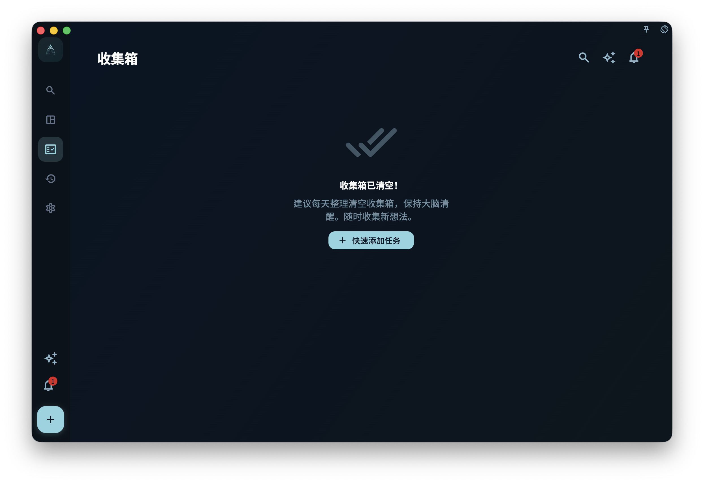

把任务连接到项目后，它会从收集箱离开，出现在项目里；如果它有日期，也仍然会出现在今日视图或日历视图里。项目用来说明这件事属于哪个项目，里程碑用来说明它属于项目里的哪个阶段。

## 怎么连接

你可以用两种方式把任务连接到项目。

### 方法一：在任务详情里选择项目

打开任务详情，找到项目字段，选择目标项目。需要时，也可以继续选择这个项目下的某个里程碑。

这是最常用的方式，适合你已经打开任务、想直接给它归类的时候。

### 方法二：在项目页面拖入任务

打开项目详情页，把现有任务拖到某个里程碑下面。这样任务就会连接到这个项目，并归到对应里程碑下。

<!-- manual-screenshot:id=projects-link-tasks-drag -->

## 任务连接后出现在哪里

连接项目之后，同一个任务可能会同时出现在多个地方。它不是被复制了，而是同一个任务在不同视图里显示。

| 视图 | 说明 |
| --- | --- |
| 项目页面 | 出现在对应项目里；如果选了里程碑，会出现在对应里程碑下 |
| 今日视图 | 如果任务有今天的日期，仍然出现 |
| 日历视图 | 按截止日期显示 |
| 收集箱 | **不再出现**（挂上项目后会离开收集箱） |

:::note[收集箱的变化]
只有同时满足“无截止日期”“无项目”“无里程碑”的任务，才会待在收集箱。一旦你把任务挂进项目，它就自动离开收集箱，这是正常行为。
:::

## 挂到项目和挂到里程碑有什么区别

挂到项目，表示这个任务属于这个项目。

挂到里程碑，表示这个任务不只属于项目，还属于项目里的某个阶段。比如一个项目里有“准备”“执行”“复盘”几个里程碑，任务可以放到其中一个里程碑下。

如果你还没想好任务属于哪个阶段，只挂到项目也可以。

## 想把一个任务从项目里移出来

打开任务详情，把项目字段清空就行。

清空后，如果这个任务也没有截止日期，它会重新出现在收集箱。如果它还有截止日期，它仍然会按日期出现在今日视图或日历视图里。

## 一个任务能挂多个项目吗

不能。每个任务只能属于一个项目（和一个里程碑）。

如果你发现一个任务好像跨了两个项目，通常有两种处理方式：

1. 选择它更主要归属的那个项目
2. 把它拆成两个任务，分别挂到各自的项目
