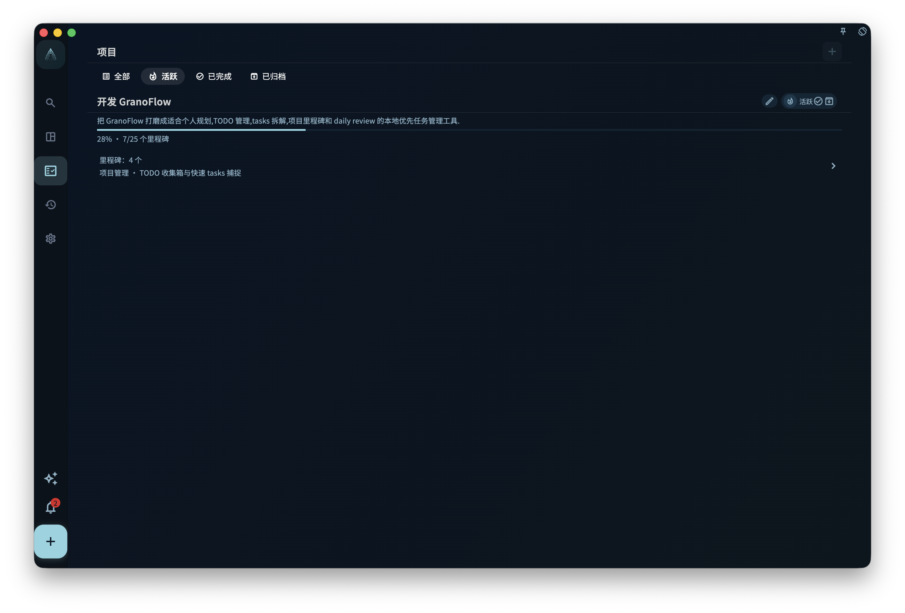
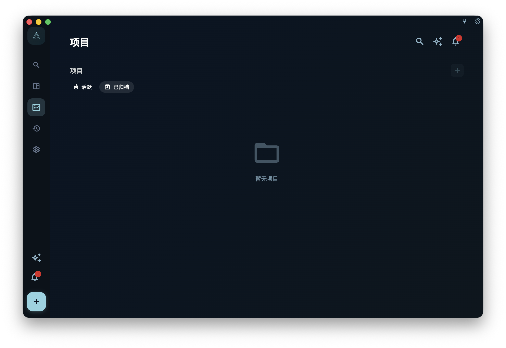
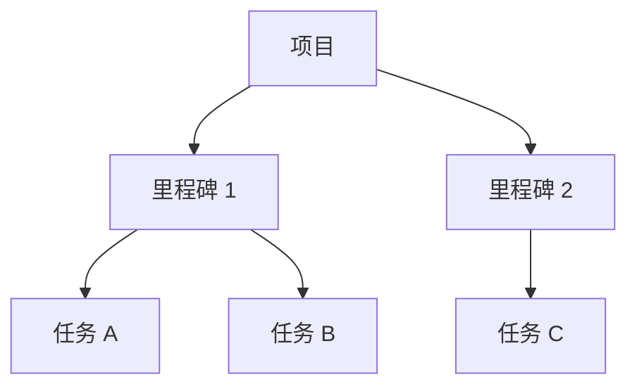

项目用来管理一个会持续一段时间的目标：你可以把相关任务放进同一个项目，用里程碑分阶段，然后查看整体进度。

任务是一件具体要做的事，项目是一组相关任务背后的目标。比如你要搬家，买纸箱、打包厨房、联系搬家公司都是任务；“搬家”这件事本身就是项目。把这些任务放进同一个项目，你就不用到处找，也更容易判断这件事做到哪一步了。

## 项目页面能看什么

<!-- manual-screenshot:id=projects-overview-main -->

在项目列表里，你可以看到已有项目，以及每个项目当前的进度。即使截图没有加载，你也可以把这里理解成“所有项目的总览页”：先找到你要看的项目，再进入详情。

进入项目详情后，你能看到：

- 这个项目里的所有里程碑，也就是阶段目标
- 每个里程碑下面的任务
- 项目整体完成了多少

<!-- manual-screenshot:id=projects-detail-main -->

在宽屏或桌面上，点击任务后，任务详情会以右侧弹窗打开。关闭弹窗后，你会回到原来的项目阶段位置，不需要在多个页面之间来回跳。

## 项目能做什么、不能做什么

项目**能做的**：

- 把相关任务放在一起看
- 用里程碑把一个大目标拆成几个阶段
- 追踪项目整体进度

项目**不能替代**：

- 今日安排：哪天做一件事，还是要看截止日期
- 标签筛选：跨项目的横向分类，还是要靠标签
- 日回顾：日回顾看的是每天完成了什么，不是项目视角

:::tip[什么时候该建项目]
如果一件事会产生三个以上相关任务，而且会持续超过一周，就值得建一个项目。如果只是一两个任务，直接创建任务就好，不需要专门建项目。
:::

## 三层结构快速回顾

项目、里程碑、任务这三层按需使用。简单目标可以只用“项目 + 任务”，不一定要建里程碑。
