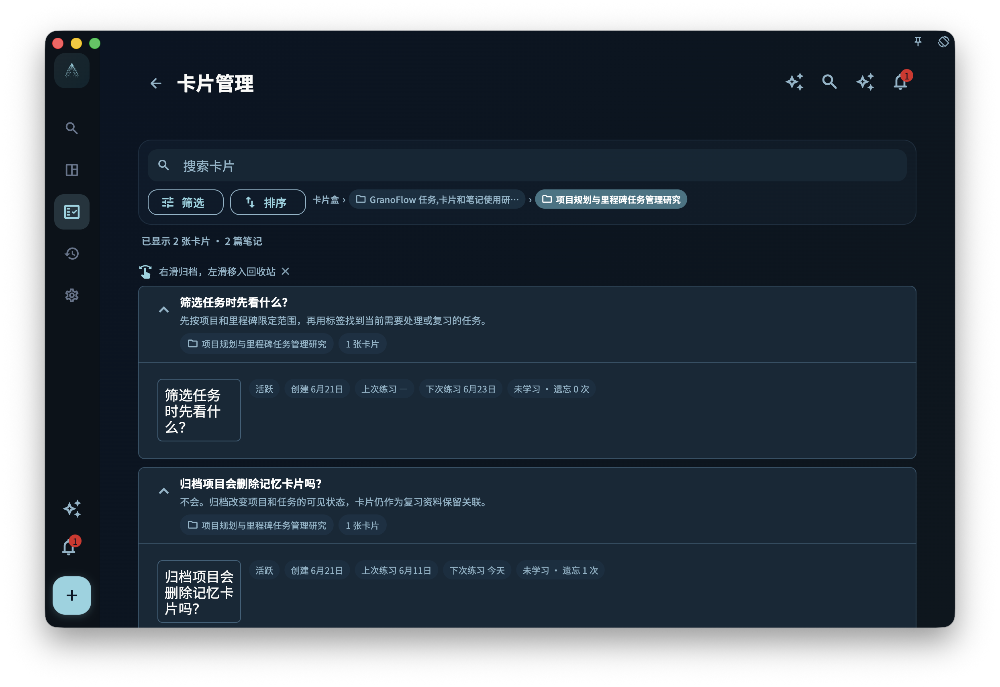

当卡片变多以后，你会自然想整理它们：哪些属于同一批任务，哪些来自同一个导入包，哪些可以迁移到另一台设备，哪些应该暂时归档。

这就是卡片盒存在的原因。卡片盒不是另一个项目系统，也不是完整备份。它更像一个用来管理和迁移卡片范围的容器。

## 不要把三种文件混在一起

GranoFlow 里有几类容易混淆的东西：

- `.flow.grano`：完整本地备份，用来整机迁移或恢复。
- `.deck.grano`：GranoFlow 自有卡片盒包，只处理选定卡片盒和其中卡片。
- Anki/APKG：Anki 的卡片盒格式，和 GranoFlow 的笔记、布局、任务关联模型并不相同。

它们看起来都和“导入导出”有关，但解决的问题不同。把 `.deck.grano` 当完整备份，会漏掉任务、项目和回顾。把 Anki 当 GranoFlow 的原生卡片盒，也会误解字段、媒体、模板和学习记录的边界。

## 核心概念：卡片盒处理范围，不处理整个人生系统

卡片盒关注的是一组卡片以及它们的卡片盒树。它可以帮助你迁移某一类知识经验，比如“论文阅读方法”“用户访谈经验”“产品设计原则”。

但任务本体、项目、里程碑、日回顾、账号和设备密钥，不属于 `.deck.grano` 的职责。它不会创建任务本体，也不能替代完整本地备份。

你可以这样判断：

- 想换机或整机恢复，用 `.flow.grano` 本地备份。
- 想迁移或分享某个卡片盒，用 `.deck.grano`。
- 想尝试把 Anki 卡片带进来，用“转换 Anki 卡片盒”，再在待筛选卡片盒里逐张确认。

## 一个真实任务例子

假设你整理了一组“科研写作”卡片，里面有读论文、写摘要、准备组会、处理导师反馈的经验。你想把这组卡片迁移到另一台电脑。

这时不需要导出整个 GranoFlow 备份，也不应该把它理解成 Anki 包。你可以进入卡片盒列表，选择顶层卡片盒并导出 `.deck.grano`。这个包会包含选定顶层卡片盒、子卡片盒、未删除卡片和可打包的本地图片媒体。

需要特别留意：`.deck.grano` 是迁移和分享卡片盒的文件，不是加密备份。它不像 `.flow.grano` 那样用数据密钥保护；如果你把卡包发给别人，对方可能读取包内的卡片正文和图片。不要把含有敏感内容的卡包当作保密容器保存或发送。

如果你打开了“包含学习记录”，学习记录才会写入导出包；默认不会包含。卡片盒导入后不会直接混入现有卡片库，而是先成为一个待筛选卡片盒。你可以逐张查看，也可以确认后一次性导入剩余卡片。

## 从哪里管理卡片盒

卡片盒级导入、导出与 Anki 转换的主入口在卡片盒列表，也会出现在数据管理页的“卡片盒”区域。

你可以从卡片统计进入卡片盒列表，也可以在卡片管理页通过卡片盒面包屑进入。列表顶部提供“导入卡片盒”“转换 Anki 卡片盒”和“待筛选卡片盒”入口，每个顶层卡片盒行尾有导出按钮。

“导入卡片盒”用于选择 `.deck.grano` 文件；“转换 Anki 卡片盒”用于选择 `.apkg` 文件并把可转换内容整理成 GranoFlow 的待筛选卡片盒。两条路径都不会直接把外部卡片写进正式卡片库。真正进入本地卡片库之前，你还需要打开“待筛选卡片盒”，继续逐张筛选，或确认后全部导入剩余卡片。

卡片管理页本身主要用于搜索、筛选、排序和整理当前范围的卡片；它不承担卡片盒级导入导出。这样分开，是为了避免你在整理单张卡片时误以为自己正在操作整个卡片盒。

<!-- manual-screenshot:id=review-card-deck-list-main -->

## 只管理某个卡片盒里的卡片

从某个卡片盒进入“管理卡片”时，GranoFlow 会打开卡片盒范围内的卡片管理页。这个页面仍然提供搜索、筛选、排序、归档和回收站等整理能力，但范围被限制在当前卡片盒以及它的子卡片盒里。

这适合做局部整理，例如只检查“科研写作”卡片盒里哪些卡片已经掌握、哪些卡片应该归档。它不等同于卡片盒列表，也不提供卡片盒级导入导出；要导出 `.deck.grano`，仍回到卡片盒列表处理。

如果你从普通卡片管理页进入，看到的是全局范围；如果从卡片盒行进入，看到的是该卡片盒范围。排查“为什么这里少了几张卡片”时，先确认自己当前是不是在某个卡片盒范围内。

<!-- manual-screenshot:id=review-card-deck-scoped-management -->

## 卡片盒列表里的归档与删除

卡片盒列表会显示活跃、已归档、未学习、学习中、已掌握和已内化等统计。

在卡片盒列表里：

- 右滑可以归档未内化卡片，已内化卡片会保留在主动复习里。
- 左滑只删除未关联任务的卡片。
- 卡片盒本身会尽量保留，尤其当里面还有不能删除或不应该删除的卡片时。

这个设计有点保守，但很必要。卡片盒往往包含一整组经验，误删的代价比单张卡更高。已内化卡片尤其值得小心，因为它已经在多个项目中被用过。

## `.deck.grano` 能做什么

`.deck.grano` 适合在 GranoFlow 之间迁移一个卡片盒。

它会处理：

- 选定顶层卡片盒和子卡片盒
- 未删除卡片
- 笔记、字段、布局和可打包的本地图片媒体
- 可选的学习记录

它不会处理：

- 任务本体
- 项目和里程碑本体
- 日回顾、周回顾、月回顾正文
- 完整账号或设备恢复
- 像 `.flow.grano` 一样的加密备份保护或分享密码
- 任意 Anki 模板、CSS 或调度历史的无损还原

导入 `.deck.grano` 前，GranoFlow 会先显示预览，再由你确认。确认后，它会被解包成待筛选卡片盒，数据和附件暂存在单独空间里，不会立刻混入现有卡片库。

打开待筛选卡片盒后，你会看到卡片正面，点击后看到反面，再决定导入、丢弃或跳过。导入会把这张卡片写入本地卡片库；丢弃会从待筛选卡片盒里删除这张临时卡片；跳过会把它留到后面再看。如果你已经确认剩余卡片都可用，可以在待筛选卡片盒列表里右滑“全部导入”；如果剩余内容不想要，可以左滑“删除剩余”。当待筛选卡片盒已经没有剩余卡片时，打开或滑动它会建议删除这个空盒，你也可以取消并暂时保留。

`.deck.grano` 导入不会创建任务本体，只会保留这台设备上仍然存在、并且不在回收站里的任务关联。缺失任务关联会在预览中计数并跳过；没有有效任务关联的卡片会以卡片内容为主进入待筛选流程。

## Anki 入口怎样理解

Anki/APKG 和 GranoFlow 的卡片格式完全不同，所以 GranoFlow 使用“转换 Anki 卡片盒”，而不是“直接导入 Anki 卡片盒”。

Anki 更强调卡片模板和字段组合；GranoFlow 还要处理笔记、布局、媒体边界、卡片盒来源和复习上下文。所以 Anki 转换不能被理解成“原样搬进来”。转换成功后，它仍会先进入待筛选卡片盒，你可以逐张确认内容是否可用，再决定导入还是丢弃。

当前 Anki 转换会先显示风险提示，再让你选择 `.apkg` 文件并进行预检。预检会统计卡片盒、笔记、卡片、模板和媒体情况；如果发现当前版本不支持的音频、视频、过多远程媒体、缺失关键附件或无法稳定转换的模板，会阻止转换或要求你选择是否跳过问题卡片。

转换过程中，GranoFlow 会尽量保留可读的题干、答案、基础富文本、图片和来源信息，但不会执行 Anki 插件、JS、任意 CSS 或远程自动加载内容；学习调度历史也不会变成 GranoFlow 的学习状态。转换结果会带有来源信息，方便你知道它来自 Anki。

更稳妥的方式仍然是：让 GranoFlow 卡片来自你自己的任务和回顾。Anki 转换可以作为迁移旧资料的补充，但不应该成为建立经验系统的主路径。

## 和完整备份的关系

如果你准备换设备、重装系统或做大规模删除，应该先创建完整本地备份 `.flow.grano`。完整备份仍然是保留某个时间点副本的主要防线；之后导入 `.flow.grano` 时，GranoFlow 会把备份内容按最后修改时间增量合入当前设备。

数据管理页里的“卡片盒”区域可以处理 `.deck.grano` 导入、Anki 卡片盒转换、导出卡片盒、进入待筛选卡片盒、查看卡片缓存和清空缓存。但这些都不等于完整备份，也不能替代 `.flow.grano` 覆盖更多业务记录、附件和加密边界的能力。

一个简单原则是：

- 担心整套数据丢失，先备份。
- 只想迁移一组卡片，再导出卡片盒。
- 想导入外部卡片，先读限制；`.deck.grano` 是 GranoFlow 之间迁移卡片盒的主路径，Anki/APKG 需要先转换并进入待筛选卡片盒。

## 收束

卡片盒让卡片系统可以整理、迁移和控制范围，但它不改变卡片的核心：真正重要的仍然是经验能不能回到任务里。导入导出只是搬运方式，卡片是否有价值，最终还要看它是否帮助你在下一次行动中做出更好的判断。
