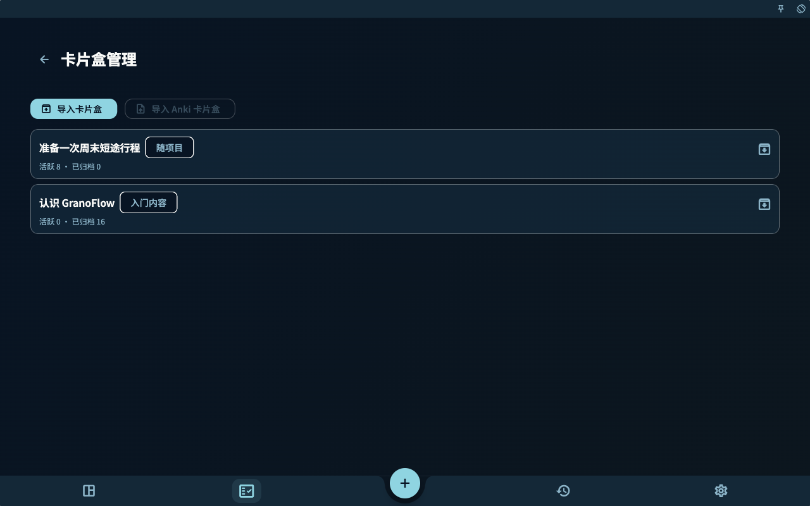

当卡片变多以后，你会自然想整理它们：哪些属于同一批任务，哪些来自同一个导入包，哪些可以迁移到另一台设备，哪些应该暂时归档。

这就是卡片盒存在的原因。卡片盒不是另一个项目系统，也不是完整备份。它更像一个用来管理和迁移卡片范围的容器。

## 不要把三种文件混在一起

GranoFlow 里有几类容易混淆的东西：

- `.flow.grano`：完整本地备份，用来整机迁移或恢复。
- `.deck.grano`：GranoFlow 自有卡片盒包，只处理选定卡片盒和其中卡片。
- Anki/APKG：Anki 的卡片盒格式，和 GranoFlow 的卡片资料、布局、任务关联模型并不相同。

它们看起来都和“导入导出”有关，但解决的问题不同。把 `.deck.grano` 当完整备份，会漏掉任务、项目和回顾。把 Anki 当 GranoFlow 的原生卡片盒，也会误解字段、媒体、模板和学习记录的边界。

## 核心概念：卡片盒处理范围，不处理整个人生系统

卡片盒关注的是一组卡片以及它们的卡片盒树。它可以帮助你迁移某一类知识经验，比如“论文阅读方法”“用户访谈经验”“产品设计原则”。

但任务本体、项目、里程碑、日回顾、账号和设备密钥，不属于 `.deck.grano` 的职责。它不会创建任务本体，也不能替代完整本地备份。

你可以这样判断：

- 想换机或整机恢复，用 `.flow.grano` 本地备份。
- 想迁移或分享某个卡片盒，用 `.deck.grano`。
- 想尝试把 Anki 卡片带进来，看 Anki 导入入口和说明，但不要期待无损还原。

## 一个真实任务例子

假设你整理了一组“科研写作”卡片，里面有读论文、写摘要、准备组会、处理导师反馈的经验。你想把这组卡片迁移到另一台电脑。

这时不需要导出整个 GranoFlow 备份，也不应该把它理解成 Anki 包。你可以进入卡片盒列表，选择顶层卡片盒并导出 `.deck.grano`。这个包会包含选定顶层卡片盒、子卡片盒、未删除卡片和可打包的本地图片媒体。

如果你打开了“包含学习记录”，学习记录才会写入导出包；默认不会包含。导入时也一样，学习记录默认不导入，只有你在导入预览里明确打开“导入学习记录”才会合并。

## 从哪里管理卡片盒

卡片盒级导入、导出与 Anki 导入的主入口在卡片盒列表。

你可以从卡片统计进入卡片盒列表，也可以在卡片管理页通过卡片盒面包屑进入。列表顶部提供“导入卡片盒”和“导入 Anki 卡片盒”，每个顶层卡片盒行尾有导出按钮。

卡片管理页本身主要用于搜索、筛选、排序和练习当前范围的卡片；它不承担卡片盒级导入导出。这样分开，是为了避免你在整理单张卡片时误以为自己正在操作整个卡片盒。

<!-- manual-screenshot:id=review-card-deck-list-main -->

## 卡片盒列表里的归档与删除

卡片盒列表会显示活跃、已归档、未学习、学习中、已掌握和已内化等统计。

在卡片盒列表里：

- 右滑可以归档未内化卡片，已内化卡片会保留在主动复习里。
- 左滑只删除未关联任务的卡片。
- 卡片盒本身会尽量保留，尤其当里面还有不能删除或不应该删除的卡片时。

这个设计有点保守，但很必要。卡片盒往往包含一整组经验，误删的代价比单张卡更高。已内化卡片尤其值得小心，因为它已经在多个项目中被用过。

## `.deck.grano` 能做什么

`.deck.grano` 适合在 GranoFlow 之间迁移一个卡片盒。

它会处理：

- 选定顶层卡片盒和子卡片盒
- 未删除卡片
- 卡片资料、字段、布局和可打包的本地图片媒体
- 可选的学习记录

它不会处理：

- 任务本体
- 项目和里程碑本体
- 日回顾、周回顾、月回顾正文
- 完整账号或设备恢复
- 任意 Anki 模板、CSS 或调度历史的无损还原

导入 `.deck.grano` 前，GranoFlow 会先显示预览，再由你确认。导入不会创建任务本体，只会保留这台设备上仍然存在、并且不在回收站里的任务关联。缺失任务关联会在预览中计数并跳过；没有有效任务关联的卡片可能进入已归档卡片。

## Anki 入口怎样理解

Anki/APKG 和 GranoFlow 的卡片格式完全不同。

Anki 更强调卡片模板和字段组合；GranoFlow 还要处理任务关联、卡片资料、布局、媒体边界、卡片盒来源和复习上下文。所以 Anki 导入不能被理解成“原样搬进来”。

当前 Anki 入口会显示说明和限制。遇到不支持的模板、远程媒体、缺失附件、视频媒体或无法稳定派生标题的内容，导入可能被拒绝或跳过部分资料和卡片。即使导入成功，也不应期待任意 Anki 模板、CSS、调度历史和学习记录都能无损迁移。

更稳妥的方式仍然是：让 GranoFlow 卡片来自你自己的任务和回顾。Anki 入口可以作为补充，但不应该成为建立经验系统的主路径。

## 和完整备份的关系

如果你准备换设备、重装系统或做大规模删除，应该先创建完整本地备份 `.flow.grano`。完整备份才是回到某个时间点的主要防线。

数据管理页里的“卡片盒”卡片可以处理 `.deck.grano` 导入、Anki 导入说明、导出当前卡片盒、查看卡片缓存和清空缓存。但这些都不等于完整备份。

一个简单原则是：

- 担心整套数据丢失，先备份。
- 只想迁移一组卡片，再导出卡片盒。
- 想导入外部卡片，先读限制，再小范围尝试。

## 收束

卡片盒让卡片系统可以整理、迁移和控制范围，但它不改变卡片的核心：真正重要的仍然是经验能不能回到任务里。导入导出只是搬运方式，卡片是否有价值，最终还要看它是否帮助你在下一次行动中做出更好的判断。
