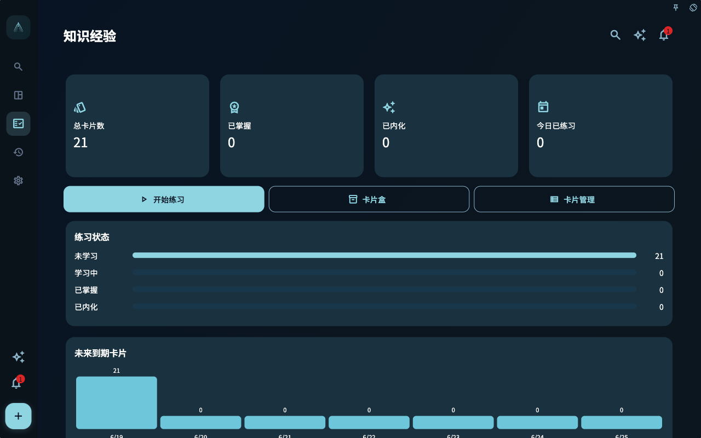

你可能已经习惯把“卡片”理解成背单词、背概念、背答案的工具。这样理解没有错，但放在 GranoFlow 里还不够。

GranoFlow 的卡片更像一张可以随身带走的经验纸条：它来自你做过的事，也应该回到你将要做的事。它不只是提醒你“答案是什么”，更重要的是提醒你“下次遇到类似情况时，我该怎样判断”。

比如你刚完成一次论文开题汇报，回顾时写下：

> 老师真正关心的不是我列了多少材料，而是研究问题是否能被一句话说清楚。

如果这句话只留在当天回顾里，它当然有价值，但以后不一定会被你想起来。把它整理成卡片，并关联到这次汇报任务后，它就能在未来写摘要、做组会或准备答辩时重新出现。经验开始从“那天发生过的事”，变成“下次可以使用的判断”。

## 容易误解的地方

最容易误解的是：卡片越多，学习越扎实。

实际上，卡片太多、太散、脱离任务，反而会让你重新回到另一个收集箱。你可能每天刷了很多张，却很少知道这些内容应该用在哪里。这样的卡片更像材料堆，不像经验。

GranoFlow 里的卡片故意和任务、回顾、项目放在一起，是为了避免这种漂浮感。你可以从任务详情添加卡片，也可以在日回顾、周回顾或月回顾中看到与任务相关的卡片，再进入练习。系统关心的不是你把多少内容搬进来，而是这些内容有没有机会回到真实行动。

## 核心概念：卡片是经验的最小可复用单位

一条回顾记录可以很长，里面有当天的情绪、过程、背景和细节。卡片要小一些，它只保留以后值得重复提取的一点。

这点可以是：

- 一个判断原则：沟通前先确认对方真正受什么限制。
- 一个方法提醒：读论文时先找问题、证据和结论，不急着摘句子。
- 一个易错边界：归档不是删除，只是退出主动关注。
- 一个操作经验：复盘项目时先看里程碑是否还成立，再看任务数量。

这就像把一段经历压成一枚可以再次点亮的书签。书签本身不是书，但它能把你带回重要位置。

## 一个真实任务例子

假设你是研究生，今天完成了“整理访谈提纲”这个任务。你在回顾里发现，自己一开始写了很多问题，但真正有用的是那些能让受访者讲出具体经历的问题。

你可以把这条经验整理成一张卡片：

- 标题：访谈问题要引出具体经历
- 正面：设计访谈问题时，怎样避免只得到抽象评价？
- 背面：把“你怎么看”改成“上一次发生这种情况时，你做了什么、当时有什么限制、后来怎么变化？”

这张卡片不是为了让你背诵一句漂亮话。它的价值在于，下次你创建“准备用户访谈”“写调研问题”“复盘访谈结果”这类任务时，可以把它关联过去，再通过任务或回顾上下文重新练习。

## 可以复用的判断原则

判断一条内容是否适合做成卡片，可以问三个问题：

1. 这条经验以后还会遇到吗？
2. 它能帮助我在下一次任务里做出更好的判断吗？
3. 它能被压缩成一个清楚的问题和一个可用的回答吗？

如果答案都是“是”，它就值得进入卡片。反过来，如果它只是当天的情绪宣泄、临时事实或不会再用到的琐碎记录，留在回顾里就好。

这也是为什么 GranoFlow 不鼓励你一开始就批量搬入大量卡片。卡片最好从真实任务里慢慢长出来。少一点，但每一张都知道自己从哪里来、要回到哪里去。

## 从哪里进入卡片系统

卡片通常有几个入口：

1. 在项目任务详情里，从“任务卡片”区域点击“添加卡片”。
2. 在“关联卡片”页面，搜索并关联已有卡片，或者选择“添加卡片”手工创建。
3. 在进展页的“卡片学习”区域进入卡片统计、练习或管理。
4. 在单个任务的 AI 助手里，和 AI 一起分析或复盘任务后生成可确认导入的卡片草稿。
5. 在日回顾、周回顾、月回顾里，从相关任务卡片进入上下文练习。

这些入口看起来分散，其实都服务同一件事：让卡片留在任务和回顾的上下文里，而不是变成另一个孤立仓库。

<!-- manual-screenshot:id=review-card-statistics-main -->

## 边界：卡片不是完整记录

卡片不替代任务，不替代回顾，也不替代项目文档。

任务负责说明你要做什么；回顾负责记录这件事发生后你怎么看；项目负责承载长期目标。卡片只取其中最适合以后反复使用的一点。它越清楚，越容易在未来被想起来；它越想包办一切，越容易变成没人愿意复习的长文。

一个简单的自检是：如果你下次看到这张卡片时，能立刻知道它适用于哪类任务，它就是好卡片。如果你需要重新读一大段背景才知道它在说什么，可能应该回到回顾或项目文档里整理，而不是急着做卡。

理解了卡片为什么要回到行动，下一章就可以看它怎样从一个具体任务里被创建、关联和编排。
