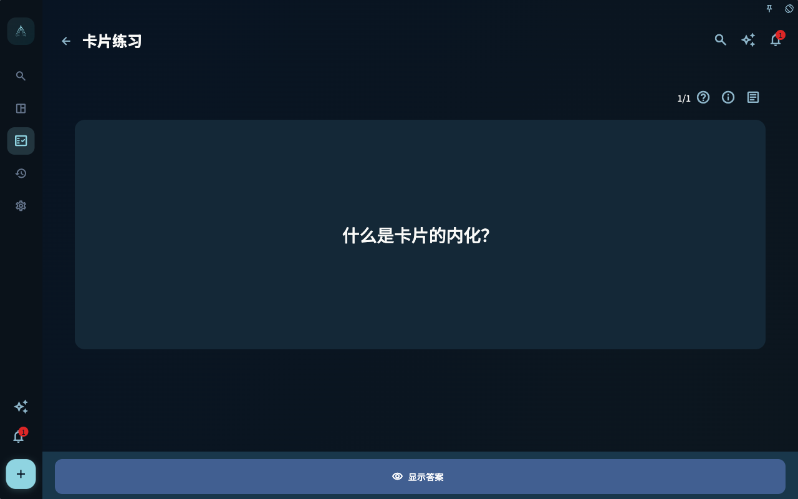
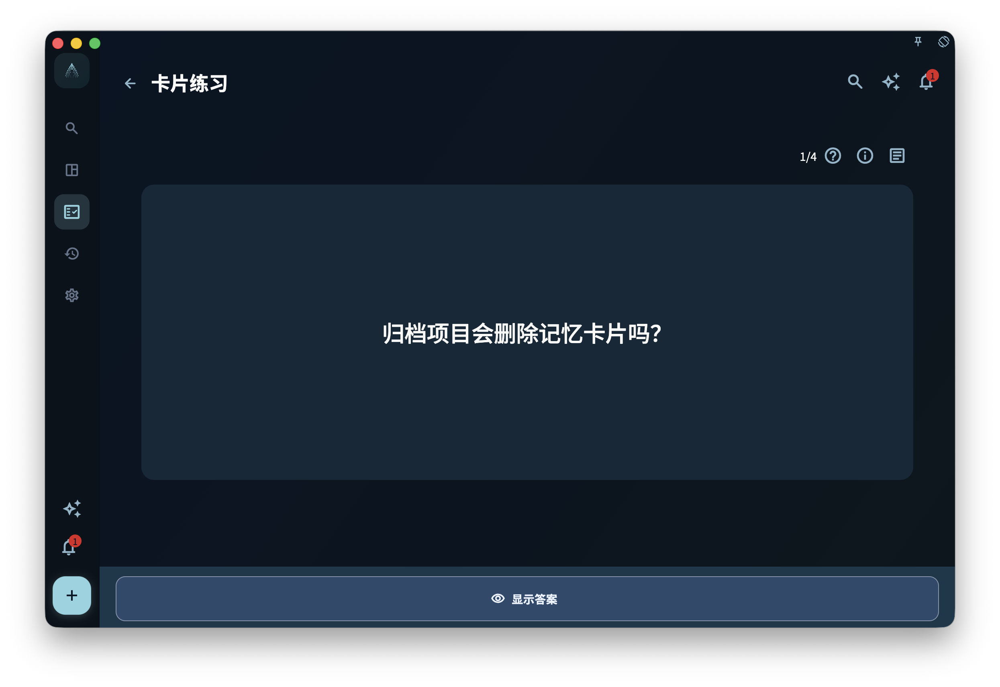
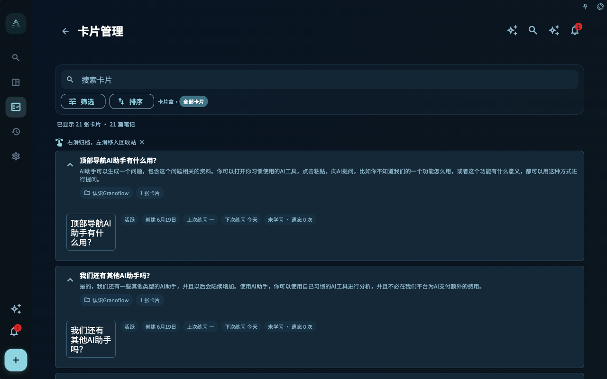

卡片练习很容易让人紧张。看到问题，翻答案，再点“遗忘”或“轻松”，好像系统正在给自己打分。

在 GranoFlow 里，最好把它理解成一次很短的提醒：这条经验我还记得吗？我知道它适合用在哪里吗？下次遇到类似任务时，我能不能更快做出判断？

练习不是为了证明你记忆力好，而是让经验有机会从卡片回到行动。

## 误区：复习得轻松就代表学会了

一张卡片今天答得出来，只说明它今天容易被提取。它不一定已经能在真实任务里使用。

比如你能背出：

> 访谈问题要引出具体经历。

这很好，但还不够。真正有用的是，当你下次写访谈提纲时，能自然把“你怎么看”改成“上一次发生时你怎么做”。这才是卡片从记忆走向使用。

GranoFlow 用“已掌握”和“已内化”区分这两层。已掌握说明它在复习中已经稳定；已内化说明它被带回多个不同项目的任务，开始作为经验参与真实行动。

## 核心概念：主动复习和上下文复习不同

进展页里的“卡片学习”是主动复习。它会根据今日待练习和复习调度，提醒你哪些主动卡片应该练习。

任务、日回顾、周回顾、月回顾里的卡片练习是上下文复习。它不只是问“今天到期了吗”，而是问“这件任务、这段回顾里有哪些相关经验值得重新看一遍”。

这两种练习都重要：

- 主动复习帮助你维持记忆，不让经验完全沉下去。
- 上下文复习帮助你把经验放回场景，看它能不能指导当下任务。

如果说主动复习像定期翻书签，上下文复习就像在写新章节时发现旧书签正好派上用场。

## 一个真实任务例子

你有一张卡片：

- 正面：设计访谈问题时，怎样避免只得到抽象评价？
- 背面：让对方讲最近一次真实经历，包括当时限制、采取动作和后来变化。

第一次练习时，你可能点“勉强”。后来多练几次，你能稳定答出，就进入已掌握。

但真正的变化发生在后面。你在“毕业论文访谈”“产品用户调研”“团队复盘访谈”三个不同项目里都把这张卡片关联到任务，并在准备问题时用到了它。此时，系统会把它归为已内化：它不只是被你记住，也已经在不同项目中被使用过。

已内化不是 AI 自动评价，也不是说它永远不用复习。它只是一个很有用的提示：这条经验已经走出卡片盒，回到了你的行动里。

## 四种学习状态

卡片学习状态分为四种：

- **未学习**：还没有复习记录，或者没有学习状态。
- **学习中**：已经复习过，但还没有达到已掌握。
- **已掌握**：复习中已经稳定，但还没有满足已内化条件。
- **已内化**：已掌握，并且同一张卡片关联到 3 个不同项目的任务。

同一项目里的多个任务只算一个项目。这个限制很重要，因为内化看的是跨场景迁移，而不是在同一个项目里反复出现。

## 练习时怎样评分

练习页会先显示问题。你点击显示答案后，再用四档反馈：

- **遗忘**：基本想不起来。
- **勉强**：有印象，但不稳，或者需要看答案才接上。
- **记得**：能答出来，理解基本清楚。
- **轻松**：很自然，几乎不费力。

这四档会被系统用来安排后续复习。不要为了让统计好看而点更高档，也不要因为今天状态差就责备自己。反馈越真实，后续提醒越有帮助。

有时你已经点过反馈，卡片仍会在本轮稍后再次出现。这通常表示这次反馈后，系统判断它还适合今天再练一次。它会被放到队尾，但不会让本轮总数或已完成数量增加；只有当这次反馈把下次练习时间排到明天或更晚，已完成数量才会前进。比如早期学习阶段里，第一次“记得”也可能只是几分钟后再看一次；连续稳定记得，或点“轻松”，才更容易把间隔拉到明天以后。

如果今日待练习为 0，但还有可练习候选，进展页可能显示“今天的卡片练习已完成”和“再练一组”。这适合你还有精力时继续练一小组，不表示今天必须额外完成。

<!-- manual-screenshot:id=review-card-study-question-focus -->

## 主动复习队列页

从卡片统计或进展页进入的主动复习，会先按当前可练习卡片组成一个队列。这个入口不是某一张卡片的详情页，而是一次练习会话：你看完一张卡、显示答案并给出反馈后，系统会继续带你处理下一张。

如果队列里暂时没有需要处理的卡片，页面会显示完成状态或引导你回到卡片统计。它不代表卡片盒里没有卡片，只说明当前主动复习范围内没有待练习项。任务详情、日回顾、周回顾、月回顾里的上下文复习仍可能显示相关卡片。

<!-- manual-screenshot:id=review-card-study-queue -->

## 查看笔记

有些卡片属于一篇更完整的笔记。练习页会提供笔记入口，打开后可以在侧边面板查看：

- 笔记标题和内容
- 对应译文
- 来源
- 关联项目和关联任务
- 同一篇笔记下的全部卡片

关联项目会用三个圆点表示覆盖 0、1、2、3 个及以上项目；没有项目的任务会放在“未归入项目”下面。点击关联任务时，GranoFlow 会先关闭笔记面板，再打开任务详情。

这个面板的作用不是让你在练习时读长文，而是在需要时帮你找回上下文：这张卡从哪里来，和哪些任务有关，同一篇笔记下还有哪些卡片。

## 归档和回收站

归档适合不想再进入主动复习，但仍然有保存价值的卡片。

已归档卡片不会进入进展页的主动复习卡片数、今日待练习或主动复习队列；但它仍保留内容、任务关联和回顾上下文。你在相关任务或回顾里仍可能看到它，需要时也可以在已归档视图中取消归档。

移到回收站则不同。它表示这张卡片暂时被删除，不再进入普通卡片详情、学习队列或关联卡片区。只要回收站没有清空，你仍可以恢复；永久删除或清空后就不能依赖回收站找回。

卡片的已归档和回收站都在「卡片管理」里查看。进入卡片管理后，点工具栏里的「筛选」，在状态里选择「已归档」或「回收站」。如果你是从某个卡片盒进入卡片管理，同一个筛选只会作用在当前卡片盒范围内。外层的「已归档」和「回收站」页面只处理任务，不再放卡片入口。

默认情况下，已内化卡片在卡片管理列表里受到保护。你滑动归档或移到回收站时，系统会提醒你这张卡片已经在多个项目中被用过。这个提醒不是阻止你整理，而是避免你一时手滑删掉已经证明有用的经验。

## 从进展页进入练习

进展页的“卡片学习”区域会显示主动复习卡片数和今日待练习数量。点击总卡片数可以进入卡片统计，查看学习状态、未来 7 天负荷和近期练习活动。

卡片统计是卡片系列页面的主入口。你可以从那里进入卡片练习，也可以打开卡片管理。卡片练习和卡片管理会作为子页面打开，并返回卡片统计页。

卡片管理会按笔记组织卡片，而不是把每张卡都当成孤立条目。你可以从一篇笔记下面看到它的多张卡片、归档状态和学习状态；已经内化的卡片在整理时会有额外提醒，避免你误把已经在多个项目中证明有用的经验移走。

<!-- manual-screenshot:id=review-card-management-main -->

## 一个小检查

练习完一张卡后，可以快速问自己：

- 我只是记得答案，还是知道它适用于哪类任务？
- 它是否应该继续主动复习？
- 它是否已经过时，应该归档或移到回收站？
- 最近有没有真实任务可以关联它？

这些问题不需要每次都写下来。它们只是帮你把练习从“点按钮”拉回“下一次怎么做”。

下一章会处理卡片盒、导入、导出和备份边界：当卡片变多之后，怎样迁移、整理，而不把卡片盒误当成完整备份或 Anki 克隆。
