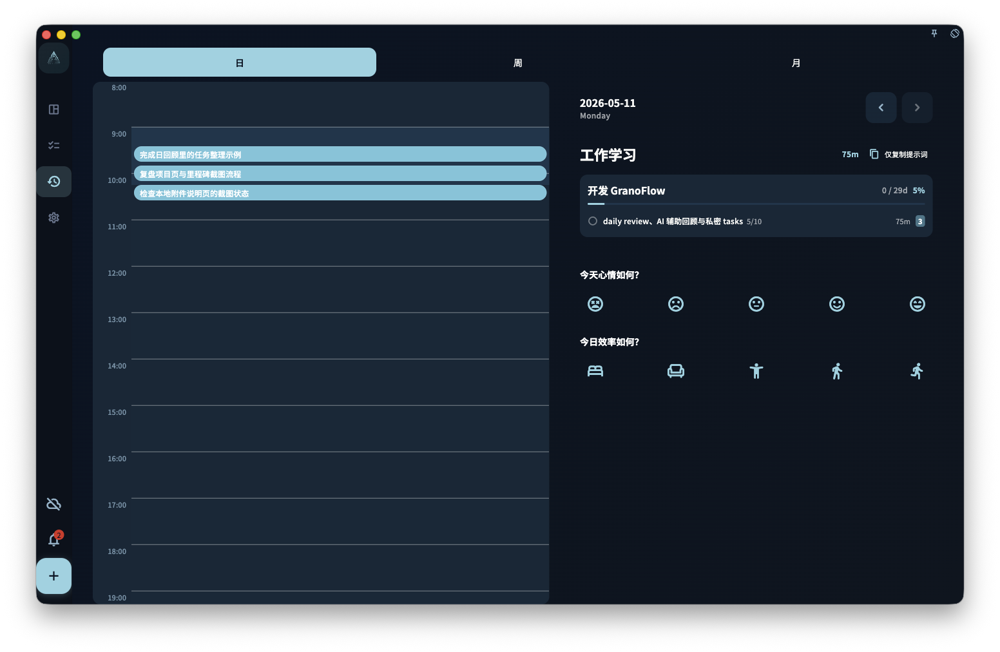

日回顾是 GranoFlow 里最常用的回顾形式——每天结束时看一眼今天做了什么，写几句话，然后关掉。

## 统计逻辑

日回顾按**任务的实际完成时间**统计，不按截止日期。

这意味着：

- 你昨天截止但今天才做完的任务 → 出现在今天的回顾里
- 你昨天深夜 23:58 完成的任务 → 出现在昨天的回顾里
- 你今天凌晨 1:00 完成的任务 → **出现在昨天的回顾里**（因为凌晨 6 点前完成都算前一天）

这个设计的逻辑是：凌晨才睡的人，那一段时间算做是"昨天的延伸"，而不是"新的一天开始"。

## 怎么写日回顾

没有固定格式，写什么都行：

- 今天完成了什么、没完成什么
- 哪件事让你感到顺畅或困难
- 明天想优先做什么
- 今天的状态是什么样的

三到五句话就够了。不用写成日报，也不用每道提示都回答。

## 没有完成任务的日期

如果某天没有完成任何任务，日回顾会显示空态，但不会用空图表或"你今天没做任何事"来制造焦虑。安静的空页面，就是当天的如实记录。

:::note[回顾是给你自己看的]
回顾的受众是未来的你，不是老板或用户。怎么写让自己好理解就怎么写。
:::
