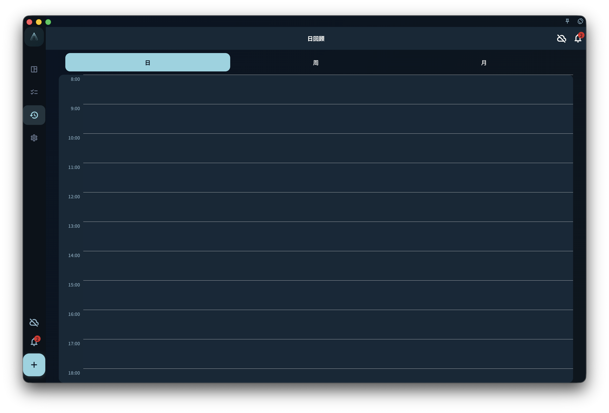
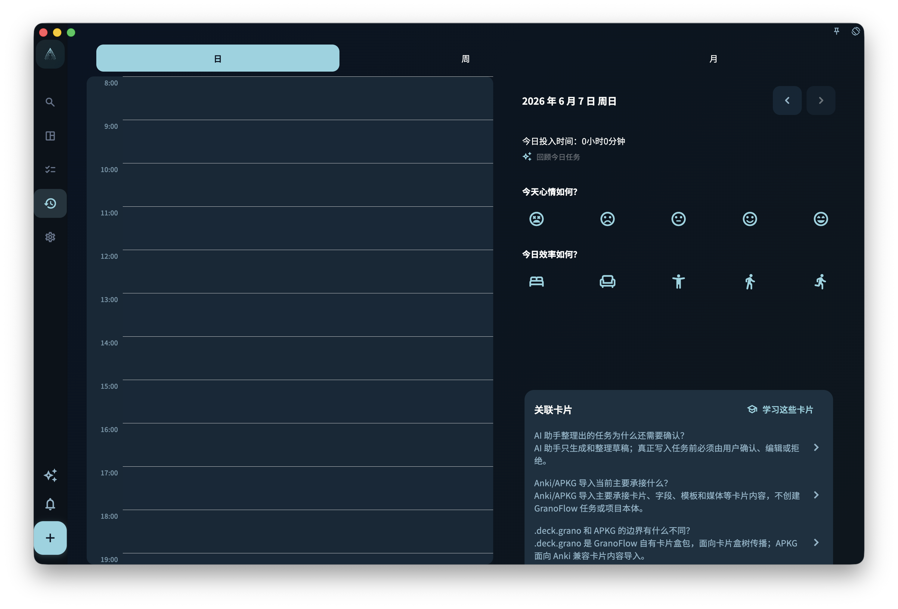

日回顾用来在一天结束时确认自己实际完成了什么，并写下几句记录。它按任务的**完成时间**统计，不按截止日期；每天从 0 点开始算新的一天。

你可以在日回顾的日期标题旁切换上一天或下一天。竖屏打开详情时，详情页顶部也会显示当前日期，并继续使用同一组上一天 / 下一天按钮；即使某一天没有完成任务，也可以切过去查看空态。

{/* manual-screenshot:id=review-overview-main */}

## 统计逻辑

日回顾只看任务什么时候被标记为完成。

这意味着：

- 任务昨天截止，但你今天才完成 → 出现在今天的回顾里
- 任务昨天 23:58 完成 → 出现在昨天的回顾里
- 任务今天 1:00 完成 → **出现在今天的回顾里**

也就是说，日回顾按自然日归类：0 点以后完成的任务会进入新一天的回顾。

## 怎么写日回顾

日回顾没有固定格式。你可以直接写下今天值得记住的几件事，例如：

- 今天完成了什么，没完成什么
- 哪件事做得顺，哪件事卡住了
- 明天想先处理什么
- 今天的状态怎么样

三到五句话通常就够了。不需要写成日报，也不需要把每个提示问题都回答一遍。

## 整理今天的任务时间

日回顾右侧会显示“今日投入时间”。这个时间按当天任务时间块的并集计算：如果两个任务时间重叠，重叠的部分不会重复相加。

<!-- manual-screenshot:id=review-daily-time-overlap-entry -->

时间轴里的任务块以任务标题为主。如果任务有关联项目，而且任务块空间足够，标题下方会用小字显示项目名称；短任务、重叠后变窄的任务块，或没有关联项目的任务，只显示任务标题。

如果你想重新梳理当天任务复盘，可以点“回顾今日任务”，让 AI 按已记录的任务时间理解当天脉络，并整理当天涉及的领域、项目和里程碑推进。任务时间只作为只读上下文，真实时间修正需要在任务列表或任务详情里手动完成。你把结果复制回 GranoFlow 后，还需要在确认框里确认，才会写入任务标题、任务回顾、当天领域日报或可选新任务。完整流程见[回顾今日任务](../ai-assistance/daily-task-review)。

## 没有完成任务的日期

如果某天没有完成任何任务，日回顾不会用空图表或“你今天没做任何事”之类的话制造压力。右侧仍会保留基础信息，例如今日投入时间为 0，以及不可回顾时的轻量反馈。

空页面只是说明：这一天没有记录到已完成任务。

:::note[回顾是给你自己看的]
回顾的受众是未来的你，不是老板或用户。怎么写让自己以后看得懂，就怎么写。
:::
