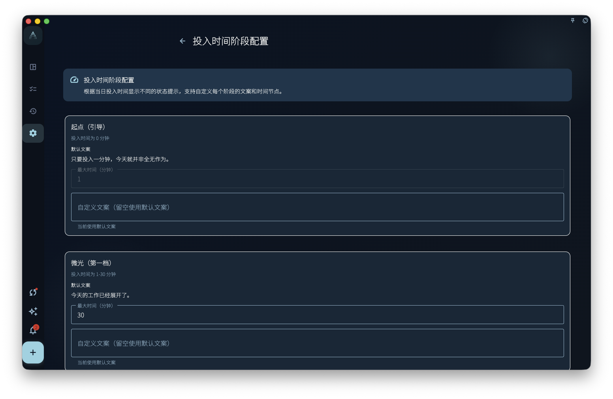
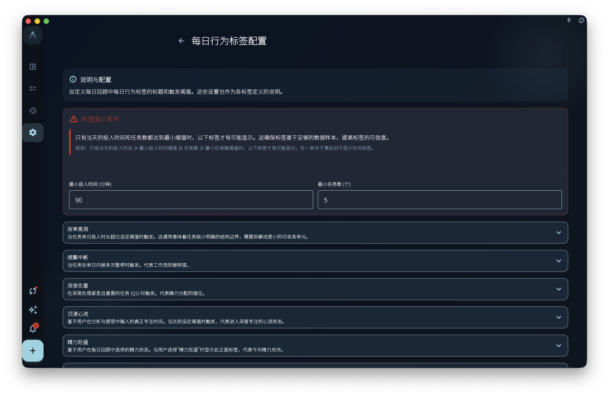
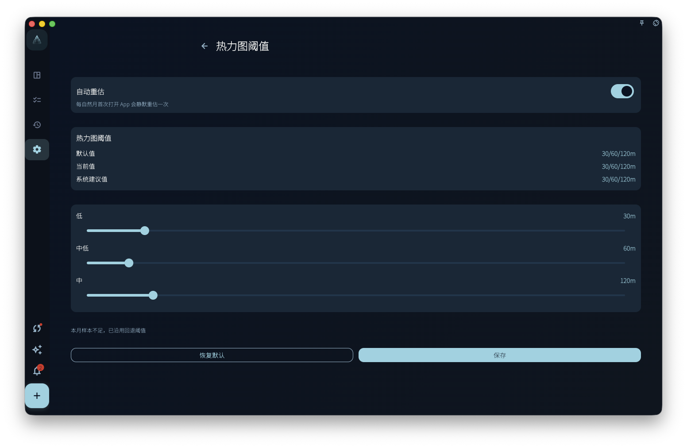

诊断和热力图设置帮助你理解回顾与进展的呈现方式，不是医疗、心理、绩效或财务评估结论。它们根据记录、投入时间和阈值生成提示，最终解释仍要回到你的真实语境。

## 从哪里进入

从会员专属设置进入投入时间阶段、每日行为标签和热力图阈值。部分页面在非会员状态下可能只允许查看或显示升级提示。

## 投入时间阶段

投入时间阶段根据当天投入时长显示不同状态文案。你可以调整阶段的时间节点和提示语，让回顾页面的状态表达更贴近自己的节奏。

<!-- manual-screenshot:id=review-diagnostic-state-settings -->

阶段文案只影响展示和解释，不会改变任务本身，也不会判断你是否“够努力”。

## 每日行为标签

每日行为标签会根据任务数量、投入时间、象限分布、暂停次数、精力选择或深度专注时长等条件显示提示。你可以调整部分标签名称和触发阈值。

<!-- manual-screenshot:id=review-diagnostic-anomaly-settings -->

这些标签用于辅助发现模式，不是诊断结论。阈值太低可能让标签过于频繁，阈值太高也可能让有用提示消失。

## 热力图阈值

热力图阈值决定不同投入时长在日历或统计热力图上如何分层显示。调整阈值后，颜色分布可能发生变化，但历史任务数据本身不会因此改变。

<!-- manual-screenshot:id=review-heatmap-threshold-settings -->

如果页面提供自动重估，它只是根据已有月份数据建议更合适的分层。接受建议前，仍要确认这些颜色是否符合你想观察的节奏。

## 使用边界

- 诊断、标签和热力图只解释 GranoFlow 中已有记录的呈现。
- 记录不完整时，提示也可能不完整。
- 它们不能替代专业医疗、心理、绩效或财务判断。
