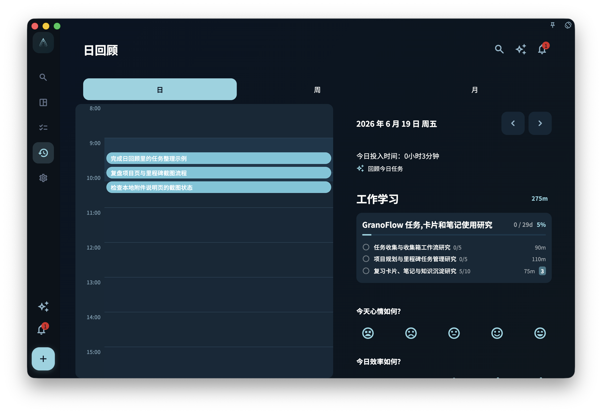

记录用来保存你在某天回顾时写下的想法。你可以写今天的感受、任务为什么完成或没完成、明天想先做什么；之后切换到那一天，就能和当天的任务一起查看。

<!-- manual-screenshot:id=review-journal-records-section -->

## 记录适合写什么

记录没有固定格式。你可以写很短，也可以写多一点。常见内容包括：

- 今天的感受，例如顺畅、拖延、意外、疲惫。
- 某件事为什么完成了，或者为什么没完成。
- 明天想优先处理什么。
- 某个项目的新想法。
- 任何你以后回顾时想重新看到的线索。

它不是日报，也不是流水账。写得短、真实，通常比写得完整但勉强更有用。

## 记录和任务的关系

记录会和当天的日期绑定，不是和某一个任务直接绑定。

如果你在完成某个任务的当天写了记录，之后查看那天的回顾时，可以同时看到当天的任务和你写下的内容。

删除或修改任务**不会**自动删除对应日期的记录。记录和任务是独立保存的。

## 查看历史记录

在回顾页切换日期，就可以查看那一天的历史记录。

只要某天有记录，你就可以通过那天的回顾找到它。
