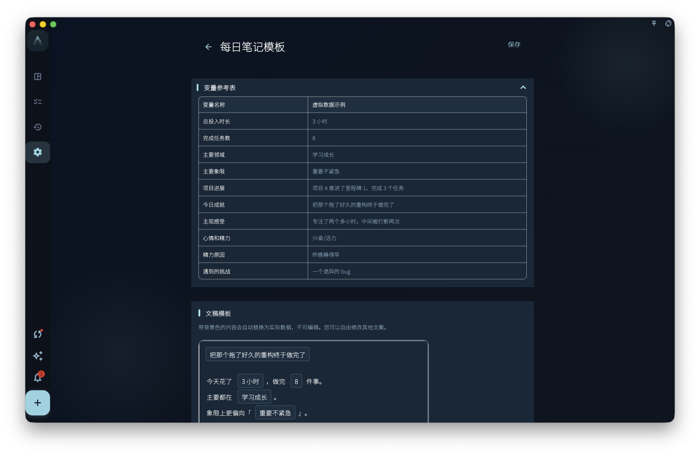

如果你每次做回顾都要想"要写什么格式"，记录模板可以省去这个步骤。

模板会在你打开今天或本周回顾时，自动生成一份带结构的草稿——比如"今天完成""今天的感受""明天优先做什么"这几个栏位已经列好，你只需要填进去。

## 两种模板

- **每日笔记模板**：影响每天生成的日记草稿
- **每周小结模板**：影响每周自动生成的周记草稿

两者独立，可以分别编辑和恢复默认。

## 变量

模板里可以使用变量，生成草稿时会自动替换成实际数据：

- 今天的日期
- 当天完成的任务列表
- 本周的回顾摘要
- 投入时间统计

这样你打开回顾时，不是面对一张空白页，而是一份已经填好了「今天完成了什么」的草稿，你只需要补充自己的感受和下一步。

## 注意：模板不替你写内容

模板只是结构框架，不会自动分析你的记录或生成总结。想要 AI 帮你整理，需要用 AI 辅助功能（不是模板）。

:::tip[会员功能]
记录模板是会员专属功能，非会员可以查看但无法自定义编辑。
:::
