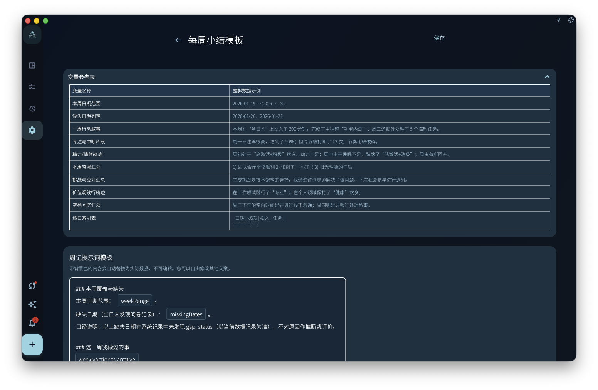

如果你想让每天或每周的回顾都有固定格式，就用记录模板。模板会先放好草稿结构，比如日期、完成事项、感受和下一步；你要做的是检查内容，然后补上自己的想法。

<!-- manual-screenshot:id=review-daily-note-template-settings -->

## 它会做什么

当你打开今天的回顾，或打开本周的小结时，GranoFlow 会按对应模板生成一份草稿。

这份草稿不是空白页。它会先把模板里的标题、段落和变量放进去。你可以把它当成一张表格：框架已经在，具体内容还需要你自己填写或调整。

## 两种模板

- **每日笔记模板**：用于每天的日记草稿。
- **每周小结模板**：用于每周的周记草稿。

<!-- manual-screenshot:id=review-weekly-note-template-settings -->

这两个模板互不影响。你可以把每日模板写得细一点，把每周模板写得更像总结；也可以分别编辑，或分别恢复默认。

## 变量是什么

变量是模板里的占位符。生成草稿时，GranoFlow 会把它们替换成实际数据。

常见变量包括：

- 今天的日期
- 当天完成的任务列表
- 本周的回顾摘要
- 投入时间统计

比如模板里放了“今天完成的任务”，打开回顾时，这一段会尽量带出当天已完成的任务。这样你不用从零开始，只需要确认哪些内容要保留，再补充感受和下一步。

## 模板不会替你写内容

模板只负责草稿结构，不会自动分析你的记录，也不会自动替你生成总结。

如果你想让 AI 帮你整理内容，需要使用 AI 辅助功能。记录模板和 AI 辅助是两件不同的事。

:::tip[会员功能]
记录模板是会员专属功能。非会员可以查看，但无法自定义编辑。
:::
