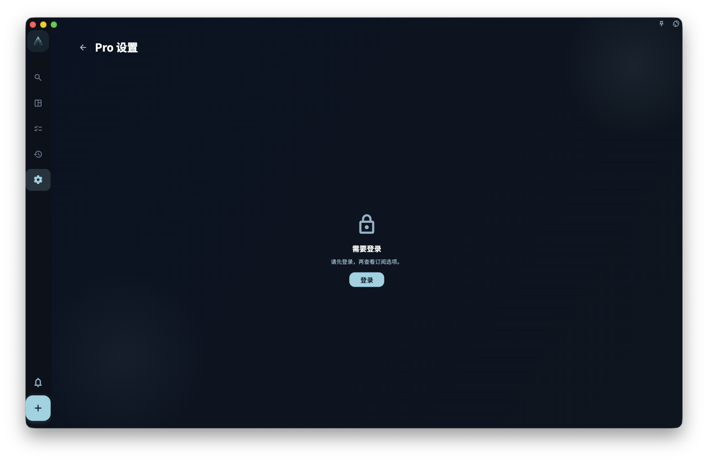

订阅权益最容易被误解的地方，是把「能用什么功能」和「能改哪些设置」混在一起。

在 GranoFlow 里，会员权益里最确定、最核心的能力是 **云同步**：当你的账号拥有有效 Pro 权益时，GranoFlow 才会允许你把本地数据同步到云端，并在多台设备之间接续使用。至于「Pro 设置」里的很多选项，它们不是一份永久固定的特权清单，而是产品前期为了处理不确定性，暂时开放给 Pro 用户调整的高级参数。

换句话说，Pro 设置不是一个必须每天研究的控制台。它更像一个缓冲区：如果你对 GranoFlow 当前的默认设定不满意，可以在这里改成更适合自己的版本；如果默认设定已经够用，就完全可以先不动。为了让这些调整能跟随账号和本地备份一起保留，当前已经纳入白名单的 Pro 设置会以明文参与云同步和本地备份。

<!-- manual-screenshot:id=subscription-vip-settings -->

## 为什么有 Pro 设置

一个产品刚开始面对真实用户时，有些默认值很难一次定准。

比如，热力图里的投入时间阈值应该多高才合理？诊断状态应该在什么时候提示你进入疲劳、停滞或异常状态？桌面端置顶窗口透明到什么程度才既不遮挡，又还能看清？这些问题没有一个适合所有人的答案。

如果 GranoFlow 直接把这些参数写死，习惯不同的用户会很难用。如果把所有参数都开放给所有人，又会让刚开始使用的人被设置淹没。所以目前的处理方式是：核心功能保持简单，云同步作为明确的 Pro 权益；一部分还在验证中的高级默认值，先放进 Pro 设置，并把其中的账号级 Pro 设置白名单带入同步和备份。

## 一个真实场景

假设你每天会在 GranoFlow 里记录任务、日回顾和专注时间。用了一段时间后，你发现热力图颜色总是太快变深，好像系统把普通工作日也判断得很重；或者你觉得诊断提示出现得太早，不符合自己的节奏。

这时，你不用把这理解成「必须升级才能正常使用」。普通用户仍然可以使用核心任务、项目、回顾和本地数据能力。Pro 用户只是多了一个调整入口：你可以进入 Pro 设置，改热力图阈值、诊断阶段、诊断异常触发条件或 AI 研究偏好，让当前版本更贴近自己的工作方式。

但这里还有一个很重要的边界：这些进入白名单的 Pro 设置会以明文同步到服务器，也会以明文写入本地备份。它们不是私密笔记、任务正文或加密内容，而是你选择过的参数值。我们会把这些设置经验作为后续开发参考，观察真实用户更常采用哪些配置。

## 哪些是稳定权益，哪些是高级设置

你可以先用这个判断方式区分：

| 类型 | 代表内容 | 应该怎么理解 |
| --- | --- | --- |
| 稳定权益 | 云同步、多设备接续、同步相关能力 | 这是 Pro 最核心、最确定的解锁能力 |
| 高级设置 | 热力图阈值、诊断阶段、诊断异常触发条件、AI 研究偏好等 | 这是给 Pro 用户调整默认值的空间，不等于永久承诺每一项都会一直可编辑 |

如果某个默认值经过足够多真实使用后已经稳定下来，而且普通用户普遍也能接受，我们可能会把它定稿为新的默认设置。到那时，对应选项可能会从 Pro 设置中移除，不再作为一个可编辑项存在。

这不是收回已经稳定的核心权益，而是把「还在试验的参数」收敛成「产品默认行为」。

## 非会员状态下会怎样

非会员通常也能看到部分 Pro 设置入口。看到入口，不代表当前账号已经拥有修改权限。

你可能会遇到几种情况：

- 云同步入口提示需要 Pro。
- 某些高级设置可以查看，但不能保存修改。
- 点击某个设置后，App 引导你查看订阅或升级说明。

这样做是为了让你知道功能在哪里，以及订阅后可能获得哪些调整空间。它不表示普通用户的数据会被限制，也不表示本地功能会因为没有订阅而停止。

## 修改 Pro 设置前，先想清楚一件事

如果你只是刚开始使用 GranoFlow，不建议一上来就把 Pro 设置全部改一遍。先使用默认值一段时间，等你真的遇到某个不适合自己的地方，再回到这里调整。

如果你已经很明确地知道自己想改什么，可以按下面顺序判断：

1. 这个设置是否影响云同步、附件或多设备使用？
2. 这个设置是否只是改变显示、阈值、提示语或 AI 辅助偏好？
3. 你是否接受这个参数会以明文同步到服务器，并以明文进入本地备份，作为后续产品默认值调整的参考？

如果第 3 点不能接受，就不要修改这一项。保持默认值即可。

## 同步权益的特殊说明

云同步是 Pro 的核心权益。如果当前账号没有可用权益，同步入口会提示你查看或开通会员。

<!-- manual-screenshot:id=subscription-sync-vip-upsell -->

看到同步权益说明页，**不代表同步已经开始，也不代表你的本地数据已经丢失**。本地数据独立于同步权益存在。只有当你登录账号、满足权益条件，并主动完成同步相关流程后，数据才会进入云同步链路。

这里也要区分两类数据：任务、项目、里程碑、卡片笔记等用户内容会按 GranoFlow 的加密边界处理；Pro 设置白名单本身是明文设置值，会随同步和本地备份保留。普通设备偏好，例如语言、主题、窗口状态、当前选中的 AI 助手等，不会因为 Pro 设置同步而变成账号级同步内容。

:::note[权益以服务器为准]
App 本地显示的权益状态，来源于服务器返回的账号信息。网络不佳时可能临时显示不正确，稍后刷新即可。
:::

理解了权益和高级设置的区别之后，下一步可以继续看平台购买与恢复购买：它解释为什么同一个 Pro 权益，在不同商店平台和不同登录账号之间可能会出现显示差异。
