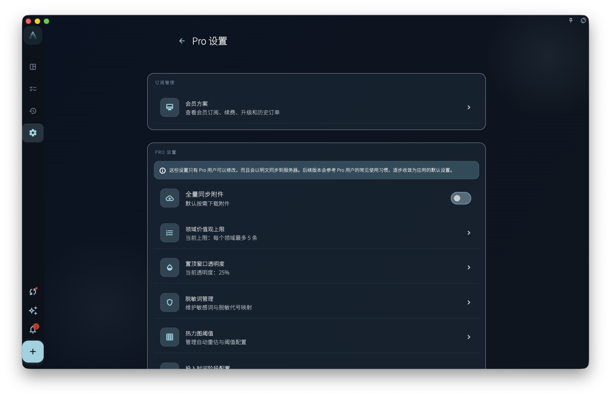
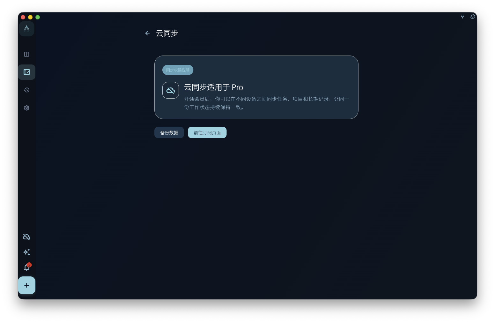

查看订阅权益如何生效，并理解本地显示、服务器状态和购买凭证之间的关系。

## 从哪里开始

从订阅或账号页面查看当前权益。订阅状态以服务器返回的账号订阅状态为准，本地显示只用于当前界面反馈。

## 怎么操作

- 购买后保持登录同一账号，等待订阅状态刷新。
- 需要恢复购买时，使用对应平台提供的恢复入口，并确认当前登录账号是否正确。
- 如果权益没有出现，先检查平台、账号、网络和购买记录，再进入排查。

## 结果和边界

订阅会影响可用权益，但不会改变你的任务数据所有权。购买凭证、平台订单和 GranoFlow 账号之间需要能对应起来。

- 不同平台的购买不一定自动转移到另一个平台。
- 支付卡号等支付凭证由平台处理，GranoFlow 不把它们作为手册操作的一部分保存。

## 会员专属设置

会员专属设置集中放置更高级的个性化能力，例如 AI 脱敏词、Helper 助手提示词、回顾 Prompt、记录模板、诊断配置和热力图阈值。部分入口在非会员状态下可能只读、显示升级提示，或不能保存修改。

<!-- manual-screenshot:id=subscription-vip-settings -->

这些设置说明你能使用哪些权益，不直接解决具体同步冲突、数据恢复或账号恢复问题。涉及数据安全、云端密钥或新设备入云时，请回到数据安全章节按对应流程处理。

## 同步会员说明

当你使用同步入口但当前账号没有可用权益时，GranoFlow 可能显示同步会员说明页。这个页面解释为什么同步能力需要会员，以及可以从哪里查看或开通权益。

<!-- manual-screenshot:id=subscription-sync-vip-upsell -->

看到同步会员说明，不代表本地数据已经丢失，也不代表云端恢复已经执行。它只是同步入口的权益门槛提示；真实同步状态仍以同步页、账号状态和数据安全相关页面为准。

## 下一步

恢复购买仍失败时，保留平台订单信息并查看订阅相关排查。
