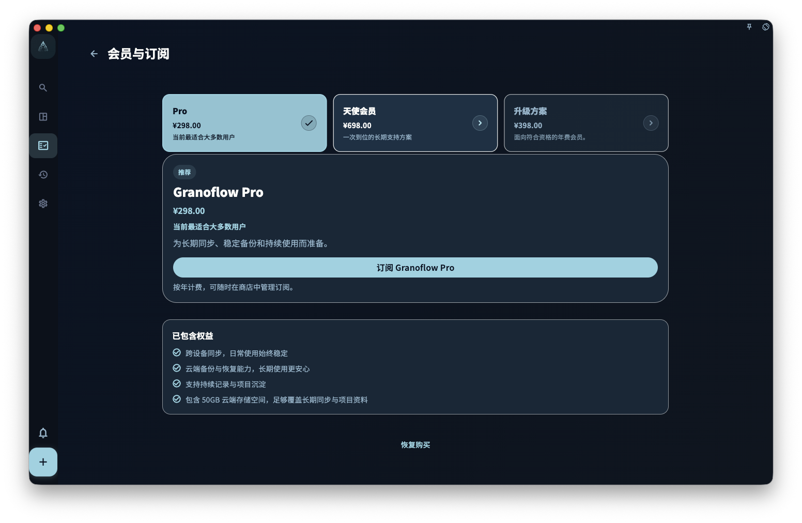

你不需要先订阅，也可以使用 GranoFlow 的核心功能：任务、项目、价值观、轻日记、回顾、本地数据和备份都能免费使用。会员主要适合两种情况：你想在多台设备之间同步，或者想使用更多个性化定制。

所以，刚开始用 GranoFlow 时，可以先用免费版把生活和工作整理起来。等你确认它适合自己的节奏之后，再决定要不要开通会员。

<!-- manual-screenshot:id=subscription-overview-main -->

## 免费 vs 会员，有什么区别

| 功能 | 免费 | 会员 |
| ---- | ---- | ---- |
| 任务、项目、价值观 | ✅ | ✅ |
| 轻日记、回顾、备份 | ✅ | ✅ |
| AI 任务解析与思路梳理 | ✅ | ✅ |
| 多设备云端同步 | ❌ | ✅ |
| 个性化定制 | ❌ | ✅ |

简单说：**免费版适合先认真试用，也适合长期只在一台设备上使用；会员适合需要多设备衔接，或者希望界面、主题和使用细节更符合自己习惯的人。**

## 订阅状态在哪里看

打开 GranoFlow 的设置，进入账号/订阅页面，就可以查看当前订阅状态。未订阅且商店可用时，页面会先显示方案切换器和当前方案详情；选择天使会员或升级方案时，详情卡会直接显示 2026 年 11 月 22 日截止购买或截止付费升级为天使会员。商店暂不可用或正在加载时，页面只显示状态说明、已包含权益、恢复购买和管理订阅入口，不会显示价格或购买按钮。

**重要**：订阅状态来自服务器，不是 App 自己决定的。如果你已经购买，但权益还没有出现，先等一会儿让状态刷新；如果仍然没有变化，再检查网络和当前登录账号。

## 最常见的问题

**买了为什么没有权益？**
先确认一件事：你现在登录的账号，和购买时用的账号，是不是同一个。

**换手机后权益怎么了？**
用同一个账号登录，权益通常会跟着账号一起回来。

**不同平台（iOS/Android/macOS）的购买能共享吗？**
不一定。请看[平台购买与恢复购买](/subscription/platforms-and-restore/)。

## 订阅和数据，哪个更重要

订阅决定你能使用哪些功能，但不决定你的数据归谁。

即使订阅过期，你的本地任务、项目、价值观、轻日记和备份数据仍然保留，你也可以继续使用所有免费功能。会员只是让这些内容更容易跨设备同步，并让界面和体验更贴合你。
