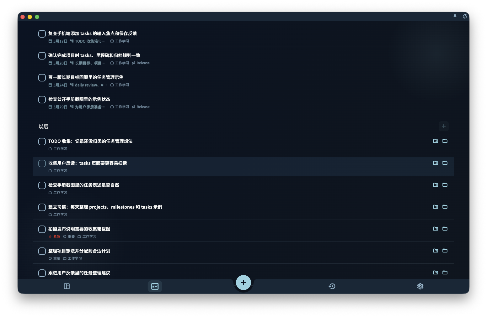

如果一个任务太大、不知道从哪里开始，就打开任务详情，在“步骤”或“节点”区域把它拆成几个小动作；每次只完成一个节点，节点都做完后，父任务就可以完成。

## 怎么拆解任务

打开任务详情，找到“步骤”或“节点”区域，点击添加第一个子步骤。

每个步骤（节点）只写一个能直接去做的动作。比如“写完整个报告”太大，可以拆成：

- “整理参考资料”
- “写提纲”
- “写正文第一段”
- “修改”
- “发给同事确认”

不用一次把所有步骤想完。先写最近能做的一两步，做完后再补新的步骤也可以。

## 节点和父任务的关系

- 完成节点后，父任务的进度会更新，比如“3/5 完成”
- 所有节点都完成后，父任务可以标记为完成
- 如果你又**加了一个新的未完成节点**，父任务会回到待办；这是正常的，系统是在提醒你还有事情没做

:::tip[不要嵌套太深]
节点可以继续添加子节点，但不要嵌套太多层。两层通常就够了。更复杂的结构，通常更适合拆成独立任务或项目里程碑。
:::

## 拆解任务 vs 创建项目里程碑

| 适合用节点拆解 | 适合用里程碑划阶段 |
| --- | --- |
| 任务在几小时到几天内能完成 | 目标需要几周甚至几个月 |
| 步骤相互依赖、顺序固定 | 阶段之间相对独立 |
| 不需要跨任务管理进度 | 需要在项目层面追踪进展 |

简单说：节点回答“下一步怎么做”，里程碑回答“项目做到哪个阶段了”。
