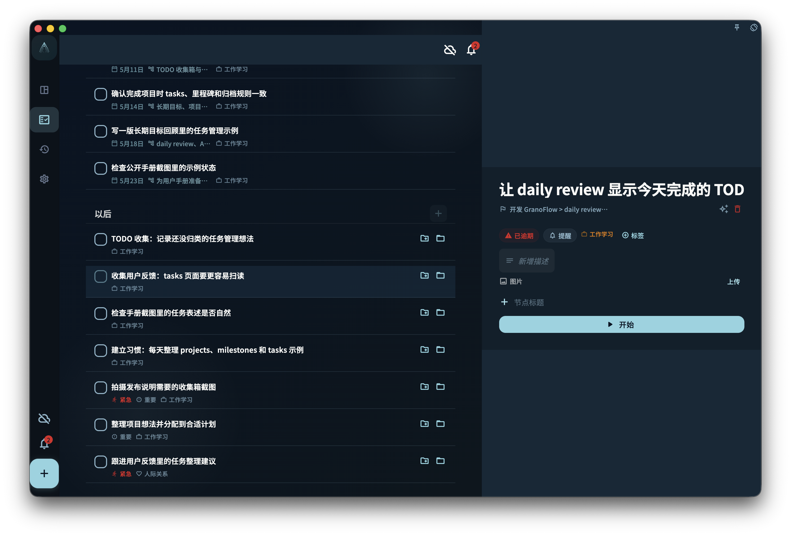

把复杂任务拆成可执行的小步骤，理解节点完成、父任务状态和排序限制之间的关系。

## 从哪里开始

打开任务详情，在拆解或步骤区域添加子节点。适合处理需要多个动作才能完成的任务。

<!-- manual-screenshot:id=tasks-breakdown-detail -->

## 怎么操作

- 把下一步写成短句，必要时继续添加多个节点。
- 完成子节点后，父任务进度会按节点状态变化；所有有效子节点完成时，父任务可以被视为完成。
- 如果重新添加或恢复未完成节点，父任务可能回到待处理状态，这是为了避免复杂任务被过早关闭。

## 结果和边界

拆解不会创建另一个项目，它只是让一个任务内部更可执行。排序和拖动会受到状态限制，避免已完成或受保护内容被随意重排。

- 没有子节点时，任务仍按普通任务处理。
- 节点完成不等于项目完成；项目和里程碑仍有自己的状态。

## 下一步

需要阶段目标时，用“管理里程碑”而不是无限拆子任务。
