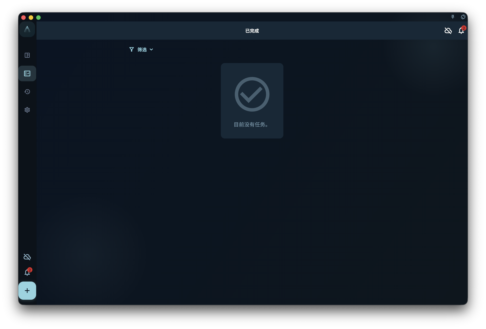
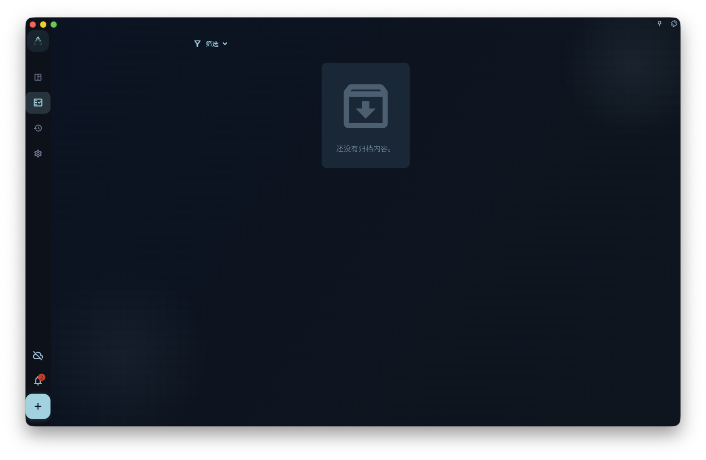
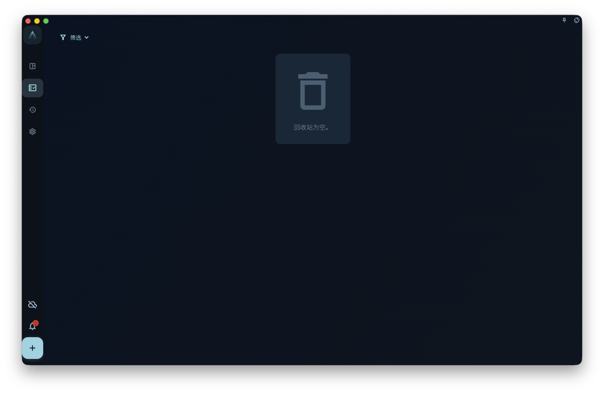

理解任务完成、归档、删除和恢复的区别，避免把正常的隐藏或保护状态误认为数据丢失。

## 从哪里开始

在任务列表或详情页完成任务；在需要整理历史内容时再使用归档或删除。

<!-- manual-screenshot:id=tasks-completed-archived-trash -->

## 怎么操作

- 点击完成后，任务会从待处理列表中退出，并进入完成相关的统计、回顾或历史位置。
- 归档用于把不再活跃但仍需要保留的任务从日常视图中收起。
- 删除前确认影响范围；删除比完成和归档更接近不可逆整理。

<!-- manual-screenshot:id=tasks-archived-list -->

<!-- manual-screenshot:id=tasks-trash-list -->

## 结果和边界

任务没有出现在当前列表，不一定代表丢失。它可能已完成、被归档、被筛选条件隐藏，或移动到项目、日期、标签对应的视图。

- 已完成任务和已归档任务有不同用途，不要为了清空列表而直接删除。
- 如果任务涉及回顾、统计或项目历史，删除会让这些上下文变少。

## 下一步

找不到任务时，先检查筛选、项目、日期、完成状态和归档状态。
