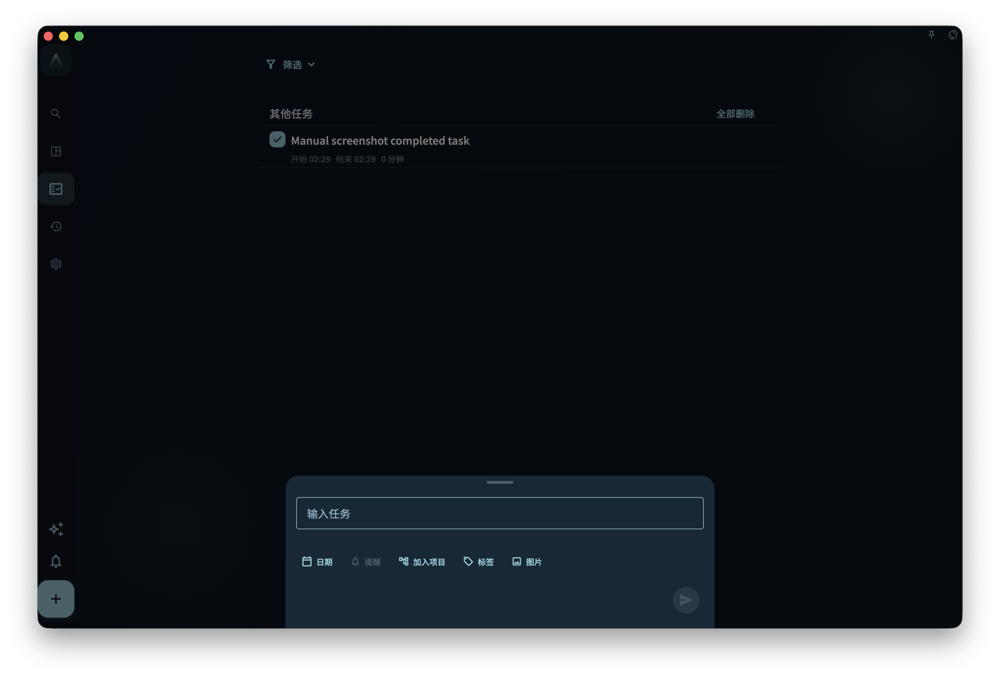
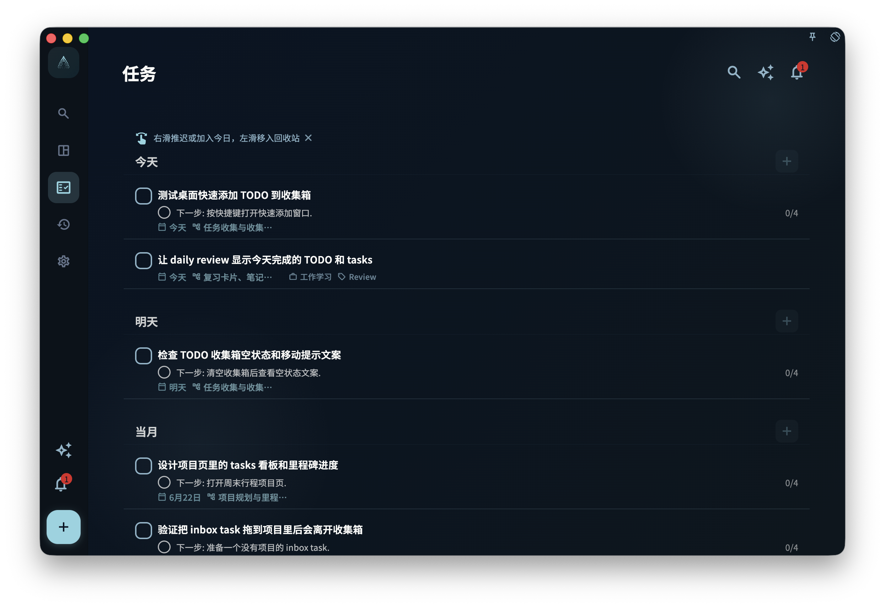
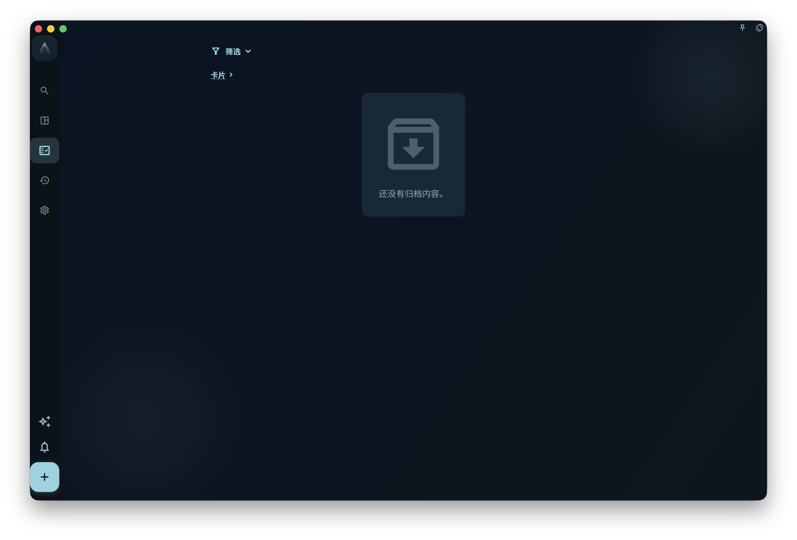
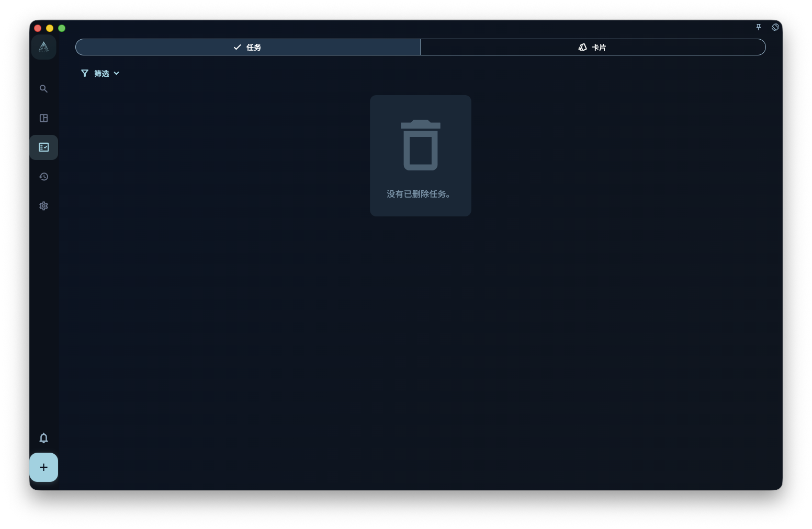
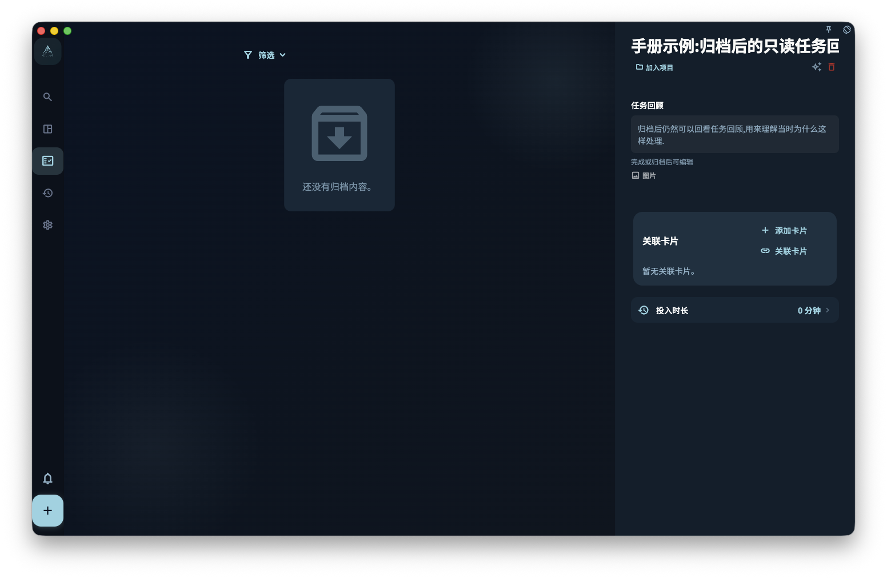

任务从列表里不见了，先别急着以为它丢了。最常见的原因是：它被筛选条件藏起来了，被安排到了某一天，放进了项目，已经完成，被归档，或者在回收站里。

GranoFlow 里和“任务不见了”最相关的三个状态是：

- **已完成**：事情做完了，会进入完成视图和日回顾统计
- **已归档**：暂时不用看，但保留记录
- **回收站**：任务被删除了，但回收站还没有清空

## 完成

一件事做完后，可以在任务详情里点“完成”，也可以从列表上的完成入口把它标记为完成。完成后，这个任务会：

- 从当前待办列表里消失
- 记录一个完成时间
- 出现在“已完成”视图里
- 用于日回顾统计
- 在任务详情里隐藏“开始”和“完成”按钮，避免已经结束的任务再次被当作待办启动

如果这条任务正在专注中，点“完成”会先结束当前专注会话，再完成任务，并把它从“当前任务”里清掉。这样任务状态、专注记录和任务列表顶部的当前任务会保持一致。

<!-- manual-screenshot:id=tasks-completed-archived-trash -->

:::tip[小技巧]
如果你还想在日回顾里看到完成记录，不要随手删除已完成任务。已完成任务不是垃圾，它们是你的完成记录。
:::

## 完成后先校准时间

任务刚完成时，系统会记录一个完成时间。这个时间已经足够让任务进入“已完成”视图和日回顾，但它不一定等于你真实开始和结束这件事的时间。

如果你希望以后复盘更准确，完成任务后建议打开这条已完成任务的详情，点击“时间记录”。弹出的时间记录窗口可以修改开始时间和完成时间。你可以把它改成更接近真实情况的时间段，例如“下午 3:10 开始整理资料，4:05 结束”，而不是只留下点完成按钮的那一刻。

<!-- manual-screenshot:id=tasks-completion-time-record-editor -->

这一步很推荐，但不是强制。它尤其适合这些任务：

- 你没有点“开始”，但实际做了一段时间。
- 你忘了及时点完成，完成时间晚于真实结束时间。
- 你想在日回顾里看到更接近真实的投入时间分布。
- 你希望以后回看这一天时，能知道时间大概花在了哪里。

时间记录会影响日回顾里的任务时间块和“今日投入时间”。日回顾按当天任务时间块的并集计算投入时间；如果两个任务时间重叠，重叠部分不会重复计算。为了避免明显不合理的记录，开始时间必须至少早于完成时间 1 分钟，完成时间也不能设在未来。

完成后，任务详情里会显示“任务回顾”，并允许编辑。这里适合记录确认过的情况、问题和经验。

已完成任务详情还会显示“心流时间”。它不是从开始时间到完成时间自动算出来的“投入时间”，而是你手工记录的真正专注时间；同一天完成的任务会共用这一天的心流时间。任务归档后可以继续编辑任务回顾，但不再显示可编辑的心流时间入口。

专注会话和心流时间不是同一个字段。专注会话记录你在某条任务上启动和结束的一段投入；心流时间是你在回顾里手工确认的主观专注时间，用来帮助复盘这一天真正沉进去多久。两者都可以帮助回顾，但含义不同。

## 归档

归档适合这种任务：你现在不想天天看到它，但以后可能还需要知道它存在过。

例如：项目里的旧任务、已经过期但有参考价值的事项、不想放在当前列表里但也不想删除的内容。

<!-- manual-screenshot:id=tasks-archived-list -->

已归档视图只处理任务归档。卡片归档和任务归档的含义不同：卡片退出主动复习，但仍可能留在任务和回顾上下文里。要查看已归档卡片，进入「卡片管理」，点「筛选」，在状态里选择「已归档」。如果你想理解卡片为什么可以退出主动复习但仍留在任务上下文里，阅读 [练习、掌握与内化](/manual/review-cards/study-and-internalize/)。

归档和完成不是一回事：

- **完成**：表示任务真的做完了，会进入完成统计
- **归档**：只是把任务从当前视图收起来，不代表做完，也不进入完成统计

## 回收站

删除任务后，任务会进入回收站。只要回收站还没有被清空，你还可以去回收站查看它。

外层回收站只处理已删除任务。已删除卡片不在这里出现；要查看卡片回收站，进入「卡片管理」，点「筛选」，在状态里选择「回收站」。如果你从某个卡片盒进入卡片管理，回收站也会按当前卡片盒范围显示。

恢复任务时，如果它原来属于已经删除的项目或里程碑，GranoFlow 会让你选择：一并恢复原项目和里程碑，或只把任务恢复到收集箱。选择只恢复任务时，它会变成没有项目、没有里程碑、没有日期的普通收集箱任务，你之后可以再重新整理。

<!-- manual-screenshot:id=tasks-trash-list -->

:::caution[清空前想好]
手动清空回收站是不可逆的。如果任务曾经属于某个项目，或者还有回顾价值，清空后就不能再靠回收站找回了。
:::

## 找不到任务怎么办

按这个顺序查，通常最快：

1. 看看是不是筛选条件把它隐藏了，比如只显示“今天”的任务。
2. 想想它是不是设置了日期。如果有日期，去那一天的任务列表找。
3. 想想它是不是加进了某个项目。如果有项目，去项目页面找。
4. 如果它已经做完了，去“已完成”视图找。
5. 如果你不想在当前列表里看到它，可能已经把它归档了，去“已归档”视图找。
6. 如果你删除过它，去回收站找。

大多数找不到的任务，都在上面这些地方。

## 重新启用后的任务回顾

如果你完成任务后写了任务回顾，之后又取消完成或重新启用任务，已有回顾不会被清空。未完成时，任务详情不会显示任务回顾；任务再次完成或归档后，回顾会重新显示并可以编辑。

<!-- manual-screenshot:id=tasks-detail-review-readonly -->

