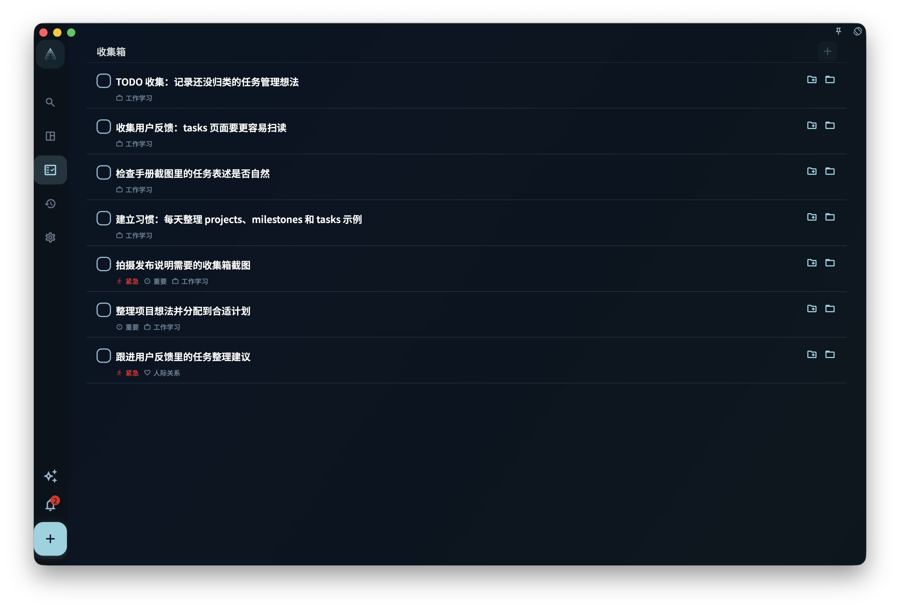
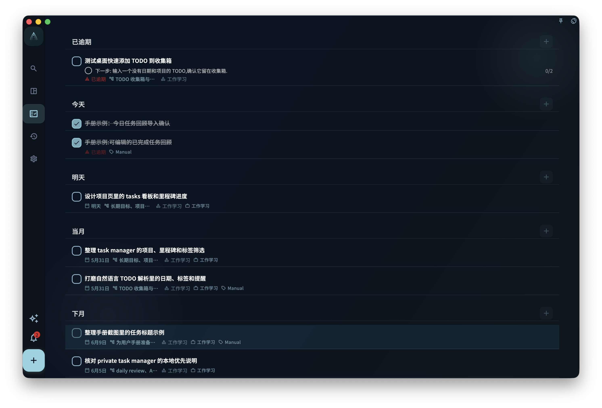

想快速创建任务，只需要输入一个标题，然后保存。其他内容都可以先不填；等你要安排日期、归到项目、加标签或拆成步骤时，再打开任务补充。

## 从哪里创建任务

| 入口 | 适合的场景 |
| --- | --- |
| 底部 **+** 按钮 | 想马上记下一件事 |
| 收集箱页面内的输入框 | 正在整理收集箱时顺手添加 |
| 项目或里程碑页面内 | 创建后希望它直接属于这个项目或阶段 |
| 已有任务详情里的节点 | 想把一个大任务拆成更小的步骤 |

## 任务编辑界面

<!-- manual-screenshot:id=tasks-create-edit-dialog -->

创建或编辑任务时，你会看到这些字段。只有标题必须填写。

| 字段 | 是否必填 | 作用 |
| --- | --- | --- |
| 标题 | ✅ 必填 | 任务名称。写得越具体，之后越容易执行 |
| 描述 | 可选 | 放背景信息、链接、备注等补充内容；支持 [富文本内容](/manual/interface/markdown-content/) |
| 截止日期 | 可选 | 设置后，任务会出现在对应日期的任务列表里 |
| 提醒 | 可选 | 到指定时间发通知；提醒时间不能设在过去 |
| 项目 | 可选 | 设置后，任务会从收集箱移到对应项目里 |
| 里程碑 | 可选 | 让任务属于项目中的某个阶段 |
| 标签 | 可选 | 用来筛选任务；一个任务可以有多个标签 |
| 节点 | 可选 | 把任务拆成更小的步骤 |
| 任务回顾 | 可选 | 记录完成后的复盘内容；完成或归档后可以编辑 |
| 任务卡片 | 可选 | 在项目任务里关联或新建卡片，把这次任务里的经验保存成以后可复习的判断 |

如果你选择的自定义标签带有模板，并且这条任务还没有描述和节点，GranoFlow 会在保存后把模板内容添加到任务描述和根节点里。任务已经有描述或节点时，模板会跳过，避免覆盖你已经填写的内容。同一个标签模板对同一条任务只会自动添加一次；如果模板添加失败，标签选择会保留，你可以稍后手动补充描述或节点。

:::tip[善用自然语言输入]
在标题输入框里，你可以直接写 `#标签名`、`@日期`、`~提醒时间`，GranoFlow 会自动解析。比如输入 `整理报告 @明天 #工作`，会自动识别出明天的日期和“工作”标签。详细规则见[用自然语言写任务](title-parser)。
:::

## 保存后任务去哪了

任务保存后出现在哪里，取决于你填了哪些字段：

- **没有日期、没有项目** → 进入收集箱
- **有日期** → 出现在那一天的任务列表里
- **有项目** → 出现在对应项目里
- **在项目页面里创建** → 直接归属到那个项目

修改日期、项目或里程碑，不会新建另一个任务，只是改变同一个任务的位置或归属。

## 编辑已有任务

点击任何任务，就可以打开任务详情。改完字段后，退出详情页时会自动保存。

<!-- manual-screenshot:id=tasks-detail-review-editable -->

任务完成或归档后，详情里会显示“任务回顾”。你可以在这里补充这件事实际花了多久、后来确认了什么、下次要注意什么。如果你先完成任务并写了回顾，之后又把任务恢复为未完成，已有回顾不会被清空；任务再次完成或归档后，回顾会重新显示并可以编辑。

如果任务属于项目，详情里还会出现“任务卡片”区域。你可以从这里添加新卡片、关联已有卡片，或进入这条任务相关卡片的练习。已关联卡片会按笔记分组展示；同一篇笔记下的多张卡片会放在一起，未归档卡片排在已归档卡片前面。取消关联只会解除当前任务和这篇笔记下卡片的关系，不会删除卡片本身。

任务描述、任务回顾，以及其他支持长文本的字段可以使用富文本编辑。需要添加表格、公式、本地图片、远程音频或 YouTube 视频时，阅读 [富文本内容](/manual/interface/markdown-content/)。
:::caution[注意]
提醒不能设置在已经过去的时间。如果你选择的提醒时间已经过了，系统会提示你重新选择。
:::

完成、归档和删除是三种不同操作。填写或修改字段，不会让任务自动变成完成状态。
