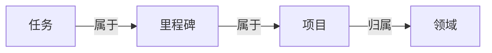

在 GranoFlow 里，任务就是你要做的一件具体的事。你可以先点底部中间的 **+**，把事情写下来并保存；以后再决定它要不要放进项目、里程碑或领域。

你可以把 GranoFlow 当成普通任务清单来用。比如“给妈妈打电话”“完成第三章初稿”，都可以直接建成任务。

GranoFlow 也支持把任务连接到项目、里程碑和领域。这样做的好处是：当事情变多时，你不只知道“要做什么”，也能看见“这件事为什么重要”。但这不是必须的。简单的事，直接记成任务就够了。

## 怎么加一个任务

最快的方法是：点底部栏中间的 **+** 按钮，输入任务内容，然后保存。

现在不需要想清楚它属于哪个项目、哪天做、有没有标签。先把事情记下来，晚点再整理。

<!-- manual-screenshot:id=tasks-overview-main -->

如果任务没有日期，也没有项目，它会先进入**收集箱（Inbox）**。你可以把收集箱理解成临时便条区：先放进去，有空再处理。

左上角菜单里可以找到这些任务视图：

| 入口 | 显示的内容 |
| --- | --- |
| 收集箱 | 还没有日期或项目的任务 |
| 任务列表 | 正在推进的任务 |
| 已完成 | 已经做完的任务 |
| 已归档 | 不需要日常关注、但想保留记录的任务 |
| 回收站 | 已删除但还没有清空的任务 |

进入“任务列表”后，任务会按时间分区显示，比如逾期、今天、明天、本周、本月、下个月和更晚。每个分区右上角都可以快速添加任务；如果你在“今天”里添加，任务会默认安排到今天，如果在“明天”里添加，就会默认安排到明天。保存时仍然可以改标题、日期、提醒、项目、里程碑、标签或图片。

如果你已经把某个任务设为当前正在做的任务，任务列表顶部会出现“当前任务”。它不是一个新的任务，而是原任务的置顶显示，方便你回到正在推进的那件事。点开它，宽屏时会在右侧打开详情，窄屏时会进入任务详情页。

## 任务、项目、里程碑、领域的关系

你可以先只用任务。等事情变复杂了，再往上加结构：

- **任务**：一件具体要做的事，是最基本的单位
- **里程碑**：项目里的一个阶段节点，比如“完成用户测试”
- **项目**：一段时间内持续推进的目标，比如“App 发布”
- **领域**：你长期在意的生活范围，比如“工作”“健康”

不是每个任务都需要连接到项目。能直接完成的小事，就直接做。需要长期推进的事，再用项目、里程碑和领域来整理。

## 任务的几种状态

| 状态 | 什么时候用 |
| --- | --- |
| 待办 | 还没开始做 |
| 进行中 | 正在做，建议同时只标一个 |
| 已完成 | 已经做完，会记录完成时间 |
| 已归档 | 不再需要关注，但保留记录 |
| 回收站 | 已删除，还没有清空 |

:::tip[专注技巧]
把任务标为“进行中”时，GranoFlow 会尽量只保留一个进行中任务。这样可以帮助你把注意力放在当前正在做的那件事上。
:::

在任务详情里点“专注”，这条任务会变成当前任务，并开始记录一次专注会话。之后你回到任务列表，就会在顶部看到它。如果已经有另一条任务正在专注中，GranoFlow 会提示你先完成或停止那条任务，避免同时有两件事都被当成“当前正在做”。

如果任务已经拆成节点，任务列表会在未完成任务下方显示一个轻量的“下一步”。勾选这里时，只会完成当前这个节点，不会直接把整条任务标为完成；完成后列表会刷新到下一个未完成节点。

## 第一次用，怎么开始

点 **+**，写下今天最想完成的一件事，然后保存。

这就够了。等你真的需要整理时，再去使用项目、里程碑、领域、归档等功能。
