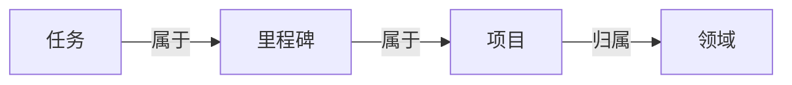

任务（tasks）就是你要做的那件具体的事。不管是"给妈妈打电话"还是"完成第三章初稿"，都可以是一个任务。

GranoFlow 的任务系统和普通 Todo 应用最大的不同是：任务可以连接到项目、里程碑和领域，让你在记录的同时，不迷失"这件事为什么重要"。

但这不是强制的。你完全可以只用任务清单，不碰项目，效果也很好。

## 怎么加一个任务

最快的方式：点底部栏中间的 **+** 按钮，写下来，保存。

不需要现在就想清楚它属于哪个项目、几号做、有没有标签。先记，晚点再整理。

任务如果没有日期也没有项目，它会先落在**收集箱（Inbox）**。你可以把收集箱当成你口袋里的便条纸堆——下次有空再处理。

左上角菜单里可以找到所有任务视图：

| 入口 | 显示的内容 |
| --- | --- |
| 收集箱 | 还没有日期或项目的任务 |
| 任务列表 | 正在推进的任务 |
| 已完成 | 做完的任务 |
| 已归档 | 不再需要日常关注、但保留记录的任务 |
| 回收站 | 删掉的任务，还可以恢复 |

## 任务、项目、里程碑、领域的关系

可以先从任务开始，等结构需要的时候再往上搭：

- **任务**：一件具体的事，最基本的单位
- **里程碑**：项目里的一个阶段节点（比如"完成用户测试"）
- **项目**：一段时间内的持续目标（比如"App 发布"）
- **领域**：你长期在意的生活范围（比如"工作""健康"）

不需要每个任务都连接到项目。简单的事直接做，复杂的事才需要上层结构。

## 任务的几种状态

| 状态 | 什么时候用 |
| --- | --- |
| 待办 | 还没开始做 |
| 进行中 | 正在做（建议同时只标一个） |
| 已完成 | 做完了，会记录完成时间 |
| 已归档 | 不再需要关注，但留着记录 |
| 回收站 | 删掉了，还没清空 |

:::tip[专注技巧]
把任务标为"进行中"时，GranoFlow 会尽量只保留一个进行中任务，帮你保持专注，不让半吊子的事越堆越多。
:::

## 第一次用，怎么开始

点 **+**，写下今天最想完成的一件事，保存。

就这样。其他功能等你用到了再探索。
