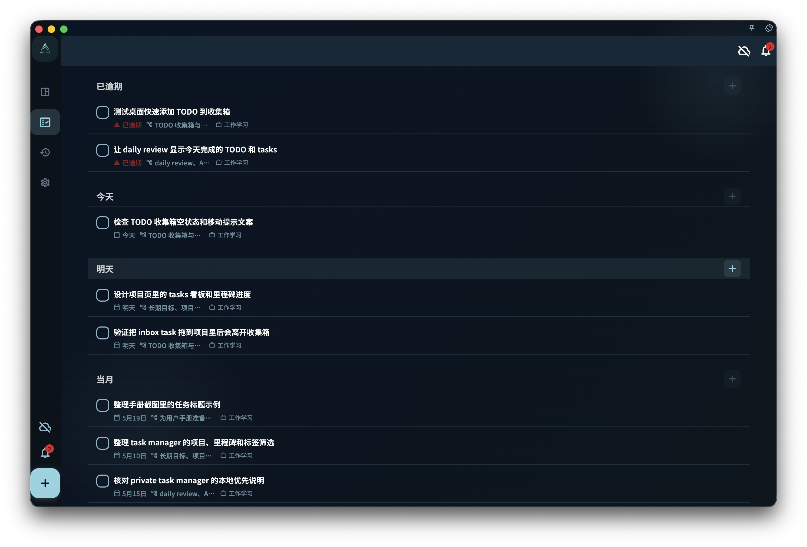

GranoFlow 的任务系统帮助你把零散想法变成清晰的下一步行动。

任务是 GranoFlow 中最小的行动单位。你可以先记录一件事，等它与项目、里程碑或长期领域的关系变得清楚后，再决定如何整理。

## 任务入口

你可以从底部栏中间的 `+` 按钮添加任务。

<!-- manual-screenshot:id=tasks-overview-main -->

快速添加入口优先服务于“先收集”。先写下眼前最明确的一件事，再按需要设置日期、项目、里程碑和标签。保存任务前，不需要先想清楚完整结构。

如果任务没有日期，也没有项目，它会先留在收集箱。给它分配项目后，它会从收集箱离开，出现在对应项目里。这样收集箱始终更像一个待整理入口，而不是固定文件夹。

你也可以通过左上角菜单找到任务相关入口：

- 收集箱：临时存放刚记录的想法和任务，等你之后再整理。
- 任务列表：查看正在推进的任务。
- 已完成：查看已经完成的任务。
- 已归档：保存不再需要日常关注的任务或相关内容。
- 回收站：查看已删除、等待后续处理的内容。

## 任务、项目、里程碑与领域

任务用于具体行动。

复杂任务可以继续拆成更小的步骤。这样你不必把“大任务”一次做完，可以先把下一步写清楚。

项目把围绕同一目标或方向的任务组织在一起。

里程碑标记项目中的阶段目标或有意义的进展点。

领域描述你长期在意的生活范围和价值，例如工作、学习、关系、健康或创作生活。

你不需要一次性搭好完整结构。先从任务开始，只有当上层结构真的有用时，再把任务向上连接。

## 任务状态与日常使用

任务还在推进时，可以留在你的任务列表中。

如果你把某个任务标记为进行中，系统会尽量保持当前只有一个进行中的任务，避免多个任务同时占用注意力。

完成后，把它标记为已完成。

如果它不再需要日常关注，但仍然值得保留，可以归档。归档后的任务更接近历史记录，不适合继续当作日常任务反复编辑。

如果某件事添加得太早，或只是误加，可以删除，并之后在回收站中恢复或继续清理。

## 不同屏幕上的布局

在宽屏或桌面模式下，任务相关页面可能会显示侧边导航或更宽的布局。

在窄屏或手机上，你主要通过底部导航、左上角菜单和底部 `+` 按钮操作。

不同平台的视觉细节可能略有差异，但收集、任务列表、完成、归档和回顾之间的关系保持一致。

## 第一次使用

如果这是你第一次使用任务系统，点按底部栏中间的 `+`，先写下一件清楚的事。

保存后，再判断它只是一个普通任务，还是应该属于某个项目、里程碑或长期领域。

不要一开始就整理所有东西。先记录一个真实的下一步行动。
