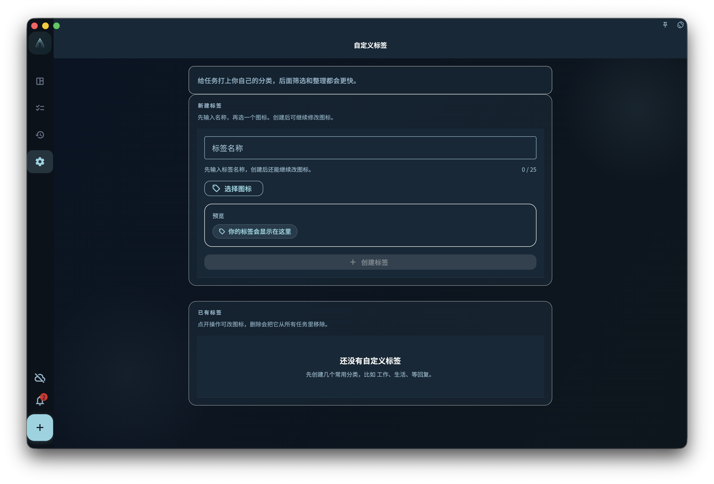

用标签给任务补充项目之外的分类，并了解创建、选择、删除标签时对已有任务的影响。

## 从哪里开始

在任务详情或新建任务时打开标签选择器。已有标签会作为候选出现；需要新分类时再创建自定义标签。

<!-- manual-screenshot:id=tasks-tags-management -->

## 怎么操作

- 选择一个或多个标签后保存，任务会在相关标签筛选中出现。
- 创建标签时使用清晰、长期会复用的名称；标签不是临时备注，适合表达场景、精力、领域或处理方式。
- 删除标签前确认影响范围。删除标签会从使用它的任务上解绑，而不是删除这些任务。

## 结果和边界

标签是横向分类，适合补充项目之外的视角。同一个任务可以属于项目，也可以带多个标签。

- 标签名称需要保持可区分；重复或含义过近会让筛选变得混乱。
- 删除标签不会恢复到某个历史标签状态。

## 下一步

需要把任务放进长期目标时，继续阅读“项目概览”。
