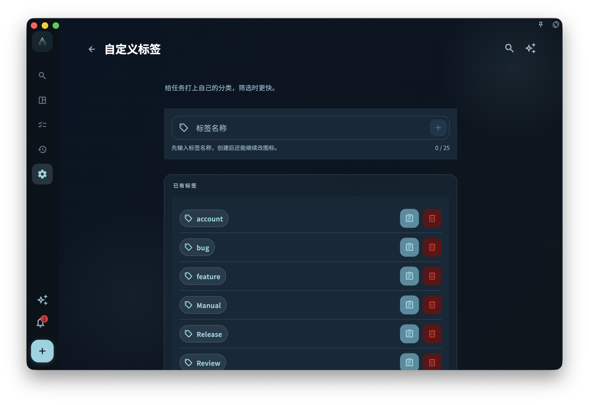

项目是纵向结构（任务属于哪个目标），标签是横向分类（这个任务属于哪种类型）。

比如你有"健身 App 开发"这个项目，里面的任务有些是"需要设计稿"、有些是"等待第三方 API"——这类横向标记就适合用标签。

## 怎么给任务加标签

在新建任务或打开任务详情时，找到标签区域，点击即可选择或创建标签。

- 已有标签会作为候选直接显示
- 找不到合适的？直接输入新名称创建一个
- 一个任务可以有多个标签

## 标签用来记什么好

标签适合表达那些**跨项目、可复用**的分类，比如：

| 用途 | 标签示例 |
| --- | --- |
| 场景 / 精力 | `低精力` `深度工作` `碎片时间` |
| 等待状态 | `等待他人` `等待回复` `待确认` |
| 类型 | `电话` `创意` `管理` |
| 临时标记 | `本周重点` `稍后处理` |

不建议把项目名称复制成标签——已经在项目里了，不需要再重复标一遍。

## 删除标签的影响

删除一个标签**不会**删除使用它的任务。它只会从那些任务上解绑这个标签。

:::caution[删前确认]
删除标签是不可撤销的。确认不再需要这个分类，再操作。
:::

## 标签多了怎么办

标签太多会让筛选失去意义。建议定期整理：

- 合并含义相近的标签
- 删除已经没人用的标签
- 保持标签名称简短、易区分
