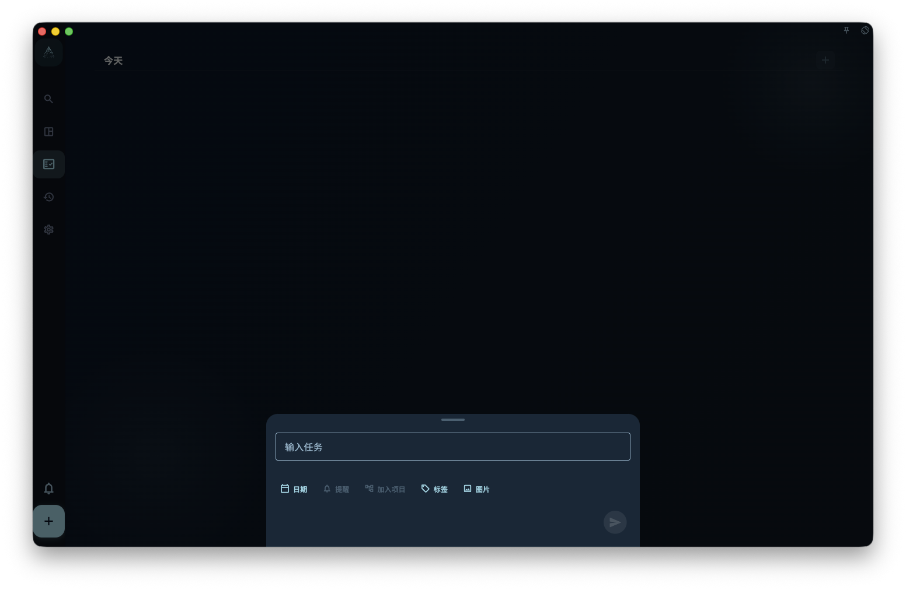

如果你想快速给任务加标签、截止日期或提醒，可以直接写在任务标题里。比如输入 `写报告 @明天 #工作 ~下午3点`，GranoFlow 会把日期、标签和提醒显示成候选项；你确认后，它们才会写入对应字段。

## 怎么操作

在添加或编辑任务标题时，直接输入这些内容：

- `#工作`：候选添加一个叫“工作”的标签
- `@明天`：候选设置截止日期为明天
- `~下午3点`：候选设置提醒时间

只要 GranoFlow 识别到 `#`、`@`、`~` 或日期词，输入框里会高亮显示对应候选项。

<!-- manual-screenshot:id=tasks-title-parser-confirmation -->

确认候选项的方法有两种：

- 点击高亮区域里的候选项
- 按 **Enter** 或 **Tab** 确认当前候选项

:::caution[重要：确认前不会写入]
识别到的内容**不会**自动变成标签、日期或提醒。你必须明确确认，才会写入对应字段。没有确认的部分会继续留在标题文字里，不会偷偷消失。
:::

## 常用语法速查

| 你输入的 | 效果 |
| --- | --- |
| `#工作` | 候选添加“工作”标签 |
| `@明天` `@下周五` `@3月5日` | 候选设置截止日期 |
| `~下午3点` `~明早9点` | 候选设置提醒时间 |
| `写报告 @明天 #工作` | 同时候选日期和标签 |

## 有什么限制

- `#`、`@`、`~` 最好放在清楚的词边界前，比如 `#工作`，不要写成 `搞#工作`
- 解析结果只是建议，最终以你确认后的字段为准
- 复杂句子里夹杂的符号，不一定都能被正确识别

如果某次识别结果不对，直接在字段里手动设置就好。自然语言输入只是快捷方式，不是必须使用的功能。
