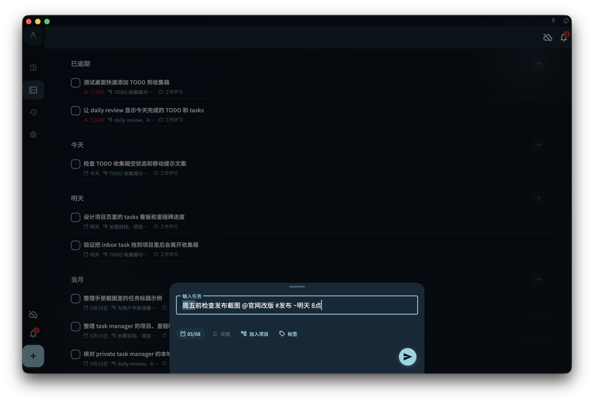

用标题里的 #、@、~ 和日期提示更快整理任务，同时理解哪些内容需要确认才会变成字段。

## 从哪里开始

在新建任务或编辑标题时直接输入自然语言。`#` 用来提示标签，`@` 用来提示项目，`~` 用来提示提醒时间，日期词会进入待确认状态。

<!-- manual-screenshot:id=tasks-title-parser-confirmation -->

## 怎么操作

- 输入 `#标签` 或 `@项目` 后，从候选项中点击、按 Enter 或 Tab 确认；确认后才会写入标签或项目字段。
- 输入日期或提醒词后，先看高亮和候选提示。点击日期提示或在日期后继续输入空格，才会把它写成结构化日期。
- 不确认的片段会继续保留在标题里，不会偷偷改成字段。

## 结果和边界

标题解析的目标是减少整理成本，而不是替你决定任务结构。你可以先把句子写完整，再只确认真正想结构化的部分。

- `#`、`@`、`~` 的识别依赖清晰边界；普通文字里的符号不一定会被当作字段。
- 解析建议可能不完整，最终以你确认后的字段为准。

## 下一步

如果你经常用标签或项目整理任务，可以继续阅读“标签”和“把任务连接到项目”。
