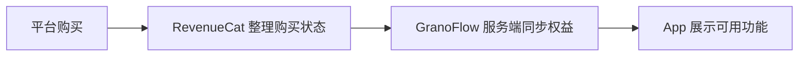

账号、订阅、会员、权益——这四个词容易混在一起，但它们不是一回事。

## 四个词的区别

| 词 | 是什么 |
| --- | --- |
| **账号** | 你在 GranoFlow 的身份，用于同步、恢复和识别 |
| **订阅** | 你在 Apple 或 Google 平台的购买关系 |
| **会员** | GranoFlow 对外描述的用户身份（如 Pro） |
| **权益** | 当前账号实际能使用哪些功能 |

路径大概是这样：

"我点过购买按钮"不等于"当前账号一定有权益"——中间的每一步都可能出现状态不对齐。

## 登录有什么用

不登录也可以用 GranoFlow 的本地功能：记录任务、整理项目、写回顾。

登录账号后，才能使用：云同步、多设备、会员权益识别、购买恢复、账号删除等需要服务端确认的功能。

> 本地使用解决"我现在怎么记录" → 登录账号解决"这些数据和权益属于谁"

如果你开启了离线模式，或者登录/购买服务暂时不可达，本地功能不会受影响；只是登录、同步、权益确认和恢复购买需要稍后再试。

## 恢复购买

换设备或重装 App 后，如果会员权益没有出现，可以尝试"恢复购买"——让平台重新检查你的购买记录，并和当前账号权益对齐。

但恢复购买不是万能的：

- 如果购买绑定的是另一个 GranoFlow 账号，当前账号不会自动得到权益
- 如果订阅已经退款或过期，恢复也无效
- 如果购买服务暂时不可达，恢复购买会提示稍后重试，本地数据不会受到影响

## 桌面端为什么没有购买按钮

桌面端（Windows/macOS/Linux）为了符合各平台分发规则，可能不显示购买入口。

这不是功能缺失——你已经有会员的话，登录后桌面端会正常解锁对应功能。需要购买的话，从 iOS 或 Android 端操作。

## 遇到问题时先问自己

1. 我现在登录的是哪个 GranoFlow 账号？
2. 购买发生在哪个平台（Apple / Google）？
3. 当前订阅是否还有效？
4. App 是否已经刷新了权益？
5. 有没有搞混不同账号？

这几个问题能定位 99% 的会员和权益问题。
