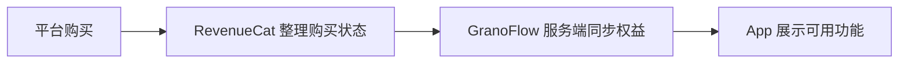

当会员没有显示、恢复购买没反应、换设备后功能没解锁时，最容易发生的一件事是：

> 所有词都混在一起了。

账号、订阅、会员、权益，听起来像是在说同一件事，但它们其实不是同一层东西。

如果这几个概念没有拆开，问题会很难定位；
如果拆开了，很多情况就会一下子清楚很多。

如果你只想先记住最重要的三件事，可以先记住：

1. **账号**决定“这些数据和权益属于谁”
2. **订阅**决定“你是否在 Apple 或 Google 上完成了购买关系”
3. **权益**决定“当前这个账号实际能用哪些功能”

所以，“我点过购买按钮”不一定等于“当前账号已经拿到权益”。
中间还隔着平台购买、购买状态整理、服务端同步和 App 刷新显示。

## 四个词，分别是什么意思

| 词 | 是什么 |
| --- | --- |
| **账号** | 你在 GranoFlow 的身份，用来识别数据和权益属于谁 |
| **订阅** | 你在 Apple 或 Google 平台上的购买关系 |
| **会员** | GranoFlow 对外描述的用户身份，例如 Pro |
| **权益** | 当前账号实际可以使用哪些功能 |

你可以把流程理解成这样：

这张图想说明的不是系统多复杂，
而是提醒你：

> 平台购买成功，只是链条中的一环。  
> 只有每一环都对齐，App 里看到的结果才会正确。

## 登录到底解决什么问题

不登录也可以使用 GranoFlow 的本地功能，例如记录任务、整理项目、写回顾。

登录账号后，GranoFlow 才能确认这些内容和权益属于谁。以下功能通常需要登录并经过服务端确认：

- 云同步
- 多设备使用
- 会员权益识别
- 恢复购买
- 账号删除

你可以把两者先简单分开：

> 本地使用解决“我现在怎么记录”。  
> 登录账号解决“这些数据和权益属于谁”。

如果你开启了离线模式，或者登录、购买服务暂时不可用，本地功能不会因此停止。只是登录、同步、权益确认和恢复购买需要稍后再试。

## 恢复购买是什么，不是什么

换设备或重装 App 后，如果会员权益没有出现，可以尝试“恢复购买”。
它的作用是：让 Apple 或 Google 重新检查购买记录，再和当前登录的 GranoFlow 账号权益对齐。

恢复购买的重点，不是“重新买一次”，而是“重新确认这笔购买属于哪个账号、当前是否仍然有效”。

但恢复购买不能解决所有情况：

- 如果购买绑定的是另一个 GranoFlow 账号，当前账号不会自动得到权益
- 如果订阅已经退款或过期，恢复购买也不会重新开通权益
- 如果购买服务暂时不可用，App 会提示稍后重试，本地数据不会受到影响

所以，当恢复购买没有立刻解决问题时，不一定是功能坏了，
也可能只是链条里的别的环节还没对上。

## 桌面端为什么没有购买按钮

桌面端，也就是 Windows、macOS 和 Linux 版本，为了符合各平台分发规则，可能不显示购买入口。

这不代表桌面端少了会员功能。
如果你已经有会员，在桌面端登录同一个 GranoFlow 账号后，对应功能会正常解锁。

需要购买会员时，请从 iOS 或 Android 端操作。

所以，桌面端没有购买按钮，并不等于桌面端不能使用会员权益。
它只是购买入口放在了更合适的平台上。

## 遇到问题时，先别急着重试很多次

如果你发现会员没有显示、恢复购买没有反应，先不要立刻反复点按钮。
更有效的方式是先回答下面几个问题：

1. 我现在登录的是哪个 GranoFlow 账号？
2. 购买发生在哪个平台，Apple 还是 Google？
3. 当前订阅是否还有效？
4. App 是否已经刷新了权益？
5. 有没有把不同账号搞混？

这几个问题能定位绝大多数会员和权益问题。

很多时候，问题不是出在“会员没了”，而是出在：

- 登录了另一个账号
- 购买平台和当前设备不一致
- 订阅已经失效
- 权益还没刷新出来

把这些环节分开以后，你会比单纯焦急地反复操作更快接近答案。

## 这页最想帮你分清的一件事

会员问题最让人头大的地方，不是它技术上多复杂，而是它很容易让人把“账号”“购买”“订阅”“权益”混成一团。

这页想帮你恢复的，只是一个清楚判断：

- 我现在的问题出在账号，还是出在购买？
- 我缺的是登录，还是权益同步？
- 我现在应该恢复购买，还是先确认自己登录的是谁？

## 下一步

如果你正在处理多设备、登录或数据归属问题，可以继续阅读：

- [数据安全与同步](/value-to-action/data-security-sync/)：分清本地数据、云同步和密钥之间的关系。
