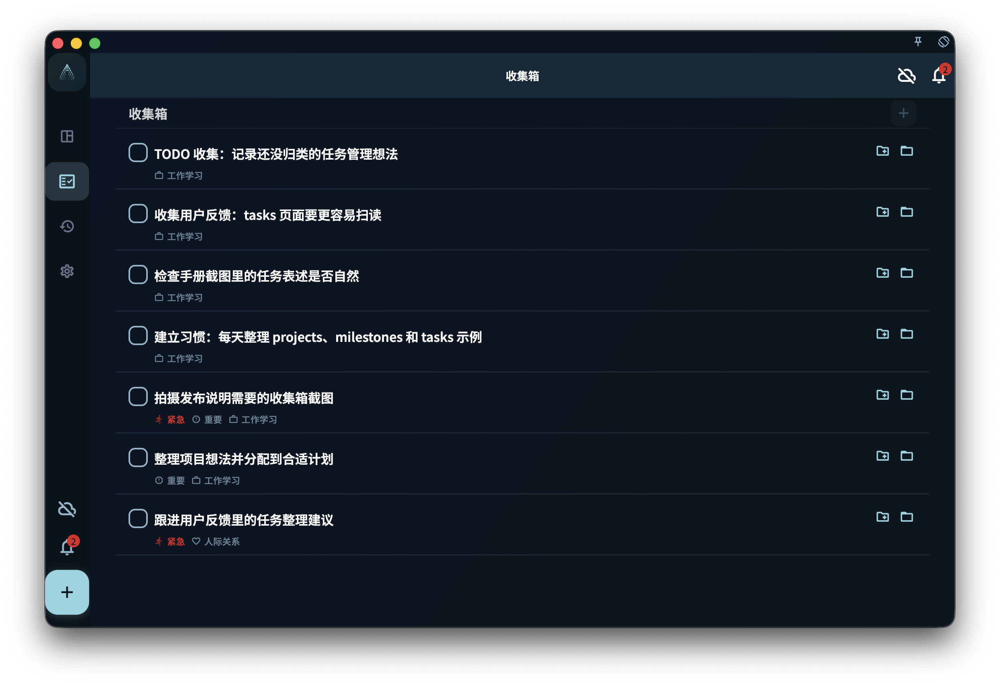

这一章把 ACT（接纳与承诺疗法）和《幸福的陷阱》的思路，落到 GranoFlow 的领域、价值观、项目、里程碑、任务和回顾里。它适合你把长期目标变成今天能做的一步，而不是把自己逼进更焦虑的 TODO 清单。

GranoFlow 背后有一个重要思想：ACT（Acceptance and Commitment Therapy，接纳与承诺疗法）。

简单说，ACT 不要求你先消灭焦虑、拖延、痛苦和混乱，再开始生活。它更关心的是：当这些状态仍然存在时，你是否还能看见自己重视什么，并做出下一步行动。

很多中文读者认识 ACT，是从 Russ Harris 的 *The Happiness Trap*（《幸福的陷阱》）开始的。这本书用更接近日常生活的语言介绍了 ACT：人不必把痛苦、焦虑、拖延或不确定性全部清除掉，才有资格开始过自己重视的生活。

ACT 通常被归入现代认知行为疗法（CBT）相关方法中，围绕接纳、正念、价值和承诺行动展开。它关注的不是把所有不舒服的感受消灭，而是在真实处境里提升心理灵活性：看见当下发生了什么，看见自己重视什么，然后做出一个更接近价值的行动。

GranoFlow 不是心理治疗工具，也不能替代书籍、医生、治疗师或专业帮助。它只是借用了 ACT 和《幸福的陷阱》中适合日常生活的一部分：接纳现实、澄清价值、承诺行动，再通过任务、项目和回顾把行动留下来。

## 接纳：先承认现在的状态

很多人以为，只有状态好了，才能开始行动。

等不焦虑了，再工作。  
等不拖延了，再学习。  
等想清楚了，再做计划。  
等生活稳定了，再开始改变。

但现实通常不是这样。

你可能一边混乱，一边还有事情要做。你可能一边怀疑自己，一边仍然想推进某个目标。你可能没有完全准备好，但今天已经需要开始。

在 GranoFlow 里，第一步不是把自己调整到完美状态，而是先把事情写下来。

写下一件事，不代表你已经想清楚了。  
写下一件事，只是承认：它正在占用你的注意力。

你可以把任务放进收集箱，也可以在回顾里写下今天的状态。它暂时不需要被解释、分类或优化。先记录下来，就是把脑中的混乱移到一个可以慢慢处理的位置。

<!-- manual-screenshot:id=tasks-inbox-main -->

接纳不是躺平，也不是认输。

接纳的意思是：我先承认现在就是这样，然后从这里开始。

## 价值：想清楚自己重视什么

任务回答的是“我要做什么”。

价值回答的是“我想成为什么样的人”。

同样是学习英语，有人是为了考试，有人是为了工作，有人是为了更自由地理解世界。  
同样是锻炼身体，有人是为了外形，有人是为了健康，有人是为了让自己在长期生活中更有力量。  
同样是做一个项目，有人是为了收入，有人是为了作品，有人是为了证明自己能长期完成一件事。

GranoFlow 里的领域和价值观，不是用来装饰页面的。

它们的作用是帮你看见：你反复投入时间的地方，是否真的接近你重视的方向。

你不需要一开始就写出完美的人生价值观。可以先问自己几个简单问题：

- 我希望自己在工作或学习中成为什么样的人？
- 我希望如何对待重要的人际关系？
- 我希望如何照顾自己的身心健康？
- 我希望留下些什么作品、表达或创造？

答案可以很普通。

- 我希望自己是一个可靠的人。
- 我希望自己遇到困难时仍然能继续推进。
- 我希望自己不是只消耗生活，也能创造一点东西。
- 我希望自己能照顾身体，而不是一直透支。

真正有用的价值观，往往不是一句漂亮口号，而是能反复指导选择的方向。

## 承诺：把方向变成下一步行动

只写价值观还不够。

如果“我想成为可靠的人”永远停留在一句话里，它不会自动改变生活。它需要变成项目、里程碑和任务。

例如，你重视“成为可靠的人”。

它可以落成一个项目：

> 完成当前产品版本

项目下面可以有里程碑：

> 完成核心功能  
> 完成测试  
> 准备发布材料

里程碑下面再拆成任务：

> 检查登录流程  
> 修复图片上传问题  
> 更新手册文案  
> 提交审核说明

这样，价值观就不再只是抽象愿望，而是进入了每天可以推进的结构。

承诺行动不是说“我从此不能中断”。

它的意思是：即使我现在状态并不完美，我也愿意朝自己重视的方向，做一个具体动作。

当你不知道该做什么时，看任务。  
当任务太碎时，看里程碑。  
当项目失去意义时，看价值观。  
当价值观变得模糊时，回到回顾里重新整理。

## 回顾：让经历变成积累

完成任务不是结束。

如果你只是不断写任务、做任务、删除任务，生活很容易变成一串被消耗掉的清单。

回顾的作用，是让经历留下痕迹。

你可以在一天结束时问自己：

- 今天我实际做了什么？
- 哪些事让我更接近重视的方向？
- 哪些事只是消耗了我？
- 下一步应该是什么？

回顾不需要长，也不需要漂亮。它不是作文，不是日报，也不是自我检讨。

它更像一次简短整理：把今天发生过的事，和你长期在意的方向重新连起来。

有些时候，回顾会告诉你：这个项目值得继续。  
有些时候，回顾会告诉你：这个目标其实已经不重要了。  
有些时候，回顾只是让你承认：今天很难，但你仍然做了一点。

这些都算数。

## 中断不是失败

GranoFlow 不以连续打卡作为核心。

因为人生本来就会中断。

你可能生病、换工作、情绪低落、临时忙别的事，也可能只是突然失去动力。中断不说明你失败了，只说明生活发生了变化。

真正重要的不是“从来没有停下”，而是“停下之后还能回来”。

回来时，不需要补偿过去，也不需要责备自己。你只需要重新看一眼：

- 当前还重要的领域是什么？
- 哪个项目仍然值得继续？
- 最近一个里程碑是什么？
- 今天能推进的最小任务是什么？

如果旧计划已经不适合，也可以调整、归档或放弃。

放弃一个项目，不等于否定过去的投入。只要你能从中看见经验，它仍然会成为积累的一部分。

## 用 GranoFlow 完成一次 ACT 循环

你可以把 GranoFlow 的一次完整使用，看作一个简单循环：

1. **接纳现实**：把脑中的混乱、任务或状态写下来。
2. **看见价值**：判断它和哪个领域、价值观或长期方向有关。
3. **承诺行动**：把方向拆成项目、里程碑和任务。
4. **实际推进**：今天只完成一个清楚的下一步。
5. **回顾沉淀**：记录发生了什么，以及下一步是什么。
6. **中断后回来**：不清零，不羞耻，重新从当前状态开始。

你不需要每一天都完整走完这个循环。

有时你只是写下一件事。  
有时你只是完成一个任务。  
有时你只是做一次回顾。

这些都可以。

GranoFlow 的目的不是让你变成一个永远高效的人，而是帮你在真实生活里，持续靠近自己重视的方向。

## 延伸阅读

如果你想进一步了解 ACT，可以阅读 Russ Harris 的 *The Happiness Trap*（《幸福的陷阱》），也可以查看 Wikipedia 上的 [The Happiness Trap](https://en.wikipedia.org/wiki/The_Happiness_Trap) 和 [Acceptance and commitment therapy](https://en.wikipedia.org/wiki/Acceptance_and_commitment_therapy) 条目，或查看 Association for Contextual Behavioral Science 对 ACT 的介绍。

GranoFlow 不是《幸福的陷阱》的总结，也不是这本书的替代品。它只是把其中一部分适合日常生活的思路，转化成记录、项目、任务和回顾结构，帮助你把“我重视什么”落到今天能做的一步。
