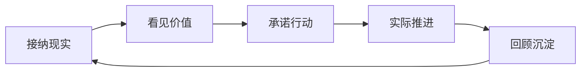
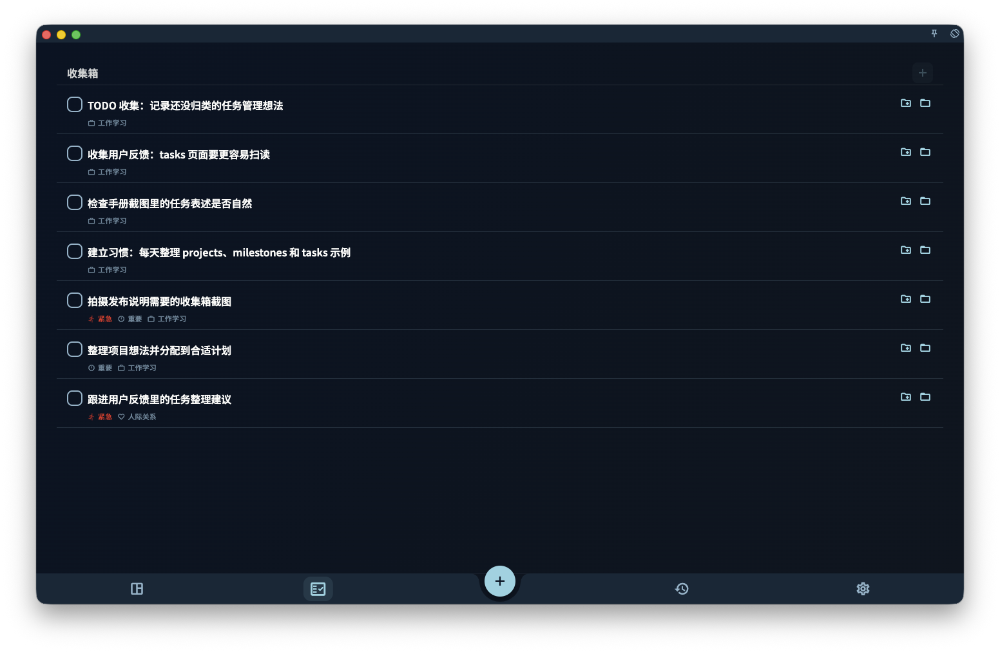

很多任务工具的隐含逻辑是：你先把状态调整好，再开始。

等不焦虑了再工作。等想清楚了再做计划。等生活稳定了再开始改变。

问题是，状态往往没有完全准备好的那一天。

GranoFlow 借用了 **ACT（接纳与承诺疗法）** 的思路，来自 Russ Harris 的《幸福的陷阱》：你不必先消灭焦虑和混乱，才能过自己重视的生活。你可以带着现实中的不完美，仍然做下一步。

## 一个循环：接纳 → 价值 → 行动 → 回顾

不需要每天走完这个循环。有时你只是写下一件事；有时你只是做一次回顾——这些都算数。

## 接纳：先写下来，不用先想清楚

在 GranoFlow 里，第一步不是把自己调整到完美状态，而是先把占用注意力的事写下来。

写进收集箱，暂时不用解释它为什么在这里、该怎么分类。先记录，就是把脑中混乱移到一个可以处理的位置。

接纳不是躺平，而是：我先承认现在就是这样，然后从这里开始。

## 价值：我想成为什么样的人

任务回答"我要做什么"，价值回答"我想成为什么样的人"。

同样是锻炼身体，有人为外形，有人为健康，有人为让自己在长期生活中更有力量——同一件事，背后的价值观完全不同。

不需要写出漂亮的人生格言。最有用的价值观往往很普通：

- 我希望自己是一个可靠的人
- 我希望遇到困难时仍然能继续推进
- 我希望不只是消耗生活，也能创造一点东西

## 承诺行动：把方向变成今天能做的一步

只写价值观不够，它需要落进项目、里程碑和任务里。

比如你重视"成为可靠的人"，可以落成一个项目"完成当前产品版本"，再拆成里程碑"完成核心功能 → 测试 → 上线"，每个里程碑再拆成具体任务。

承诺行动不是说"从此不能中断"，而是：即使状态不完美，我也愿意朝自己重视的方向，做一个具体动作。

## 中断不是失败

人生本来就会中断。生病、换工作、情绪低落，都可能让计划暂停。

真正重要的不是"从来没有停下"，而是"停下之后还能回来"。

回来时，不需要补偿过去，不需要责备自己。只需要重新问：当前还重要的项目是什么？今天能推进的最小一步是什么？

## GranoFlow 的立场

GranoFlow 不是心理治疗工具，也不能替代专业帮助。它只是借用了 ACT 适合日常生活的部分：接纳现实、看见价值、承诺行动、通过回顾把行动留下来。

目标不是让你变成永远高效的人，而是在真实生活里，持续靠近自己重视的方向。
