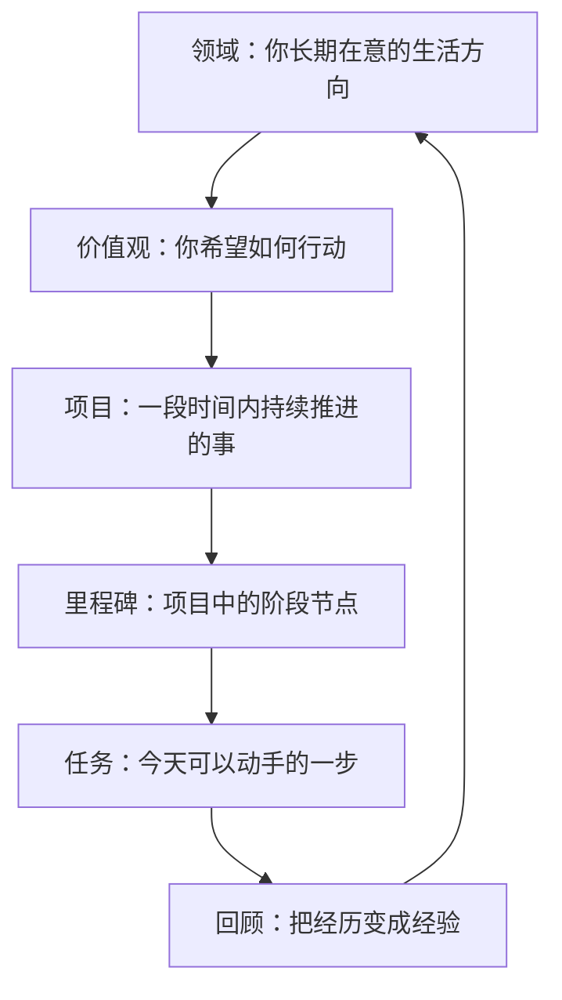

很多人第一次接触 GranoFlow 时，真正困惑的不是“怎么点按钮”，而是：

> 我脑子里的这件事，到底该放到哪里？

有些念头像任务，有些更像长期方向；有些事情今天就能做，有些则需要花几周、几个月慢慢推进。
如果这些东西全都挤在同一个清单里，你很容易同时感到两种压力：

- 事情很多，但不知道先做什么
- 好像一直在忙，但又说不清自己在靠近什么

这就是为什么 GranoFlow 不只是一张任务清单。
它更像一张行动地图：帮你把一个模糊的念头，慢慢放回合适的位置，再把它变成今天能做的一步。

## 先记住这张地图

在 GranoFlow 里，一条完整的路径通常是这样的：

这不是一张要求你一次填满的表格。
它只是帮你回答六个不同的问题：

- 我长期在意什么？
- 我希望自己怎么行动？
- 我这段时间在推进什么？
- 当前先完成哪一段？
- 今天先做哪一步？
- 这次行动告诉了我什么？

当这些问题分开以后，很多混乱都会明显减轻。

## 为什么不能只有任务

很多工具只帮你记录“要做什么”，但不会帮你看见“为什么做”。
于是任务越记越多，你也可能越来越忙，却越来越难感到自己在向某个方向前进。

ACT 和《幸福的陷阱》里有一个很重要的实践思想：
**行动不是只靠效率推动的，行动还需要方向。**

如果没有方向，任务很容易变成机械处理。
如果只有方向，没有任务，方向又会停留在空话里。

GranoFlow 的结构，就是把这两件事重新连起来：

> 让长期方向能落地，让今天的行动也能回得去。

## 领域：我长期在意什么

领域是你长期在意的生活方向，比如：

- 工作学习
- 人际关系
- 身心健康
- 业余创作

领域不是任务分类文件夹，也不是短期目标。
它更像你人生地图上的几块区域，帮助你看见：最近我把时间和注意力，主要投向了哪里。

容易混淆的例子：

| 不是领域 | 更适合做 |
|---------|---------|
| 完成一个 App 版本 | 项目 |
| 每周跑步三次 | 任务或习惯 |
| 工作学习 | ✅ 领域 |
| 身心健康 | ✅ 领域 |

如果你发现某些事情反复出现、长期占用注意力，它背后通常对应着某个领域。

## 价值观：我希望自己怎样行动

领域回答的是“哪一块生活值得我投入”。
价值观回答的是：**在这块生活里，我希望自己成为怎样的人。**

价值观不是目标。目标可以完成，价值观不会被一次性打勾。

例如：

> 三个月减重 5 公斤

这是目标。

> 我希望长期照顾身体，而不是一直透支自己。

这是价值观。

再例如：

> 发布一个产品版本

这是目标。

> 我希望自己成为一个可靠、清楚、能交付的人。

这是价值观。

价值观的作用，不是在顺利时锦上添花。
它真正有用的时刻，往往是你状态不好、犹豫不决、想逃避的时候。
那时它会提醒你：

> 哪一种行动，更接近我想成为的人？

## 项目：我这段时间在推进什么

项目是介于“长期方向”和“今天任务”之间的容器。
它承接的是一段时间内持续推进的事情，通常会持续几天到几个月。

你可以先问自己一个简单问题：

> 这件事今天能直接做完吗？

如果能，写成任务就够了。
如果它会反复占用注意力，需要多次推进、拆分、跟进，它更适合成为项目。

例如：

- 回复一封邮件 → 任务
- 准备一次考试 → 项目
- 跑步 20 分钟 → 任务
- 建立三个月锻炼节奏 → 项目

项目的作用，是给持续投入一个稳定容器。
没有项目，很多重要的事会一直停留在“我以后要认真做”这种模糊状态里。

## 里程碑：当前先完成哪一段

里程碑是项目里的阶段节点。
它不是为了增加复杂度，而是为了帮你把“大目标”切成几段看得见的路。

例如，一个项目叫：

> 完成产品版本

它可以拆成：

- 完成核心功能
- 修复主要问题
- 准备发布材料
- 提交审核

这样你每天就不需要面对“整个版本”这个庞然大物，
而只需要面对：

> 现在这一段，先推进什么？

如果项目很小，里程碑可以没有。
但如果你看着一个项目，不知道该从哪继续，它通常就该拆阶段了。

## 任务：今天先做哪一步

任务是 GranoFlow 里最接近现实行动的一层。
一个好任务，应该让你看完就知道怎么开始。

例如：

- 写完首页文案
- 检查登录流程
- 整理 10 个测试反馈
- 给朋友发一条确认消息

不太好的任务通常太大、太虚，或者更像愿望：

- 变得更自律
- 做好产品
- 学好英语
- 处理所有问题

如果一个任务让你迟迟无法开始，通常不是你不够努力，而是它还不够具体。
继续拆小，直到它变成一个能在今天开始的动作。

你可以把任务理解成一句很朴素的话：

> 不问“我该不该做完全部”，只问“我现在先做哪一步”。

## 回顾：这次行动说明了什么

回顾是这张地图里最容易被忽略、但也最重要的一步。

如果没有回顾，任务完成后只会变成一个被划掉的清单项。
有了回顾，你才会慢慢知道：

- 什么方法对自己有效
- 哪些行动真的推动了项目
- 哪些努力更接近价值观
- 哪些方向其实已经不再重要

回顾时不需要写很多。
你可以只问几个问题：

- 今天完成了什么？
- 哪些行动更接近我重视的方向？
- 这次卡住的地方是什么？
- 下一步是什么？

这样，回顾就不是额外工作，而是把经历慢慢变成经验。

## 不需要从最上面开始

很多人看到“领域 → 价值观 → 项目 → 任务”这条路径，会以为自己应该先搭完整套结构。
其实不必。

最常见、也最自然的起点，反而是任务。

你可以先把脑中的事写下来。
之后发现它会持续占用注意力，再把它整理成项目。
项目变大了，再拆出里程碑。
回顾做久了，你再慢慢看见自己长期在意的领域和价值观。

也就是说，这条路既可以从上往下走，也可以从下往上长出来。

:::tip[结构不是负担，而是减轻负担的工具]
最简单的路径是：先写任务 → 发现它会持续就建项目 → 项目变大了再拆里程碑 → 回顾时慢慢整理领域和价值观。你不需要一开始就全都准备好。
:::

## 一个完整例子

假设你脑中冒出一句很模糊的话：

> 我得把手册做好。

如果它只停在这里，你很容易既焦虑又不知道从哪开始。

把它放进这张地图里，事情就会慢慢清楚：

- **领域**：工作学习
- **价值观**：我希望自己成为一个可靠、清楚、能交付的人
- **项目**：完成 GranoFlow 新手手册第一版
- **里程碑**：完成第二章改写
- **任务**：重写“从领域到任务”这一篇
- **回顾**：今天把章节结构理顺了。下一步去重写“长期方向”。

这就是 GranoFlow 最核心的事情：
**不是把生活变复杂，而是把模糊的压力，慢慢翻译成可以行动的一步。**

## 下一步

如果你已经理解这张地图，下一步最适合继续读：

- [先确定长期方向](/value-to-action/long-term-direction/)：理解领域和价值观为什么不是口号。
- [项目与里程碑：把长期方向拆成阶段目标](/value-to-action/projects-and-milestones/)：学会给持续投入建立骨架。
- [任务与收集箱：把下一步写下来](/value-to-action/tasks-and-inbox/)：把模糊的压力变成可执行动作。